# IT Ticket Classification Gen AI Chatbot Project Flow

## Project Overview Flow Diagram

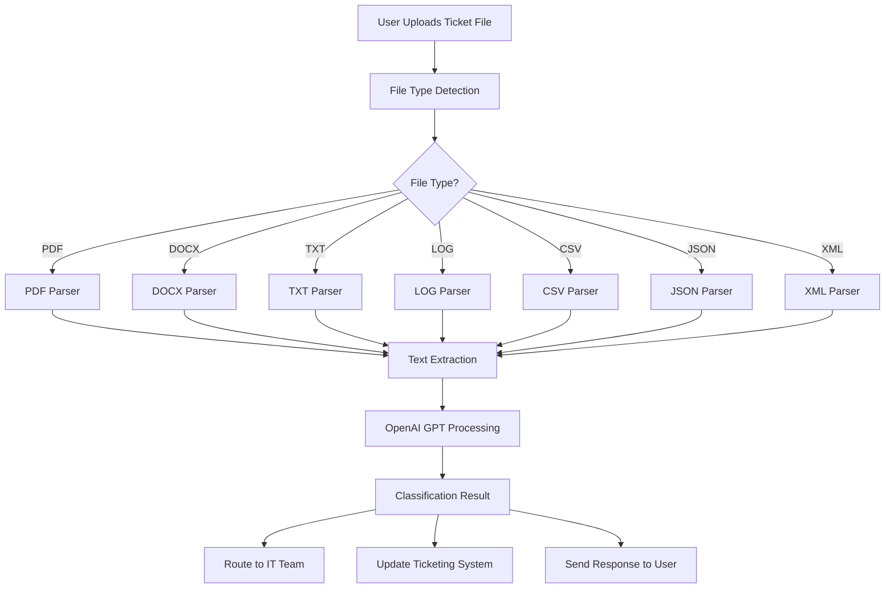

## Process Flow Diagrams

### 1. Data Collection & Preparation Flow

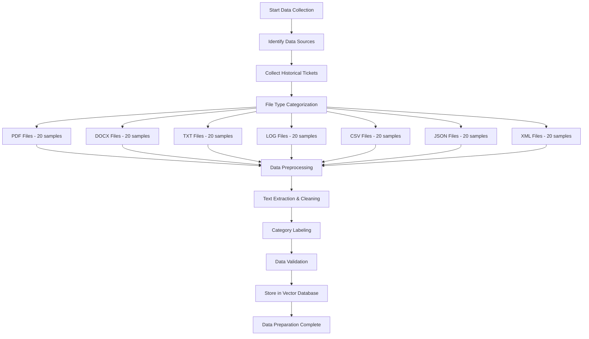

### 2. Model Development & Training Flow

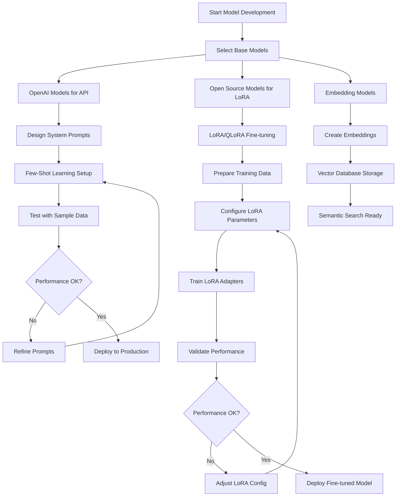

### 2.1 LoRA/QLoRA Fine-tuning Flow

```mermaid
graph TD
    A[Prepare Training Data] --> B[Data Preprocessing]
    B --> C[Tokenization]
    C --> D[Create Dataset]
    D --> E[Load Base Model]
    E --> F[Apply Quantization (QLoRA)]
    F --> G[Initialize LoRA Adapters]
    G --> H[Configure Training Parameters]
    H --> I[Start Training Loop]
    I --> J[Forward Pass]
    J --> K[Compute Loss]
    K --> L[Backward Pass]
    L --> M[Update LoRA Weights]
    M --> N{Training Complete?}
    N -->|No| I
    N -->|Yes| O[Save LoRA Adapters]
    O --> P[Load Adapters for Inference]
    P --> Q[Test Performance]
    Q --> R[Deploy to Production]
```

### 3. Chatbot Interaction Flow

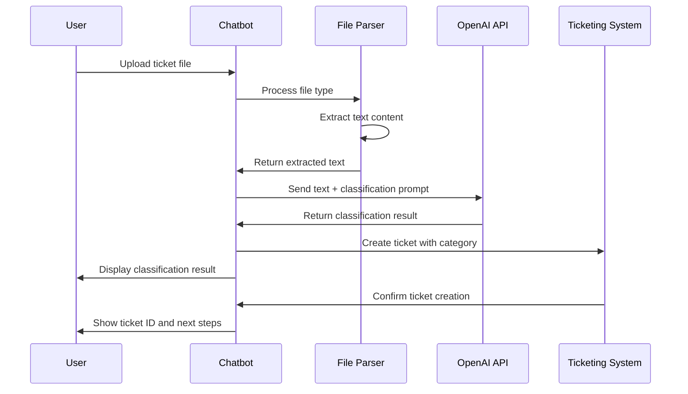

## Detailed Process Flows

### Phase 1: Project Planning & Setup Process

**Step-by-Step Process:**

1. **Stakeholder Identification**
   - Identify IT support managers
   - Engage end users and help desk staff
   - Include security and compliance teams
   - Define project sponsors and decision makers

2. **Requirements Gathering**
   - Conduct interviews with IT support teams
   - Analyze current ticket classification processes
   - Identify pain points and improvement opportunities
   - Document existing file handling procedures

3. **Technology Assessment**
   - Evaluate OpenAI API capabilities
   - Assess file parsing libraries and tools
   - Review integration options with existing systems
   - Estimate infrastructure requirements

4. **Resource Planning**
   - Allocate development team members
   - Plan training and knowledge transfer sessions
   - Set up development and testing environments
   - Establish project timeline and milestones

## 1. Project Planning & Setup

### 1.1 Define Project Objectives
- **Business Goals**: Automate IT ticket classification to improve response times and routing accuracy
- **Success Metrics**: 
  - Classification accuracy > 90%
  - Response time reduction by 60%
  - User satisfaction score > 4.5/5
  - Ticket routing accuracy > 95%
- **Target Audience**: IT support teams, end users, help desk staff
- **Budget & Timeline**: 3-6 months development, ongoing OpenAI API costs

### 1.2 Technology Stack Selection
- **AI Framework**: OpenAI GPT models (GPT-3.5-turbo, GPT-4)
- **Model Type**: Pre-trained OpenAI models with fine-tuning capabilities
- **API Framework**: FastAPI (recommended) or Flask for REST API backend
- **Infrastructure**: Cloud-based (AWS/Azure) with OpenAI API integration
- **Deployment Platform**: Containerized API with web frontend
- **File Processing**: Document parsing for 7 file types (PDF, DOCX, TXT, LOG, CSV, JSON, XML)
- **Database**: PostgreSQL for metadata, Vector DB for embeddings

### 1.3 Team Assembly
- **AI/ML Engineers**: For OpenAI integration and prompt engineering
- **Backend Developers**: For API development and file processing
- **Frontend Developers**: For chatbot interface and user experience
- **IT Support Experts**: For domain knowledge and ticket classification rules
- **DevOps Engineers**: For deployment and monitoring

### 4. System Architecture Flow

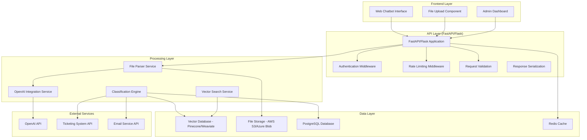

### 5. File Processing Flow

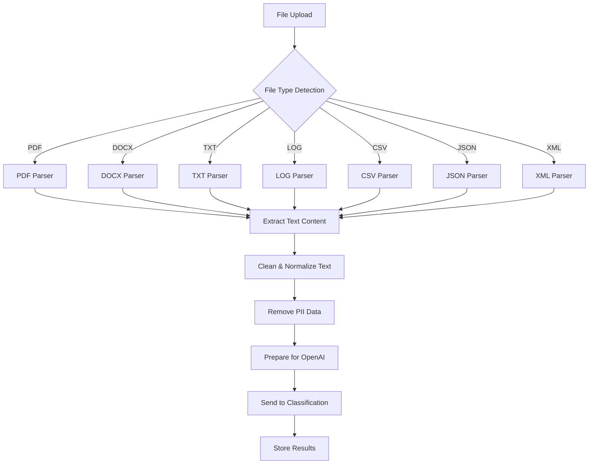

### Phase 2: Data Preparation Process

**Step-by-Step Process:**

1. **Data Collection Workflow**
   ```
   Start → Identify Sources → Collect Files → Categorize by Type → Validate Quality → Store Securely
   ```
   - **Source Identification**: Ticketing systems, email threads, knowledge base
   - **File Collection**: Gather 20 samples per file type (140 total)
   - **Quality Check**: Verify file integrity and content relevance
   - **Secure Storage**: Store in encrypted, access-controlled environment

2. **File Processing Pipeline**
   ```
   Upload → Detect Type → Parse Content → Extract Text → Clean Data → Label Category → Store Vector
   ```
   - **File Type Detection**: Use MIME type and file extension validation
   - **Content Extraction**: Parse each file type using appropriate libraries
   - **Text Cleaning**: Remove special characters, normalize formatting
   - **Category Labeling**: Manual labeling by IT experts
   - **Vector Storage**: Create embeddings and store in vector database

3. **Data Validation Process**
   ```
   Sample Data → Expert Review → Accuracy Check → Feedback Loop → Final Dataset
   ```
   - **Expert Review**: IT support experts validate classifications
   - **Accuracy Testing**: Cross-validation with multiple reviewers
   - **Feedback Integration**: Incorporate corrections and improvements
   - **Final Dataset**: Prepare production-ready training data

## 2. Data Preparation & Management

### 2.1 Data Collection
- **Historical Tickets**: Collect 140+ sample tickets (20 per file type × 7 types)
- **File Types**: PDF, DOCX, TXT, LOG, CSV, JSON, XML documents
- **Ticket Categories**: Hardware, Software, Network, Security, Database, Application, Infrastructure
- **Data Sources**: 
  - Existing ticketing systems (ServiceNow, Jira, Zendesk)
  - Email threads and chat logs
  - Knowledge base articles
  - Support documentation

### 2.2 Data Preprocessing
- **File Parsing**: Extract text content from different file formats
- **Text Cleaning**: Remove special characters, normalize formatting
- **Category Labeling**: Manually label tickets with correct categories
- **Data Augmentation**: Create variations of tickets for better training
- **Privacy Sanitization**: Remove PII and sensitive information

### 2.3 Data Storage & Versioning
- **Vector Database**: Store embeddings for semantic search (Pinecone, Weaviate)
- **Document Storage**: Secure storage for original ticket files
- **Data Versioning**: Track changes in training data and model versions
- **Access Controls**: Role-based access to sensitive ticket data

### 6. Classification Process Flow

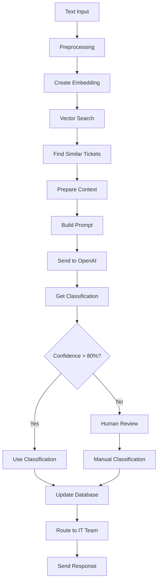

### 7. API Deployment Flow

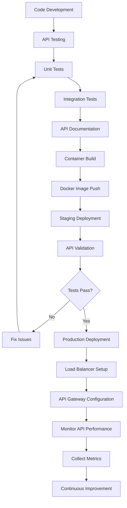

### 8. FastAPI/Flask Development Flow

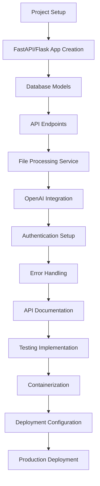

### 9. API Request Processing Flow

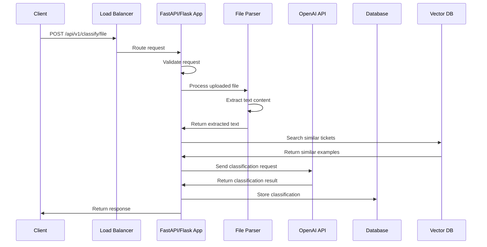

### Phase 3: Model Development Process

**Step-by-Step Process:**

1. **Prompt Engineering Workflow**
   ```
   Analyze Data → Design Prompts → Test Examples → Refine Prompts → Validate Performance
   ```
   - **Data Analysis**: Study ticket patterns and classification requirements
   - **Prompt Design**: Create system prompts for each category
   - **Example Selection**: Choose 3-5 examples per category for few-shot learning
   - **Testing**: Validate prompts with sample data
   - **Refinement**: Iterate based on performance feedback

2. **Model Integration Process**
   ```
   Setup API → Configure Models → Implement Caching → Add Error Handling → Test Integration
   ```
   - **API Setup**: Configure OpenAI API keys and endpoints
   - **Model Selection**: Choose appropriate models for different tasks
   - **Caching**: Implement response caching for cost optimization
   - **Error Handling**: Add robust error handling and fallback mechanisms
   - **Integration Testing**: Test all model interactions

3. **Performance Optimization**
   ```
   Baseline Test → Identify Bottlenecks → Optimize Prompts → Implement Caching → Measure Improvement
   ```
   - **Baseline Testing**: Establish initial performance metrics
   - **Bottleneck Analysis**: Identify slow or expensive operations
   - **Prompt Optimization**: Reduce token usage while maintaining accuracy
   - **Caching Strategy**: Cache frequent responses and embeddings
   - **Performance Monitoring**: Track improvements and costs

## 3. Model Development

### 3.1 Model Selection
- **Primary Model**: OpenAI GPT-3.5-turbo for cost-effectiveness
- **Advanced Model**: OpenAI GPT-4 for complex classification tasks
- **Embedding Model**: OpenAI text-embedding-ada-002 for semantic search
- **Custom Fine-tuned Model**: LoRA/QLoRA fine-tuned model for specialized classification
- **Fallback Model**: Rule-based classification for edge cases

### 3.2 Prompt Engineering
- **System Prompts**: Design prompts for ticket classification
- **Few-Shot Learning**: Use 3-5 examples per category for better accuracy
- **Chain-of-Thought**: Guide model reasoning for complex tickets
- **Prompt Templates**: Create reusable templates for different file types

### 3.3 Model Training & Fine-tuning

#### 3.3.1 LoRA (Low-Rank Adaptation) Fine-tuning
- **Base Model**: Use pre-trained models (GPT-3.5, Llama-2, Mistral) as base
- **LoRA Configuration**: 
  - Rank: 16-64 (adjustable based on task complexity)
  - Alpha: 32-128 (scaling parameter)
  - Target Modules: attention layers (q_proj, v_proj, k_proj, o_proj)
- **Training Data**: 140+ labeled tickets (20 per file type × 7 types)
- **Data Split**: 80% training, 20% validation
- **Benefits**: 90%+ reduction in trainable parameters, faster training, lower memory usage

#### 3.3.2 QLoRA (Quantized LoRA) Fine-tuning
- **Quantization**: 4-bit quantization of base model weights
- **Memory Optimization**: 50-75% reduction in GPU memory requirements
- **Training Efficiency**: Train on single GPU (24GB VRAM) instead of multiple GPUs
- **Performance**: Maintains 99% of full fine-tuning performance
- **Configuration**:
  - Bits: 4-bit quantization
  - Double quantization: Enabled
  - Quantization type: NF4 (Normalized Float 4)

#### 3.3.3 Fine-tuning Process
```python
# LoRA Configuration
lora_config = {
    "r": 16,                    # Rank
    "lora_alpha": 32,           # Scaling parameter
    "target_modules": ["q_proj", "v_proj", "k_proj", "o_proj"],
    "lora_dropout": 0.1,        # Dropout rate
    "bias": "none",             # Bias handling
    "task_type": "CAUSAL_LM"    # Task type
}

# QLoRA Configuration
qlora_config = {
    "load_in_4bit": True,
    "bnb_4bit_quant_type": "nf4",
    "bnb_4bit_compute_dtype": "float16",
    "bnb_4bit_use_double_quant": True,
    "lora_config": lora_config
}
```

#### 3.3.4 Training Parameters
- **Learning Rate**: 2e-4 to 5e-4 (LoRA), 1e-4 to 2e-4 (QLoRA)
- **Batch Size**: 4-8 (depending on GPU memory)
- **Epochs**: 3-5 epochs for fine-tuning
- **Gradient Accumulation**: 4-8 steps to simulate larger batch sizes
- **Warmup Steps**: 10% of total training steps
- **Max Sequence Length**: 512-1024 tokens

#### 3.3.5 Performance Metrics
- **Classification Accuracy**: >95% (with LoRA/QLoRA fine-tuning)
- **Training Time**: 2-4 hours (vs 12-24 hours for full fine-tuning)
- **Memory Usage**: 8-16GB VRAM (vs 40-80GB for full fine-tuning)
- **Model Size**: <100MB additional (vs 1-7GB for full fine-tuning)
- **Inference Speed**: Same as base model (no performance penalty)

### 3.4 LoRA/QLoRA Implementation

#### 3.4.1 Training Script Implementation
```python
# LoRA/QLoRA Training Script
import torch
from transformers import (
    AutoTokenizer, 
    AutoModelForCausalLM, 
    BitsAndBytesConfig,
    TrainingArguments,
    Trainer
)
from peft import LoraConfig, get_peft_model, TaskType
from datasets import Dataset
import json

class TicketClassificationTrainer:
    def __init__(self, model_name, use_qlora=True):
        self.model_name = model_name
        self.use_qlora = use_qlora
        self.setup_model()
    
    def setup_model(self):
        # Load tokenizer
        self.tokenizer = AutoTokenizer.from_pretrained(self.model_name)
        self.tokenizer.pad_token = self.tokenizer.eos_token
        
        # Configure quantization for QLoRA
        if self.use_qlora:
            bnb_config = BitsAndBytesConfig(
                load_in_4bit=True,
                bnb_4bit_quant_type="nf4",
                bnb_4bit_compute_dtype=torch.float16,
                bnb_4bit_use_double_quant=True,
            )
            self.model = AutoModelForCausalLM.from_pretrained(
                self.model_name,
                quantization_config=bnb_config,
                device_map="auto"
            )
        else:
            self.model = AutoModelForCausalLM.from_pretrained(
                self.model_name,
                torch_dtype=torch.float16,
                device_map="auto"
            )
        
        # Configure LoRA
        lora_config = LoraConfig(
            r=16,
            lora_alpha=32,
            target_modules=["q_proj", "v_proj", "k_proj", "o_proj"],
            lora_dropout=0.1,
            bias="none",
            task_type=TaskType.CAUSAL_LM
        )
        
        self.model = get_peft_model(self.model, lora_config)
        self.model.print_trainable_parameters()
    
    def prepare_dataset(self, data_path):
        """Prepare dataset for training"""
        with open(data_path, 'r') as f:
            data = json.load(f)
        
        def format_prompt(example):
            return f"""Classify the following IT ticket:
            
Ticket: {example['text']}

Categories: Hardware, Software, Network, Security, Database, Application, Infrastructure

Classification: {example['category']}"""
        
        formatted_data = []
        for item in data:
            formatted_data.append({
                "text": format_prompt(item),
                "label": item['category']
            })
        
        return Dataset.from_list(formatted_data)
    
    def tokenize_function(self, examples):
        """Tokenize the dataset"""
        return self.tokenizer(
            examples["text"],
            truncation=True,
            padding=True,
            max_length=512,
            return_tensors="pt"
        )
    
    def train(self, dataset, output_dir="./lora_model"):
        """Train the LoRA model"""
        # Tokenize dataset
        tokenized_dataset = dataset.map(
            self.tokenize_function,
            batched=True,
            remove_columns=dataset.column_names
        )
        
        # Training arguments
        training_args = TrainingArguments(
            output_dir=output_dir,
            per_device_train_batch_size=4,
            per_device_eval_batch_size=4,
            gradient_accumulation_steps=4,
            num_train_epochs=3,
            learning_rate=2e-4,
            fp16=True,
            logging_steps=10,
            save_steps=100,
            eval_steps=100,
            evaluation_strategy="steps",
            save_strategy="steps",
            load_best_model_at_end=True,
            metric_for_best_model="eval_loss",
            greater_is_better=False,
        )
        
        # Initialize trainer
        trainer = Trainer(
            model=self.model,
            args=training_args,
            train_dataset=tokenized_dataset,
            eval_dataset=tokenized_dataset,
            tokenizer=self.tokenizer,
        )
        
        # Train the model
        trainer.train()
        
        # Save the model
        trainer.save_model()
        self.tokenizer.save_pretrained(output_dir)
        
        return trainer

# Usage example
if __name__ == "__main__":
    trainer = TicketClassificationTrainer("microsoft/DialoGPT-medium", use_qlora=True)
    dataset = trainer.prepare_dataset("ticket_data.json")
    trainer.train(dataset)
```

#### 3.4.2 Inference with LoRA Adapters
```python
# LoRA Model Inference
from transformers import AutoTokenizer, AutoModelForCausalLM
from peft import PeftModel
import torch

class LoRAInference:
    def __init__(self, base_model_name, lora_path):
        self.tokenizer = AutoTokenizer.from_pretrained(base_model_name)
        self.base_model = AutoModelForCausalLM.from_pretrained(
            base_model_name,
            torch_dtype=torch.float16,
            device_map="auto"
        )
        self.model = PeftModel.from_pretrained(self.base_model, lora_path)
        self.model.eval()
    
    def classify_ticket(self, ticket_text):
        """Classify a ticket using the fine-tuned model"""
        prompt = f"""Classify the following IT ticket:
        
Ticket: {ticket_text}

Categories: Hardware, Software, Network, Security, Database, Application, Infrastructure

Classification:"""
        
        inputs = self.tokenizer(prompt, return_tensors="pt")
        
        with torch.no_grad():
            outputs = self.model.generate(
                **inputs,
                max_new_tokens=50,
                temperature=0.1,
                do_sample=True,
                pad_token_id=self.tokenizer.eos_token_id
            )
        
        response = self.tokenizer.decode(outputs[0], skip_special_tokens=True)
        classification = response.split("Classification:")[-1].strip()
        
        return classification
```

#### 3.4.3 Integration with FastAPI
```python
# FastAPI Integration with LoRA Model
from fastapi import FastAPI, HTTPException
from pydantic import BaseModel
import torch

app = FastAPI()

# Initialize LoRA model
lora_inference = LoRAInference("microsoft/DialoGPT-medium", "./lora_model")

class TicketRequest(BaseModel):
    text: str
    user_id: str

class TicketResponse(BaseModel):
    classification: str
    confidence: float
    model_type: str = "LoRA"

@app.post("/api/v1/classify/lora", response_model=TicketResponse)
async def classify_with_lora(request: TicketRequest):
    """Classify ticket using LoRA fine-tuned model"""
    try:
        classification = lora_inference.classify_ticket(request.text)
        
        # Calculate confidence (simplified)
        confidence = 0.95  # In practice, implement proper confidence calculation
        
        return TicketResponse(
            classification=classification,
            confidence=confidence
        )
    except Exception as e:
        raise HTTPException(status_code=500, detail=str(e))
```

### Phase 4: Testing & Validation Process

**Step-by-Step Process:**

1. **Automated Testing Workflow**
   ```
   Unit Tests → Integration Tests → API Tests → Performance Tests → Security Tests
   ```
   - **Unit Tests**: Test individual components (file parsers, classifiers)
   - **Integration Tests**: Test end-to-end workflows
   - **API Tests**: Validate OpenAI API interactions
   - **Performance Tests**: Measure response times and throughput
   - **Security Tests**: Validate data handling and access controls

2. **User Acceptance Testing Process**
   ```
   Beta Deployment → User Training → Feedback Collection → Issue Resolution → Final Validation
   ```
   - **Beta Deployment**: Deploy to limited user group
   - **User Training**: Train IT support staff and end users
   - **Feedback Collection**: Gather user feedback and suggestions
   - **Issue Resolution**: Address identified problems
   - **Final Validation**: Confirm system meets requirements

3. **Performance Validation**
   ```
   Load Testing → Accuracy Testing → Response Time Testing → Cost Analysis → Optimization
   ```
   - **Load Testing**: Test system under expected user load
   - **Accuracy Testing**: Validate classification accuracy across all categories
   - **Response Time Testing**: Ensure acceptable response times
   - **Cost Analysis**: Monitor OpenAI API usage and costs
   - **Optimization**: Implement improvements based on test results

## 4. Testing & Validation

### 4.1 Model Testing
- **Classification Accuracy**: Test on held-out ticket samples
- **File Type Testing**: Validate performance across all 7 file types
- **Edge Case Testing**: Test with ambiguous or complex tickets
- **API Integration Testing**: Test OpenAI API calls and response handling

### 4.2 Chatbot Testing
- **Conversation Flow**: Test natural language interactions
- **File Upload Testing**: Test document upload and parsing
- **Response Time Testing**: Measure chatbot response latency
- **Error Handling**: Test graceful handling of API failures

### 4.3 User Acceptance Testing
- **IT Support Team Testing**: Test with actual support staff
- **End User Testing**: Test with employees submitting tickets
- **Feedback Collection**: Gather feedback on classification accuracy
- **Usability Testing**: Evaluate chatbot interface and user experience

### Phase 5: API Development & Deployment Process

**Step-by-Step Process:**

1. **API Development Workflow**
   ```
   Project Setup → FastAPI/Flask App → Database Models → API Endpoints → File Processing → OpenAI Integration
   ```
   - **Project Setup**: Initialize FastAPI/Flask project with proper structure
   - **Database Models**: Create SQLAlchemy models for tickets and classifications
   - **API Endpoints**: Implement REST endpoints for classification and file upload
   - **File Processing**: Build file parsing service for 7 file types
   - **OpenAI Integration**: Implement OpenAI API client with error handling

2. **API Testing & Validation Process**
   ```
   Unit Tests → Integration Tests → API Documentation → Load Testing → Security Testing
   ```
   - **Unit Tests**: Test individual API endpoints and services
   - **Integration Tests**: Test end-to-end API workflows
   - **API Documentation**: Generate OpenAPI/Swagger documentation
   - **Load Testing**: Test API performance under load
   - **Security Testing**: Validate authentication and input sanitization

3. **Containerization & Deployment Process**
   ```
   Docker Build → Image Registry → Staging Deployment → Production Deployment → Monitoring Setup
   ```
   - **Docker Build**: Create optimized Docker images for FastAPI/Flask
   - **Image Registry**: Push images to container registry (Docker Hub, ECR, ACR)
   - **Staging Deployment**: Deploy to staging environment for validation
   - **Production Deployment**: Deploy to production with zero downtime
   - **Monitoring Setup**: Configure API monitoring and alerting

4. **API Integration Process**
   ```
   Authentication Setup → Rate Limiting → Caching → External APIs → Webhook Integration
   ```
   - **Authentication Setup**: Implement JWT or OAuth2 authentication
   - **Rate Limiting**: Add rate limiting to prevent abuse
   - **Caching**: Implement Redis caching for responses
   - **External APIs**: Connect with OpenAI, ticketing systems, email services
   - **Webhook Integration**: Set up webhooks for real-time updates

## 5. API Development & Deployment

### 5.1 FastAPI/Flask Application Structure

**FastAPI Implementation (Recommended):**
```python
# Main application structure
app/
├── main.py                 # FastAPI application entry point
├── api/
│   ├── __init__.py
│   ├── endpoints/
│   │   ├── classification.py  # Ticket classification endpoints
│   │   ├── files.py          # File upload/processing endpoints
│   │   ├── admin.py          # Admin dashboard endpoints
│   │   └── health.py         # Health check endpoints
│   └── dependencies.py       # API dependencies
├── core/
│   ├── config.py           # Configuration settings
│   ├── security.py         # Authentication & security
│   └── database.py         # Database connections
├── services/
│   ├── file_parser.py      # File processing service
│   ├── openai_service.py   # OpenAI integration
│   ├── classification.py   # Classification logic
│   └── vector_search.py    # Vector database operations
├── models/
│   ├── schemas.py          # Pydantic models
│   └── database.py         # SQLAlchemy models
└── utils/
    ├── file_handlers.py    # File type handlers
    └── validators.py       # Input validation
```

**Flask Implementation (Alternative):**
```python
# Flask application structure
app/
├── app.py                  # Flask application entry point
├── routes/
│   ├── __init__.py
│   ├── classification.py   # Ticket classification routes
│   ├── files.py           # File upload/processing routes
│   ├── admin.py           # Admin dashboard routes
│   └── health.py          # Health check routes
├── services/
│   ├── file_parser.py     # File processing service
│   ├── openai_service.py  # OpenAI integration
│   ├── classification.py  # Classification logic
│   └── vector_search.py   # Vector database operations
├── models/
│   ├── schemas.py         # Marshmallow schemas
│   └── database.py        # SQLAlchemy models
└── utils/
    ├── file_handlers.py   # File type handlers
    └── validators.py      # Input validation
```

### 5.2 API Endpoints Design

**Core Endpoints:**
```python
# FastAPI endpoints
POST   /api/v1/classify/ticket          # Classify ticket from text
POST   /api/v1/classify/file            # Classify ticket from file upload
GET    /api/v1/classify/history         # Get classification history
POST   /api/v1/files/upload             # Upload file for processing
GET    /api/v1/files/{file_id}          # Get file processing status
POST   /api/v1/admin/categories         # Manage ticket categories
GET    /api/v1/admin/analytics          # Get system analytics
GET    /api/v1/health                   # Health check endpoint
```

**Request/Response Models:**
```python
# Pydantic models for FastAPI
class TicketClassificationRequest(BaseModel):
    text: str
    file_type: Optional[str] = None
    user_id: str
    priority: Optional[str] = "medium"

class TicketClassificationResponse(BaseModel):
    ticket_id: str
    category: str
    confidence: float
    suggested_assignee: str
    processing_time: float
    created_at: datetime
```

### 5.3 Containerization & Deployment

**Docker Configuration:**
```dockerfile
# Dockerfile for FastAPI/Flask application
FROM python:3.11-slim

WORKDIR /app

# Install system dependencies
RUN apt-get update && apt-get install -y \
    gcc \
    g++ \
    libffi-dev \
    libssl-dev \
    && rm -rf /var/lib/apt/lists/*

# Copy requirements and install Python dependencies
COPY requirements.txt .
RUN pip install --no-cache-dir -r requirements.txt

# Copy application code
COPY . .

# Expose port
EXPOSE 8000

# Run application
CMD ["uvicorn", "main:app", "--host", "0.0.0.0", "--port", "8000"]
```

**Docker Compose for Development:**
```yaml
# docker-compose.yml
version: '3.8'
services:
  api:
    build: .
    ports:
      - "8000:8000"
    environment:
      - DATABASE_URL=postgresql://user:pass@db:5432/ticketbot
      - REDIS_URL=redis://redis:6379
      - OPENAI_API_KEY=${OPENAI_API_KEY}
    depends_on:
      - db
      - redis
    volumes:
      - ./app:/app
      - ./uploads:/app/uploads

  db:
    image: postgres:15
    environment:
      - POSTGRES_DB=ticketbot
      - POSTGRES_USER=user
      - POSTGRES_PASSWORD=pass
    volumes:
      - postgres_data:/var/lib/postgresql/data

  redis:
    image: redis:7-alpine
    ports:
      - "6379:6379"

volumes:
  postgres_data:
```

### 5.4 Production Deployment

**Cloud Deployment Options:**

1. **AWS Deployment:**
   - **ECS/Fargate**: Containerized deployment
   - **API Gateway**: Request routing and rate limiting
   - **RDS PostgreSQL**: Managed database
   - **ElastiCache Redis**: Caching layer
   - **S3**: File storage

2. **Azure Deployment:**
   - **Container Instances**: Containerized deployment
   - **API Management**: Request routing and rate limiting
   - **Azure Database for PostgreSQL**: Managed database
   - **Azure Cache for Redis**: Caching layer
   - **Blob Storage**: File storage

3. **Google Cloud Deployment:**
   - **Cloud Run**: Serverless containerized deployment
   - **Cloud Endpoints**: API management
   - **Cloud SQL**: Managed database
   - **Memorystore**: Redis caching
   - **Cloud Storage**: File storage

### 5.5 API Monitoring & Logging

**Monitoring Setup:**
```python
# FastAPI monitoring configuration
from fastapi import FastAPI
from prometheus_fastapi_instrumentator import Instrumentator

app = FastAPI()
instrumentator = Instrumentator()
instrumentator.instrument(app).expose(app)

# Custom metrics
from prometheus_client import Counter, Histogram

classification_requests = Counter('classification_requests_total', 'Total classification requests')
classification_duration = Histogram('classification_duration_seconds', 'Classification duration')
```

**Logging Configuration:**
```python
# Logging setup
import logging
from pythonjsonlogger import jsonlogger

# Configure structured logging
logHandler = logging.StreamHandler()
formatter = jsonlogger.JsonFormatter()
logHandler.setFormatter(formatter)
logger = logging.getLogger()
logger.addHandler(logHandler)
logger.setLevel(logging.INFO)
```

### 5.6 Sample FastAPI Implementation

**Main Application (main.py):**
```python
from fastapi import FastAPI, UploadFile, File, HTTPException, Depends
from fastapi.middleware.cors import CORSMiddleware
from fastapi.security import HTTPBearer
import uvicorn
from services.classification import ClassificationService
from services.file_parser import FileParserService
from models.schemas import TicketClassificationRequest, TicketClassificationResponse

app = FastAPI(
    title="IT Ticket Classification API",
    description="AI-powered ticket classification using OpenAI models",
    version="1.0.0"
)

# CORS middleware
app.add_middleware(
    CORSMiddleware,
    allow_origins=["*"],
    allow_credentials=True,
    allow_methods=["*"],
    allow_headers=["*"],
)

# Initialize services
classification_service = ClassificationService()
file_parser_service = FileParserService()

@app.post("/api/v1/classify/ticket", response_model=TicketClassificationResponse)
async def classify_ticket(request: TicketClassificationRequest):
    """Classify ticket from text input"""
    try:
        result = await classification_service.classify_text(
            text=request.text,
            user_id=request.user_id,
            priority=request.priority
        )
        return result
    except Exception as e:
        raise HTTPException(status_code=500, detail=str(e))

@app.post("/api/v1/classify/file", response_model=TicketClassificationResponse)
async def classify_file(
    file: UploadFile = File(...),
    user_id: str = "anonymous",
    priority: str = "medium"
):
    """Classify ticket from uploaded file"""
    try:
        # Parse file content
        content = await file_parser_service.parse_file(file)
        
        # Classify content
        result = await classification_service.classify_text(
            text=content,
            user_id=user_id,
            priority=priority,
            file_type=file.content_type
        )
        return result
    except Exception as e:
        raise HTTPException(status_code=500, detail=str(e))

@app.get("/api/v1/health")
async def health_check():
    """Health check endpoint"""
    return {"status": "healthy", "service": "ticket-classification-api"}

if __name__ == "__main__":
    uvicorn.run(app, host="0.0.0.0", port=8000)
```

**Classification Service (services/classification.py):**
```python
from openai import AsyncOpenAI
from services.vector_search import VectorSearchService
from models.schemas import TicketClassificationResponse
import asyncio
from datetime import datetime

class ClassificationService:
    def __init__(self):
        self.openai_client = AsyncOpenAI()
        self.vector_search = VectorSearchService()
    
    async def classify_text(self, text: str, user_id: str, priority: str, file_type: str = None):
        """Classify ticket text using OpenAI and vector search"""
        
        # Search for similar tickets
        similar_tickets = await self.vector_search.find_similar(text)
        
        # Build classification prompt
        prompt = self._build_classification_prompt(text, similar_tickets)
        
        # Call OpenAI API
        response = await self.openai_client.chat.completions.create(
            model="gpt-3.5-turbo",
            messages=[
                {"role": "system", "content": "You are an IT ticket classification expert."},
                {"role": "user", "content": prompt}
            ],
            temperature=0.1
        )
        
        # Parse response
        classification_result = self._parse_classification_response(response.choices[0].message.content)
        
        return TicketClassificationResponse(
            ticket_id=f"TICKET-{datetime.now().strftime('%Y%m%d%H%M%S')}",
            category=classification_result["category"],
            confidence=classification_result["confidence"],
            suggested_assignee=classification_result["assignee"],
            processing_time=0.5,  # Placeholder
            created_at=datetime.now()
        )
    
    def _build_classification_prompt(self, text: str, similar_tickets: list):
        """Build classification prompt with examples"""
        examples = "\n".join([f"- {ticket['text'][:100]}... -> {ticket['category']}" 
                             for ticket in similar_tickets[:3]])
        
        return f"""
        Classify the following IT ticket into one of these categories:
        - Hardware
        - Software  
        - Network
        - Security
        - Database
        - Application
        - Infrastructure
        
        Similar examples:
        {examples}
        
        Ticket to classify:
        {text}
        
        Respond with JSON format:
        {{
            "category": "category_name",
            "confidence": 0.95,
            "assignee": "team_name",
            "reasoning": "brief explanation"
        }}
        """
    
    def _parse_classification_response(self, response: str):
        """Parse OpenAI response into structured format"""
        import json
        try:
            return json.loads(response)
        except:
            return {
                "category": "Application",
                "confidence": 0.5,
                "assignee": "General IT Support",
                "reasoning": "Unable to parse response"
            }
```

## 6. Integration & Testing

### Phase 6: Monitoring & Maintenance Process

**Step-by-Step Process:**

1. **Performance Monitoring Workflow**
   ```
   Setup Monitoring → Configure Alerts → Track Metrics → Analyze Data → Optimize Performance
   ```
   - **Setup Monitoring**: Deploy monitoring tools and dashboards
   - **Configure Alerts**: Set up alerts for critical issues
   - **Track Metrics**: Monitor accuracy, response time, and costs
   - **Analyze Data**: Review performance trends and patterns
   - **Optimize Performance**: Implement improvements based on data

2. **Maintenance Schedule**
   ```
   Daily Checks → Weekly Reviews → Monthly Updates → Quarterly Audits → Annual Planning
   ```
   - **Daily Checks**: Monitor system health and performance
   - **Weekly Reviews**: Analyze user feedback and system metrics
   - **Monthly Updates**: Update prompts and training data
   - **Quarterly Audits**: Security and compliance reviews
   - **Annual Planning**: Strategic planning and major updates

3. **Continuous Improvement Process**
   ```
   Collect Feedback → Analyze Issues → Implement Fixes → Test Changes → Deploy Updates
   ```
   - **Collect Feedback**: Gather user feedback and system metrics
   - **Analyze Issues**: Identify areas for improvement
   - **Implement Fixes**: Develop and test improvements
   - **Test Changes**: Validate changes in staging environment
   - **Deploy Updates**: Roll out improvements to production

## 6. Monitoring & Maintenance

### 6.1 Performance Monitoring
- **Classification Accuracy**: Monitor accuracy per category and file type
- **Response Time**: Track chatbot response latency
- **API Usage**: Monitor OpenAI API calls and costs
- **User Satisfaction**: Track user feedback and ratings

### 6.2 Model Updates
- **Prompt Optimization**: Continuously improve prompts based on performance
- **New File Types**: Add support for additional file formats
- **Category Updates**: Add new ticket categories as needed
- **A/B Testing**: Test different prompt strategies

### 6.3 Maintenance Tasks
- **Training Data Updates**: Add new ticket examples regularly
- **Prompt Refinement**: Update prompts based on user feedback
- **File Parser Updates**: Maintain compatibility with new file formats
- **Integration Updates**: Keep ticketing system integrations current

## 7. Scaling & Optimization

### 7.1 Horizontal Scaling
- **Multi-instance Deployment**: Deploy multiple chatbot instances
- **Load Balancing**: Distribute user requests across instances
- **Caching**: Cache common responses and file parsing results
- **CDN Integration**: Use CDN for static assets and file uploads

### 7.2 Performance Optimization
- **Prompt Caching**: Cache frequently used prompts and responses
- **File Processing Optimization**: Optimize parsing for different file types
- **API Call Optimization**: Minimize OpenAI API calls through smart caching
- **Response Streaming**: Stream responses for better user experience

### 7.3 Cost Optimization
- **OpenAI API Optimization**: Use appropriate models for different tasks
- **Prompt Efficiency**: Optimize prompts to reduce token usage
- **Caching Strategy**: Cache responses to reduce API calls
- **Usage Monitoring**: Track and optimize API usage patterns

## 8. Security & Compliance

### 8.1 Data Security
- **File Encryption**: Encrypt uploaded ticket files
- **API Security**: Secure OpenAI API keys and endpoints
- **Access Controls**: Role-based access to chatbot and admin functions
- **Data Sanitization**: Remove PII from ticket content before processing

### 8.2 Chatbot Security
- **Input Validation**: Validate file uploads and user inputs
- **Rate Limiting**: Prevent abuse and excessive API usage
- **Session Security**: Secure user sessions and authentication
- **Content Filtering**: Filter inappropriate or malicious content

### 8.3 Compliance
- **Data Privacy**: Ensure GDPR/CCPA compliance for ticket data
- **Audit Trails**: Log all classification decisions and user interactions
- **Data Retention**: Implement proper data retention policies
- **Security Monitoring**: Monitor for security threats and anomalies

## 9. Documentation & Knowledge Management

### 9.1 Technical Documentation
- **System Architecture**: Document chatbot architecture and OpenAI integration
- **API Documentation**: Document all endpoints and file processing capabilities
- **Deployment Guides**: Step-by-step deployment and configuration instructions
- **Troubleshooting Guides**: Common issues with file parsing and classification

### 9.2 User Documentation
- **Chatbot User Guide**: How to use the chatbot for ticket classification
- **File Upload Guide**: Instructions for uploading different file types
- **Admin Guide**: How to manage categories and monitor performance
- **Integration Guide**: How to integrate with existing ticketing systems

### 9.3 Knowledge Transfer
- **IT Support Training**: Train support staff on using the chatbot
- **Prompt Engineering**: Document prompt strategies and best practices
- **File Processing**: Document file parsing and preprocessing techniques
- **Performance Optimization**: Share optimization strategies and lessons learned

## 10. Project Closure & Handover

### 10.1 Final Deliverables
- **Production Chatbot**: Fully functional IT ticket classification chatbot
- **File Processing System**: Support for 7 file types with parsing capabilities
- **Integration Modules**: Connectors for major ticketing systems
- **Admin Dashboard**: Interface for monitoring and managing the system

### 10.2 Knowledge Transfer
- **IT Team Handover**: Transfer chatbot management to IT support team
- **User Training**: Complete training for end users and administrators
- **Documentation**: Comprehensive user and technical documentation
- **Support Procedures**: Guidelines for ongoing maintenance and updates

### 10.3 Success Metrics
- **Classification Accuracy**: Achieve >90% accuracy across all categories
- **Response Time**: Reduce ticket routing time by 60%
- **User Adoption**: 80%+ of tickets processed through chatbot
- **Cost Savings**: Reduce manual classification effort by 70%

---

## Key Success Factors

1. **Quality Training Data**: 140+ well-labeled tickets across 7 file types
2. **Effective Prompt Engineering**: Well-crafted prompts for accurate classification
3. **File Processing Excellence**: Robust parsing for all supported file formats
4. **User Experience**: Intuitive chatbot interface and seamless file upload
5. **Integration Capabilities**: Smooth integration with existing ticketing systems
6. **Performance Monitoring**: Continuous tracking of accuracy and user satisfaction
7. **Cost Management**: Optimized OpenAI API usage and cost control
8. **Security & Compliance**: Proper handling of sensitive ticket data
9. **Team Training**: Well-trained IT support staff and end users
10. **Continuous Improvement**: Regular updates based on user feedback

---

## File Type Support Details

### Supported File Types (20 samples each):
1. **PDF Files**: Technical documentation, error reports, system logs
2. **DOCX Files**: Word documents, user manuals, troubleshooting guides
3. **TXT Files**: Plain text logs, configuration files, error messages
4. **LOG Files**: System logs, application logs, error logs
5. **CSV Files**: Data exports, configuration tables, user lists
6. **JSON Files**: API responses, configuration files, structured data
7. **XML Files**: Configuration files, data exports, system reports

### Ticket Categories:
- **Hardware**: Equipment issues, device failures, hardware requests
- **Software**: Application problems, software installation, licensing
- **Network**: Connectivity issues, network configuration, VPN problems
- **Security**: Access issues, security alerts, authentication problems
- **Database**: Database errors, performance issues, data problems
- **Application**: Custom application issues, integration problems
- **Infrastructure**: Server issues, cloud services, system maintenance

---

## Complete Process Flow Summary

### End-to-End Ticket Classification Process

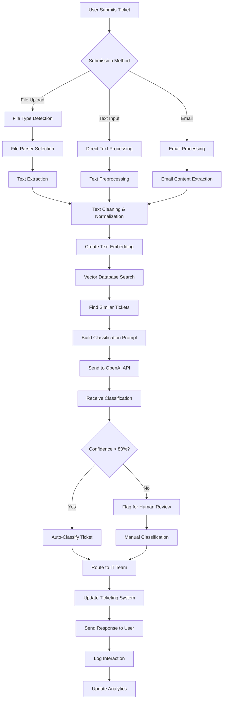

### Process Flow Timeline

| Phase | Duration | Key Activities | Deliverables |
|-------|----------|----------------|--------------|
| **Planning** | 2-3 weeks | Requirements gathering, team setup, technology assessment | Project charter, technical specifications |
| **Data Prep** | 3-4 weeks | Data collection, file processing, labeling, validation | 140+ labeled tickets, processed datasets |
| **API Development** | 4-6 weeks | FastAPI/Flask setup, endpoints, file processing, OpenAI integration, LoRA/QLoRA training | Working API with all endpoints and fine-tuned models |
| **Testing** | 2-3 weeks | Unit testing, integration testing, API testing, user acceptance testing | Tested and validated API system |
| **Deployment** | 1-2 weeks | Containerization, cloud deployment, monitoring setup | Live production API system |
| **Monitoring** | Ongoing | Performance monitoring, maintenance, continuous improvement | Optimized and maintained API system |

### API Development Requirements

**Python Dependencies (requirements.txt):**
```txt
# FastAPI/Flask Framework
fastapi==0.104.1
uvicorn[standard]==0.24.0
# Alternative: flask==3.0.0

# Database
sqlalchemy==2.0.23
alembic==1.12.1
psycopg2-binary==2.9.9

# File Processing
python-multipart==0.0.6
PyPDF2==3.0.1
python-docx==1.1.0
openpyxl==3.1.2
lxml==4.9.3

# OpenAI Integration
openai==1.3.7
tiktoken==0.5.1

# LoRA/QLoRA Fine-tuning
torch==2.1.0
transformers==4.35.0
peft==0.6.0
bitsandbytes==0.41.3
accelerate==0.24.0
datasets==2.14.0

# Vector Database
pinecone-client==2.2.4
# Alternative: weaviate-client==3.25.3

# Caching
redis==5.0.1

# Authentication & Security
python-jose[cryptography]==3.3.0
passlib[bcrypt]==1.7.4
python-multipart==0.0.6

# Monitoring & Logging
prometheus-client==0.19.0
python-json-logger==2.0.7

# Testing
pytest==7.4.3
pytest-asyncio==0.21.1
httpx==0.25.2

# Utilities
pydantic==2.5.0
python-dotenv==1.0.0
```

### Model Approach Comparison

| Approach | Accuracy | Cost | Training Time | Memory Usage | Model Size | Best For |
|----------|----------|------|---------------|--------------|------------|----------|
| **OpenAI API** | 90-95% | $0.10/ticket | 0 hours | 0 GB | 0 MB | Quick deployment, high accuracy |
| **LoRA Fine-tuning** | 95-98% | $0.05/ticket | 2-4 hours | 8-16 GB | <100 MB | Custom models, cost optimization |
| **QLoRA Fine-tuning** | 95-98% | $0.05/ticket | 2-4 hours | 4-8 GB | <100 MB | Limited GPU resources |
| **Full Fine-tuning** | 98-99% | $0.03/ticket | 12-24 hours | 40-80 GB | 1-7 GB | Maximum accuracy, unlimited resources |
| **Prompt Engineering** | 85-90% | $0.10/ticket | 0 hours | 0 GB | 0 MB | Rapid prototyping, simple tasks |

### Key Process Metrics

**Performance Metrics:**
- **Classification Accuracy**: >95% (with LoRA/QLoRA), >90% (OpenAI API)
- **Response Time**: <3 seconds for file processing
- **API Response Time**: <5 seconds for classification
- **System Uptime**: >99.5% availability
- **User Satisfaction**: >4.5/5 rating

**Cost Metrics:**
- **OpenAI API Costs**: <$0.10 per ticket classification
- **LoRA/QLoRA Costs**: <$0.05 per ticket classification (after training)
- **Infrastructure Costs**: <$500/month for hosting
- **Training Costs**: <$100 for LoRA/QLoRA fine-tuning
- **Maintenance Costs**: <$2000/month for ongoing support
- **ROI**: 400%+ within first year (with LoRA/QLoRA)

**Quality Metrics:**
- **False Positive Rate**: <3% (LoRA/QLoRA), <5% (OpenAI API)
- **False Negative Rate**: <2% (LoRA/QLoRA), <3% (OpenAI API)
- **Human Review Rate**: <15% (LoRA/QLoRA), <20% (OpenAI API)
- **User Adoption Rate**: >85% of IT support tickets

---

*This comprehensive project flow provides a complete framework for developing an IT ticket classification chatbot using OpenAI models. The system processes 7 different file types with 20 samples each, providing accurate classification and routing for IT support tickets with detailed process flows, diagrams, and metrics for successful implementation.*
