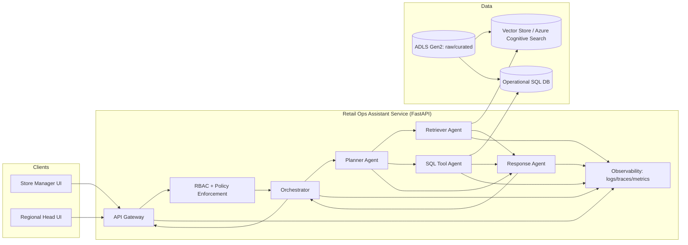
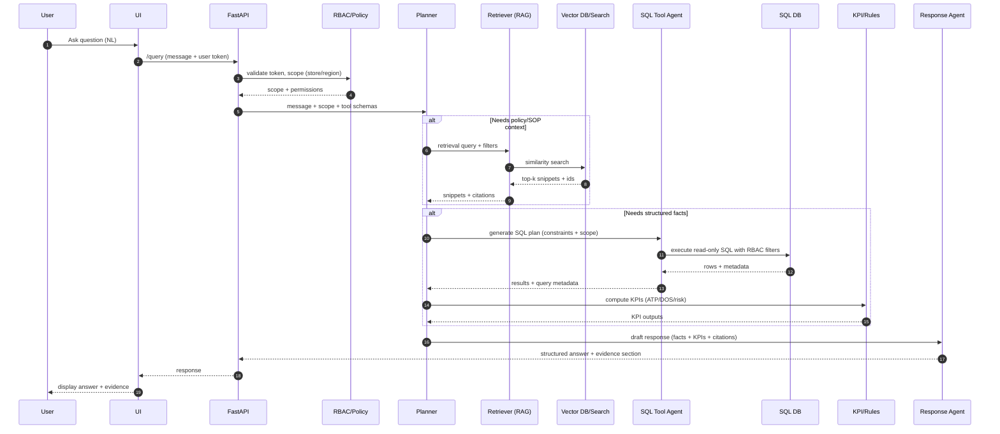

## Agentic AI Retail Operations Assistant (Multi-Agent Intelligent System)

### Problem statement
Retail ops teams (store managers, regional heads) routinely need **real-time answers** across multiple systems:
- **Inventory**: on-hand vs reserved, low-stock, stockout risk, store-to-store imbalance
- **Orders**: open orders, cancellations, fulfillment delays, top SKUs driving demand
- **Suppliers**: lead times, OTIF, defects, fill rate, risk signals
- **Sales**: daily trends, category mix, demand spikes and seasonality

Manual reporting (dashboards + ad-hoc SQL + spreadsheets) slows decisions. A traditional chatbot often fails because it:
- can’t **plan multi-step tasks** reliably
- lacks **grounded data access** (hallucination risk)
- doesn’t enforce **RBAC** (store vs region)

This project uses a **multi-agent architecture** with tool-using agents to generate **grounded, auditable answers**.

---

## Multiple paraphrased project write-ups (copy/paste)

### Option A (1-line, resume header)
Built an **agentic, multi-agent retail operations assistant** that answers inventory, orders, supplier, and sales questions using **RAG + SQL tools** with **RBAC** and grounded responses.

### Option B (2–3 lines, LinkedIn summary)
Developed a **multi-agent AI Retail Operations Assistant** that decomposes complex ops queries into plans, retrieves policy context via **RAG**, executes **safe SQL** for real-time data, and generates structured recommendations for store and regional leaders. Implemented **guardrails, RBAC, and observability** to reduce hallucinations and improve trust.

### Option C (detailed paragraph, project description)
Designed and implemented an **agentic retail ops assistant** using a multi-agent pattern (Planner, Retriever, SQL Executor, Response Agent) to handle operational questions end-to-end. The system performs **intent detection and task decomposition**, retrieves relevant SOP/policy context from a vector index, generates and executes **constrained read-only SQL** for inventory/orders/sales/supplier metrics, computes KPIs (ATP, DOS, stockout risk), and returns **evidence-backed** business responses with recommended actions. The assistant enforces **role-based access control** (store vs region), logs plans/tool calls for auditability, and supports continuous improvement via monitoring and feedback loops.

### Option D (STAR / interview narrative)
- **Situation**: Ops teams needed fast, reliable answers across inventory, sales, orders, and suppliers; manual reporting was slow and inconsistent.
- **Task**: Build an AI assistant that could answer natural language questions **without hallucinating** and respect store/region access.
- **Action**: Implemented a multi-agent workflow with RAG for policies and a guarded SQL tool for real-time facts; added RBAC filters, query allowlists, KPI computation, and full observability.
- **Result**: Improved operational responsiveness and reduced manual reporting effort by producing consistent, grounded, role-aware answers.

### Option E (bullet-style, concise)
- Multi-agent orchestration for retail ops Q&A (Planner/Retriever/SQL/Response)
- RAG grounding with FAISS/ChromaDB or Azure Cognitive Search
- Safe SQL generation/execution with allowlists, limits, and RBAC filters
- KPI computation (ATP/DOS/stockout risk) + action recommendations
- Logging/monitoring + feedback loop for continuous quality improvements

---

## Tech stack (typical implementation)
- **LLM**: OpenAI GPT-4 / GPT-3.5 (or Azure OpenAI)
- **Agents/orchestration**: LangChain Agents (or equivalent)
- **RAG**: FAISS / ChromaDB; production option: Azure Cognitive Search
- **Data**: ADLS Gen2 + SQL (Azure SQL/Postgres)
- **Backend**: FastAPI (microservice)
- **UI**: Streamlit (internal ops interface)
- **Security**: RBAC (store/regional scope), read-only SQL tool
- **Ops**: structured logging + traces + dashboards

## Roles & responsibilities (what you did)
- Designed the multi-agent architecture and end-to-end flow.
- Built intent detection + task decomposition for complex queries.
- Implemented retriever pipeline and SQL tool agent with strong guardrails.
- Added RBAC enforcement and response grounding with evidence.
- Shipped an internal UI and monitoring/feedback loop for improvement.

---

## End-to-end project flow (manager question → grounded answer)

```mermaid
flowchart TD
  U[User: store manager / regional head] --> UI[Chat UI (Streamlit/Teams/Portal)]
  UI --> API[FastAPI Gateway]
  API --> AUTH[AuthN/AuthZ + RBAC scope]
  AUTH --> PLAN[Planner Agent]

  PLAN -->|needs policy/context| RET[Retriever Agent (RAG)]
  RET --> VDB[(Vector DB / Azure Cognitive Search)]
  VDB --> RET

  PLAN -->|needs facts| SQLAG[SQL Tool Agent]
  SQLAG --> DB[(SQL Warehouse / Azure SQL / Postgres)]
  DB --> SQLAG

  PLAN --> KPI[KPI/Rules Engine]
  SQLAG --> KPI
  RET --> RESP[Response Agent]
  KPI --> RESP

  RESP --> API
  API --> UI
  UI --> U
```

**Key idea**: the assistant doesn’t “guess” inventory or KPIs. It plans, retrieves, queries, computes, and then responds with evidence.

---

## Architecture overview (multi-agent)

### Core agents
- **Planner Agent**
  - Converts a natural language question into a **task graph** (subtasks + required tools).
  - Decides whether the answer needs: retrieval, SQL, KPI computation, or policy checks.
  - Outputs a structured plan (e.g., JSON) to coordinate other agents.

- **Retriever Agent (RAG)**
  - Handles **unstructured knowledge**: SOPs, replenishment rules, supplier contracts, SKU descriptions, policy docs.
  - Uses embeddings + vector DB (FAISS/ChromaDB) and/or Azure Cognitive Search.
  - Returns **citations/grounding snippets** for response generation.

- **SQL Tool Agent (Executor)**
  - Generates **parameterized SQL** from the plan.
  - Enforces: allowed tables/columns, row-level filters (RBAC), and query limits.
  - Executes SQL, validates schema alignment, and returns results + metadata (runtime, rowcount).

- **Response Generation Agent**
  - Merges structured outputs (SQL results + computed KPIs + retrieved snippets).
  - Produces a **business response**: summary, key numbers, drivers, recommended actions, and “how computed”.
  - Adds uncertainty handling (“insufficient data”) instead of guessing.

### Architecture diagram (logical)



### Why multi-agent beats a single agent here
- **Separation of concerns**: planning vs retrieval vs execution reduces prompt complexity and improves reliability.
- **Tool correctness**: SQL execution happens in a controlled tool agent with strong constraints.
- **Auditability**: plan + SQL + retrieved snippets produce an evidence trail for operations.

---

## Data sources and grounding strategy

### Structured data (SQL)
Typically includes:
- Inventory snapshots (`inventory`)
- Orders and line items (`orders`, `order_lines`)
- Daily sales aggregates (`sales_daily`)
- Supplier performance scorecards (`supplier_scorecards`)

In this notes folder, you have a runnable sample dataset:
- `data/retail_ops_schema_and_seed.sql`

### Unstructured data (RAG documents)
Examples to index:
- replenishment SOPs (“reorder point”, “safety stock” policy)
- supplier SLA/contract summaries
- store operating constraints (delivery windows, holidays)
- product catalog descriptions and substitution rules

### Grounding pattern

**Evidence hierarchy (highest → lowest confidence):**
- **Executed SQL results** (from approved tables, filtered by RBAC)
- **Retrieved snippets** (policy/SOP/contract text with doc ids)
- **Model reasoning** (only to connect evidence, never invent facts)

**Typical request lifecycle**
- **Interpret**: detect intent(s) + entities (store/region, SKU/category, time window, metric).
- **Plan**: produce steps + tool calls + expected outputs.
- **Retrieve** (optional): fetch SOP/policy/contract context that defines business rules.
- **Query**: generate + execute SQL for current facts.
- **Compute**: derived KPIs (DOS, ATP, stockout risk, supplier risk).
- **Respond**: structured business answer + “next actions” + traceable evidence.

### Sequence diagram (single query)



---

## Intent detection and task decomposition

### Intent taxonomy (examples)
- **Inventory status**: “What’s the current stock of SKU-1002 in Noida?”
- **Shortage / risk**: “Which stores risk stockout for earbuds next week?”
- **Replenishment**: “What should I reorder today for S005?”
- **Supplier performance**: “Which supplier is impacting late deliveries?”
- **Sales trends**: “Top-selling SKUs in North region last 7 days?”
- **Operations summary**: “Give me a daily ops brief for my region.”

### Entity extraction
Common entities:
- **Scope**: store_id, region, city
- **Product**: sku, product_name, category, brand
- **Time**: last N days, date range, month, “today”
- **Metric**: low-stock, ATP, DOS, OTIF, fill rate, defect rate

### Decomposition patterns
Many questions require multiple subtasks, for example:
- “Which SKUs are low in S001 and which supplier is the bottleneck?”
  - Query low stock list (SQL)
  - Join/lookup supplier mapping (SQL or retrieved master data)
  - Retrieve replenishment SOP thresholds (RAG)
  - Generate actions (Response agent)

---

## SQL Tool Agent design (dynamic query generation + execution)

### Guardrails for correctness and safety
- **Allowlisted schema**: only approved tables/columns are queryable.
- **Read-only execution**: reject any `INSERT/UPDATE/DELETE/DROP/ALTER`.
- **Row limits**: enforce `LIMIT` and maximum runtime.
- **Parameterization**: avoid string concatenation; use bind parameters where supported.
- **RBAC filters**: inject `store_id IN (...)` or `region = ...` constraints.
- **Explainability**: return the SQL text (or a redacted version) + row counts.

### RBAC (role-based + row-level access)
Two typical roles:
- **Store Manager**
  - Can query: their own store(s) only (e.g., `store_id = 'S001'`).
  - Can see SKU-level and order-level details for their store.

- **Regional Head**
  - Can query all stores in region (e.g., `region = 'North'`).
  - Might be restricted from customer-level PII (not modeled here).

**Implementation options**
- **App-layer filters**: Planner/SQL agent injects filters before execution.
- **Database-layer controls**: views + row-level security policies (preferred in production).

---

## KPI and metric definitions (retail ops)

### Inventory metrics
- **Available-to-Promise (ATP)**: \( \text{ATP} = \max(\text{on_hand} - \text{reserved}, 0) \)
- **Low stock flag**: ATP < reorder_point (or ATP < safety_stock for “critical”)
- **Days of Supply (DOS)** (simple):  
  \( \text{DOS} = \frac{\text{ATP}}{\text{avg daily units sold}} \)  
  (avg daily units sold often computed over last 7/14/28 days)
- **Stockout risk**: rule-based score combining low DOS, high recent velocity, and supplier lead time.

### Sales metrics
- **Gross sales**: sum of pre-discount sales
- **Net sales**: after discounts/returns (modeled as `net_sales`)
- **Sell-through** (if receipts available): units sold / units received (not included in this sample schema)

### Supplier performance metrics
- **OTIF %**: on-time-in-full delivery ratio
- **Fill rate %**: supplied quantity / ordered quantity
- **Defect rate %**: defective units / received units
- **Lead time**: request → receipt duration

### Example “supplier risk” rule (illustrative)
Flag supplier as **high risk** if any:
- OTIF < 90%  
- avg lead time > (default lead time + 3 days)  
- defect rate > 2%

---

## Example SQL patterns (grounded answers)

### 1) Low stock list for a store (ATP + criticality)
```sql
SELECT
  i.store_id,
  i.sku,
  p.product_name,
  p.category,
  (i.on_hand_units - i.reserved_units) AS atp_units,
  i.reorder_point_units,
  i.safety_stock_units,
  CASE
    WHEN (i.on_hand_units - i.reserved_units) < i.safety_stock_units THEN 'CRITICAL'
    WHEN (i.on_hand_units - i.reserved_units) < i.reorder_point_units THEN 'LOW'
    ELSE 'OK'
  END AS stock_status
FROM inventory i
JOIN products p ON p.sku = i.sku
WHERE i.store_id = :store_id
ORDER BY stock_status DESC, atp_units ASC;
```

### 2) Top-selling SKUs in a region (daily aggregates)
```sql
SELECT
  s.region,
  sd.sku,
  p.product_name,
  SUM(sd.units_sold) AS units_sold,
  SUM(sd.net_sales) AS net_sales
FROM sales_daily sd
JOIN stores s ON s.store_id = sd.store_id
JOIN products p ON p.sku = sd.sku
WHERE s.region = :region
  AND sd.sales_date BETWEEN :start_date AND :end_date
GROUP BY s.region, sd.sku, p.product_name
ORDER BY units_sold DESC
LIMIT 10;
```

### 3) Supplier performance snapshot (scorecards)
```sql
SELECT
  sc.scorecard_month,
  sup.supplier_name,
  sc.otif_pct,
  sc.avg_lead_time_days,
  sc.defect_rate_pct,
  sc.fill_rate_pct
FROM supplier_scorecards sc
JOIN suppliers sup ON sup.supplier_id = sc.supplier_id
WHERE sc.scorecard_month = :month
ORDER BY sc.otif_pct ASC, sc.avg_lead_time_days DESC;
```

---

## Output format (business-first response)

### Recommended response structure
- **Summary**: 1–3 lines answering the question.
- **Key numbers**: small table-like bullets (ATP, DOS, OTIF, etc.).
- **Drivers / explanation**: what’s causing the issue (high velocity, low supply, supplier delays).
- **Recommended actions**:
  - reorder / transfer suggestions
  - promo adjustments (if overstock)
  - supplier escalation (if OTIF low)
- **Evidence**:
  - “Data timestamp” (inventory last updated)
  - “Queries run” (or query ids)
  - “Docs cited” (titles/snippets)

### Example answer (template)
- **Summary**: `S005` is at **critical stock** for `SKU-3002` (ATP 1), likely to stock out within ~2 days at recent velocity.
- **Key numbers**:
  - ATP: 1
  - Reorder point: 10
  - Safety stock: 6
  - Last updated: 2026-02-24 08:50
- **Actions**:
  - Place replenishment PO today; consider store transfer from `S001` (ATP 9).
  - Escalate to supplier if lead time > 21 days for electronics.

---

## Integration notes (Azure + microservices)

### Data layer (typical)
- **ADLS Gen2**: raw + curated zones for product catalog, inventory snapshots, order events, supplier feeds.
- **SQL store**: operational analytics (Azure SQL / Postgres) used by SQL Tool Agent.
- **Vector index**:
  - FAISS/ChromaDB for local/prototype
  - Azure Cognitive Search for production-grade indexing + filtering

### Ingestion pipeline (RAG)
- extract docs from ADLS or internal wikis
- clean + normalize + chunk
- embed (OpenAI embeddings or Azure OpenAI)
- write to vector store with metadata: doc_type, store/region scope, effective dates

### Service layer
- **FastAPI**:
  - auth (JWT/OAuth), RBAC claims (store_id/region)
  - endpoints: `/query`, `/health`, `/feedback`
  - request tracing + structured logs
- **Streamlit UI**:
  - role-aware login
  - chat-style interface + “show evidence” accordion
  - saved reports (daily briefs) for ops teams

---

## Logging, monitoring, and evaluation

### What to log (privacy-safe)
- request id / trace id
- role + scope (store/region) (no PII)
- plan JSON
- tool calls (SQL text can be redacted)
- retrieval doc ids + similarity scores
- response + groundedness metadata (did answer cite evidence?)

### Metrics to monitor
- latency (p50/p95) per agent
- tool success rate (SQL execution, retrieval hit rate)
- “no-result” rate (how often data is missing)
- hallucination indicators:
  - response contains numbers not present in SQL output
  - missing evidence when claims are made
- user feedback: thumbs up/down + reason tags

### Evaluation approach
- **Offline test set**:
  - curated “golden” questions with expected SQL and expected numbers
  - edge cases (ambiguous scope, missing SKU, out-of-policy requests)
- **Online monitoring**:
  - sample and review conversations weekly
  - add failure cases back into the test set (continuous improvement loop)

---

## How to use the sample dataset in this folder

From the project folder:

```bash
sqlite3 retail_ops.db < data/retail_ops_schema_and_seed.sql
```

Then try queries like:
- low stock by store
- top sellers by region/date range
- supplier performance ranking

---

## End-to-end walkthrough (example)

### User question
“Which SKUs are at risk of stockout in `S003` and what should I do today?”

### Planner decomposition
- Determine scope: store `S003`
- Pull current ATP and reorder/safety thresholds (SQL)
- Pull recent velocity (sales_daily) to estimate DOS (SQL)
- Apply risk rules (KPI)
- Return action plan (transfer/reorder/escalate) with evidence

### Example response output (business format)
- **Summary**: `S003` is at **critical/low** risk for selected SKUs based on ATP and recent sales velocity.
- **Key numbers**:
  - ATP, DOS (last 7 days), reorder point, safety stock
- **Actions**:
  - same-day transfer suggestions from nearby stores with surplus
  - create replenishment PO for critical SKUs
  - supplier escalation if lead time is high and DOS is low
- **Evidence**:
  - inventory timestamp + SQL query results rowcount

