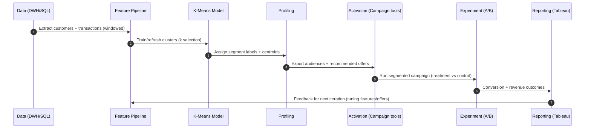

## Customer Segmentation for Personalized Marketing (Clustering)

### Business objective
Segment retail customers into **behaviorally similar groups** to enable:
- targeted promotions (right offer to right audience)
- higher conversion and engagement
- improved ROI vs blanket discounts

Reported impact (example outcome): **~15% increase in promotional offer conversions** after deploying segment-aware targeting and iterating campaigns with measurement.

---

## Multiple paraphrased project write-ups (copy/paste)

### Option A (1-line, resume header)
Built **customer segmentation** using **K-Means clustering** on RFM and behavioral features to enable personalized promotions and improve offer conversion by ~15%.

### Option B (2–3 lines, LinkedIn summary)
Developed a clustering-based customer segmentation model to group shoppers by purchase frequency, spend, discount sensitivity, channel preference, and category affinity. Converted clusters into actionable personas and promotion playbooks, then validated uplift with controlled A/B testing.

### Option C (detailed paragraph, project description)
Implemented an end-to-end customer segmentation solution for personalized marketing. I extracted customer/transaction data via SQL, engineered RFM and commercial features (recency, frequency, AOV, spend, discount sensitivity, online share, and category affinity), standardized the feature set, and trained a K-Means model with \(k\) selected using elbow/silhouette methods plus business interpretability. I profiled clusters into segment personas, partnered with marketing to design tailored offers and targeting rules per segment, and measured incremental impact through A/B experiments. Tableau dashboards tracked segment mix, conversion, revenue, and guardrail metrics, and a scheduled refresh + drift monitoring process kept segments stable over time.

### Option D (STAR / interview narrative)
- **Situation**: Blanket promotions were inefficient and didn’t match customer behavior.
- **Task**: Build customer segments that drive targeted campaigns and prove lift.
- **Action**: Created a feature pipeline (RFM + preferences), trained K-Means, produced personas and playbooks, activated audiences, and ran A/B tests with clear KPIs.
- **Result**: Delivered measurable improvement in promotional conversions (e.g., ~15% uplift) and a repeatable campaign iteration loop.

### Option E (resume bullets)
- Built RFM + behavioral feature pipeline using SQL + Python (AOV, recency, frequency, spend, discount sensitivity, channel share)
- Tuned K-Means clustering (k selection via elbow/silhouette + interpretability) and profiled clusters into personas
- Designed segment-level targeting rules and promotion playbooks with marketing stakeholders
- Measured incremental conversion lift via A/B tests and created Tableau dashboards for ongoing reporting
- Operationalized monthly refresh and drift monitoring for stable segments

---

## Tech stack (typical implementation)
- **Data**: SQL (feature tables/extracts), Excel (EDA)
- **Modeling**: Python (Pandas, scikit-learn), K-Means clustering
- **Visualization**: Tableau (segment and campaign dashboards)
- **Experimentation**: A/B tests with attribution windows and guardrail KPIs

## Roles & responsibilities (what you did)
- Defined segmentation objective and feature set aligned to marketing actions.
- Built feature engineering pipeline and trained clustering model.
- Delivered segment personas and campaign recommendations to stakeholders.
- Ran/monitored experiments and iterated based on measured outcomes.

## End-to-end project flow (data → segments → campaigns → lift)

```mermaid
flowchart TD
  A[Raw data sources] --> B[SQL extracts / Data mart]
  B --> C[Feature engineering (RFM + preferences)]
  C --> D[Preprocessing (impute + outliers + scaling)]
  D --> E[K-Means training + k selection]
  E --> F[Cluster profiling + personas]
  F --> G[Activation (audiences + offers)]
  G --> H[A/B testing + attribution]
  H --> I[Reporting (Tableau) + insights]
  I --> J[Iteration loop (update offers + re-train)]

  subgraph Sources
    A1[Customer master]
    A2[Transactions]
    A3[Channel events (optional)]
    A4[Returns/CS (optional)]
  end
  A1 --> A
  A2 --> A
  A3 --> A
  A4 --> A
```

---

## Architecture diagram (analytics + activation)

```mermaid
flowchart LR
  subgraph Data["Data Layer"]
    OLTP[(POS/Online Orders DB)]
    CRM[(CRM / Loyalty)]
    DWH[(SQL Data Warehouse)]
  end

  subgraph ML["ML & Analytics"]
    FE[Feature pipeline (Python/SQL)]
    TRAIN[K-Means training + evaluation]
    REG[(Model registry / artifacts)]
    SCORE[Batch scoring (weekly/monthly)]
    PROF[Segment profiling]
  end

  subgraph Activation
    CDP[Audience export (CSV/API)]
    CAM[Campaign tools (Email/SMS/Ads)]
    EXP[Experimentation / A-B platform]
  end

  subgraph BI["BI & Monitoring"]
    TAB[Tableau dashboards]
    DRIFT[Drift + KPI monitoring]
  end

  OLTP --> DWH
  CRM --> DWH
  DWH --> FE --> TRAIN --> REG
  REG --> SCORE --> PROF
  PROF --> CDP --> CAM --> EXP
  EXP --> TAB
  SCORE --> DRIFT
  EXP --> DRIFT
```

---

## Data used

### Typical raw inputs
- **Customer master**: demographics, location, loyalty tier, opt-in status
- **Transactions**: order lines, timestamps, channels, product categories, prices, discounts
- Optional enrichments: web/app events, returns, customer service history, CLV labels

In this folder, you have synthetic sample files:
- `data/customers.csv`
- `data/transactions.csv`
- `data/customer_features_and_segments.csv` (example engineered features + cluster labels)

---

## Feature engineering (most important part)

### Core behavioral features (RFM-style)
- **Recency**: days since last purchase
- **Frequency**: number of purchases in last N days (e.g., 90 days)
- **Monetary value**: average order value (AOV), total spend in last N days

### Commercial/marketing features
- **Discount sensitivity**: average discount %, share of discounted orders
- **Channel preference**: online share vs store share
- **Category affinity**: top category; share of spend by category (Electronics/Apparel/FMCG/Grocery)
- **Loyalty tier**: encode ordinally or one-hot

### Practical notes
- Use a consistent window (e.g., **last 90 days**) for frequency and spend to reduce seasonality noise.
- Winsorize or cap extreme spenders so one outlier doesn’t dominate cluster centers.
- Always **scale numeric features** (StandardScaler or RobustScaler) before K-Means.

---

## Modeling approach (K-Means)

### Why K-Means
- fast and scalable for large customer bases
- produces segment centers that are easy to interpret
- works well when segments are roughly spherical in feature space (after scaling)

### Preprocessing checklist
- handle missing values (impute or drop)
- deduplicate customers
- remove or treat outliers (esp. spend)
- scale features
- verify feature distributions (skew, long tails)

### Choosing \(k\)
Common techniques:
- **Elbow method** (inertia vs \(k\))
- **Silhouette score**
- Cluster interpretability (business validity)

In practice: select a \(k\) that balances **separation** and **actionability** (too many clusters become hard to market to).

---

## Segment profiling (turn clusters into personas)

After clustering, compute per-segment summaries:
- size and revenue share
- AOV, frequency, recency
- discount sensitivity
- channel mix
- category mix

Example segment personas used in this sample:
- **Segment 0 — Premium Tech Enthusiasts**
  - high AOV, frequent, electronics-heavy, relatively low discount sensitivity
  - **campaign ideas**: early access, bundles, warranty add-ons, premium membership

- **Segment 1 — Value Fashion Shoppers**
  - apparel/footwear skew, moderate AOV, promotion-responsive
  - **campaign ideas**: limited-time fashion drops, “buy 2 get 1”, cart reminders

- **Segment 2 — Grocery & Essentials Regulars**
  - frequent low/medium basket, FMCG/Grocery skew, stable repeat behavior
  - **campaign ideas**: subscriptions, replenishment reminders, multi-buy offers

- **Segment 3 — Occasional Bargain Hunters**
  - low frequency, high recency (inactive), very promo-driven
  - **campaign ideas**: win-back offers, first-order coupon, personalized best-sellers

---

## Personalization strategy (how segments drive marketing)

### Offer design by segment
- Define a **promotion playbook**: for each segment specify
  - offer type (flat %, bundle, free shipping, cashback)
  - product/category focus
  - max discount cap and guardrails
  - recommended channel (email/SMS/push/ads)
  - cadence and frequency limits

### Audience selection rules
- filter by opt-in and compliance
- exclude recent purchasers when running win-back
- add business constraints (inventory availability, margin floors)

---

## Measurement (how “15% lift” is validated)

### Experiment design
- Run A/B tests:
  - **Control**: generic promotion
  - **Treatment**: segment-based targeting (offer + creative + category)
- Randomize within segment to avoid bias.
- Ensure sufficient sample size and consistent attribution windows.

### KPIs
- **Conversion rate** (primary)
- Incremental revenue and margin
- Average discount given
- Repeat rate / retention
- Unsubscribe / complaint rates (guardrail)

### Reporting
Use Tableau dashboards to show:
- segment distribution across cities/tiers
- conversion uplift by segment and channel
- offer performance over time

---

## Example workflow (Python)

```python
import pandas as pd
from sklearn.preprocessing import StandardScaler
from sklearn.cluster import KMeans

customers = pd.read_csv("data/customers.csv")
txns = pd.read_csv("data/transactions.csv", parse_dates=["txn_date"])

# 1) Build RFM + behavioral features over last 90 days
# 2) Scale features
# 3) Fit KMeans(k=4)
# 4) Profile clusters and attach segment personas
```

---

## Example SQL extracts (for feature building)

### Purchases, spend, AOV by customer (last 90 days)
```sql
SELECT
  customer_id,
  COUNT(DISTINCT txn_id) AS purchases_90d,
  SUM(qty * unit_price * (1 - discount_pct/100.0)) AS spend_90d,
  AVG(qty * unit_price * (1 - discount_pct/100.0)) AS aov_90d
FROM transactions
WHERE txn_date >= DATE('now', '-90 day')
GROUP BY customer_id;
```

### Discount sensitivity
```sql
SELECT
  customer_id,
  AVG(discount_pct) AS discount_pct_avg,
  AVG(CASE WHEN discount_pct > 0 THEN 1.0 ELSE 0.0 END) AS discounted_order_share
FROM transactions
GROUP BY customer_id;
```

---

## Operationalizing segmentation

### Production loop
- refresh features weekly/monthly
- re-score customers into clusters
- monitor drift:
  - segment size changes
  - centroid movement
  - feature distribution shifts

### Sequence diagram (campaign iteration loop)



### Common pitfalls
- too many clusters without clear actions
- mixing seasonality spikes with “core behavior”
- not scaling features (K-Means becomes spend-only clustering)
- labeling clusters without profiling validation

