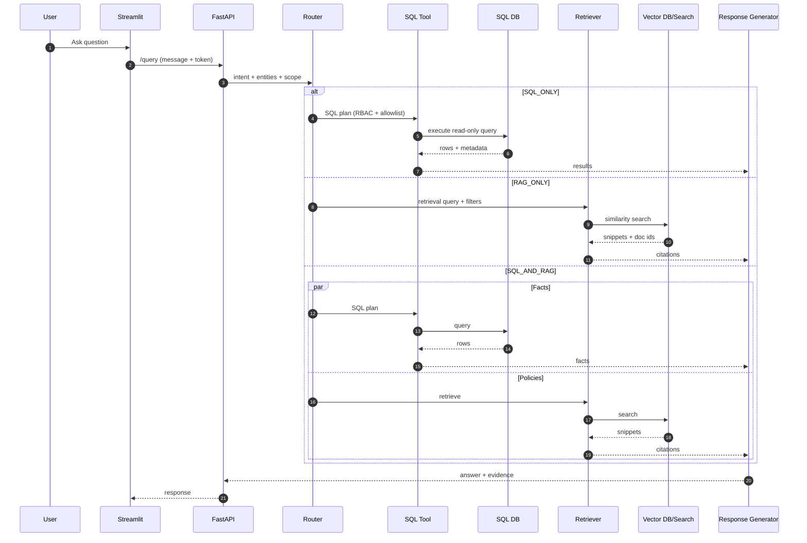
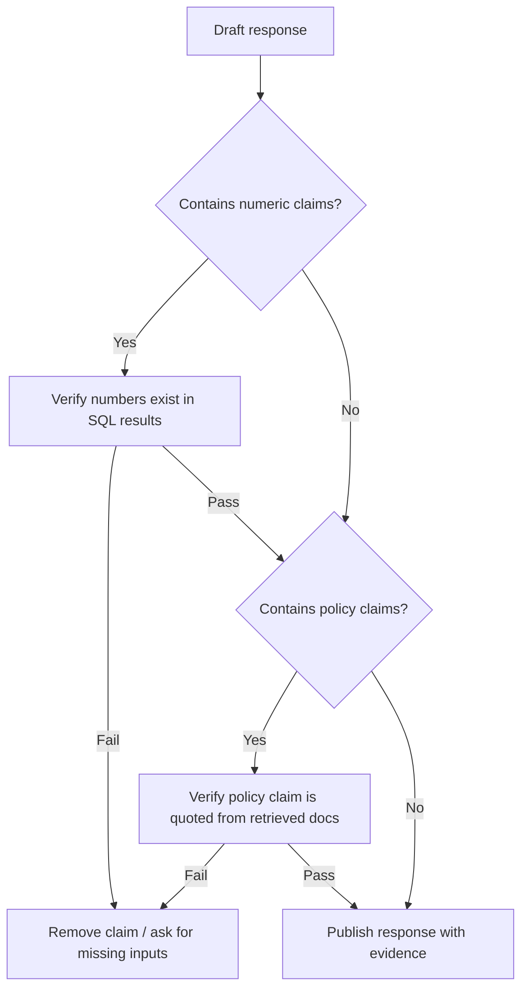

## Retail Chatbot for Inventory and Order Queries (Generative AI + RAG)

### Goal
Enable store managers and support teams to ask **natural language questions** and receive **grounded answers** about:
- stock availability (ATP)
- product pricing and active offers
- order status and recent order activity
- supplier details / escalation steps

Key design requirement: **minimize hallucinations** by grounding responses in:
- SQL data (inventory, orders, pricing, offers)
- retrieved documents (policies, SOPs, offer terms)

---

## Multiple paraphrased project write-ups (copy/paste)

### Option A (1-line, resume header)
Built a **Retail RAG chatbot** for inventory/order/price queries using **SQL grounding + vector retrieval**, deployed via **FastAPI + Streamlit** with RBAC and hallucination guardrails.

### Option B (2–3 lines, LinkedIn summary)
Developed a Generative AI retail assistant that answers internal queries about stock, pricing, offers, and order status using a **tool-based RAG approach**. The system routes questions to **SQL** for real-time numbers and to **retrieval** for policy/terms, then generates evidence-backed responses with citations and role-based access control.

### Option C (detailed paragraph, project description)
Implemented an internal retail chatbot powered by Retrieval-Augmented Generation to reduce time spent on manual inventory and order lookups. I built a RAG ingestion pipeline (document loading, cleaning, chunking, embeddings, and indexing in FAISS/ChromaDB or Azure Cognitive Search) and integrated a guarded SQL tool for operational data (inventory snapshots, orders, pricing, offers). A router classified queries into SQL-only, RAG-only, or hybrid execution, and the response generator enforced grounding rules: numeric claims must match SQL outputs and policy claims must be quoted from retrieved documents. The solution was exposed through a secure FastAPI microservice with RBAC and shipped with a Streamlit UI plus logging/monitoring and feedback loops for continuous improvement.

### Option D (STAR / interview narrative)
- **Situation**: Support and store teams needed quick answers on inventory, pricing, offers, and orders; traditional chatbots hallucinated and lacked data grounding.
- **Task**: Deliver a reliable internal assistant that is secure (RBAC) and evidence-based.
- **Action**: Built RAG ingestion + vector retrieval for policies, added a constrained SQL tool for real-time facts, implemented routing and claim-gating guardrails, and deployed via FastAPI + Streamlit with observability.
- **Result**: Reduced dependency on manual query resolution and improved response reliability through grounded, cited outputs.

### Option E (resume bullets)
- Built a tool-routed RAG assistant for inventory/price/order queries (SQL grounding + doc retrieval)
- Implemented ingestion pipeline (chunking/embeddings/indexing) with FAISS/ChromaDB or Azure Cognitive Search
- Added SQL safety: allowlisted schema, read-only execution, RBAC filters, and query limits
- Deployed FastAPI microservice + Streamlit UI; added logs/metrics and feedback-driven iteration

---

## Tech stack (typical implementation)
- **LLM**: OpenAI GPT-3.5 / GPT-4 (or Azure OpenAI)
- **RAG**: LangChain, FAISS/ChromaDB, Azure Cognitive Search
- **Data**: ADLS Gen2 + SQL (inventory/orders/pricing/offers)
- **Backend/UI**: FastAPI + Streamlit
- **Security/Ops**: RBAC, structured logging, monitoring

## End-to-end flow (user query → routed tools → grounded response)

```mermaid
flowchart TD
  U[User] --> UI[Streamlit Chat UI]
  UI --> API[FastAPI /query]
  API --> AUTH[Auth + RBAC scope]
  AUTH --> ROUTE[Intent + Router]

  ROUTE -->|SQL_ONLY| SQLT[SQL Tool]
  ROUTE -->|RAG_ONLY| RET[Retriever]
  ROUTE -->|SQL_AND_RAG| BOTH[Parallel tools]

  SQLT --> DB[(SQL DB)]
  DB --> SQLT

  RET --> VDB[(FAISS/Chroma/Azure Cognitive Search)]
  VDB --> RET

  BOTH --> SQLT
  BOTH --> RET

  SQLT --> G[Response Generator]
  RET --> G
  ROUTE --> G

  G --> EVID[Evidence pack (SQL metadata + doc citations)]
  EVID --> API --> UI --> U
```

---

## High-level architecture

### Components
- **Streamlit UI**
  - internal chat interface
  - shows “evidence” (SQL + document citations)
  - captures feedback (thumbs up/down + tags)

- **FastAPI backend (microservice)**
  - authentication + RBAC (store vs regional access)
  - request routing (retrieve vs SQL vs both)
  - logging/tracing
  - tool execution (SQL client, search client, vector DB)

- **RAG pipeline**
  - document ingestion (from ADLS Gen2 / internal docs)
  - chunking + embeddings
  - vector retrieval (FAISS/ChromaDB) or Azure Cognitive Search
  - response generation with citations

- **SQL data layer**
  - operational tables for inventory snapshots, orders, pricing, offers
  - read-only access for the assistant

### Architecture diagram (deployment view)

```mermaid
flowchart LR
  subgraph Client
    SUI[Streamlit UI]
  end

  subgraph Service["FastAPI Retail Assistant"]
    GW[API + Rate limit]
    RBAC[RBAC/Policy]
    ORCH[Orchestrator/Router]
    LLM[LLM (GPT-3.5/4)]
  end

  subgraph Tools["Tools & Data"]
    SQL[(SQL DB)]
    V[(Vector DB / Azure Cognitive Search)]
    ADLS[(ADLS Gen2 - docs + datasets)]
    LOG[(Logging/Monitoring)]
  end

  SUI --> GW --> RBAC --> ORCH
  ORCH -->|SQL tool| SQL
  ORCH -->|Retrieve| V
  ADLS --> V
  ADLS --> SQL
  ORCH --> LLM --> ORCH
  GW --> LOG
  ORCH --> LOG
```

---

## Data model (sample)

This project folder contains a runnable seed file:
- `data/rag_retail_schema_and_seed.sql`

Key tables:
- `inventory_snapshot`: on-hand and reserved units per store and snapshot timestamp
- `orders`, `order_items`: order lifecycle and purchased items
- `pricing`: list prices (effective-dated)
- `offers`: offer definitions + terms (also useful for RAG as text)

---

## RAG ingestion pipeline (documents)

### Input sources
- ADLS Gen2 “curated” container (policies/SOPs)
- supplier contracts and SLA summaries
- offer terms, coupon rules, return policies
- product catalog descriptions

### Chunking strategy
- chunk by semantic sections (headings) instead of fixed size where possible
- maintain metadata:
  - `doc_id`, `doc_type`, `effective_from`, `effective_to`
  - `scope`: store_id/region if applicable

### Embeddings + storage
- embeddings: OpenAI / Azure OpenAI embeddings models
- vector DB:
  - **FAISS**: fast local prototyping
  - **ChromaDB**: persistent local storage + metadata filtering
  - **Azure Cognitive Search**: enterprise indexing, filters, and security integration

Sample index content for prototyping lives in:
- `docs/knowledge_base.md`

### Ingestion flow diagram (ADLS → vector index)

```mermaid
flowchart TD
  A[ADLS Gen2 / Docs sources] --> B[Document loader]
  B --> C[Cleaning + normalization]
  C --> D[Chunking (by heading/section)]
  D --> E[Embeddings]
  E --> F[(Vector store)]
  F --> G[Retriever (top-k + filters)]
```

---

## Query routing (when to use SQL vs retrieval)

### Examples
- “How many units of AirLite earbuds in Noida store?” → **SQL**
- “Is Footwear Flash Sale combinable with other coupons?” → **Retrieve docs**
- “What’s the price of SKU-1002 and are there offers today?” → **SQL + Retrieve docs**
- “What’s the return policy for smartwatches?” → **Retrieve docs** (policy)

### Tool-based pattern (LangChain style)
- **Router** decides:
  - `SQL_ONLY`
  - `RAG_ONLY`
  - `SQL_AND_RAG`
- **SQL tool** executes read-only queries under RBAC constraints.
- **Retriever** returns top-k snippets with doc ids and similarity scores.

### Sequence diagram (routing + grounded generation)



---

## Guardrails to reduce hallucinations

### Grounding rules
- Any numeric claim must come from SQL results.
- Any policy claim must quote from retrieved docs.
- If neither has evidence, respond with:
  - “I don’t have enough information to answer reliably”
  - next-step options (run different query, ask for store/SKU/date)

### SQL guardrails
- allowlist tables/columns
- force `LIMIT`
- block DML/DDL
- enforce RBAC filters
- attach query metadata to the final answer

### Prompt guardrails
An example system prompt template is included:
- `prompts/system_prompt.md`

### Guardrail flow (claim gating)



---

## Example SQL snippets (for the SQL Tool Agent)

### Inventory availability (ATP) for a store at latest snapshot
```sql
WITH latest AS (
  SELECT MAX(snapshot_ts) AS snapshot_ts
  FROM inventory_snapshot
  WHERE store_id = :store_id
)
SELECT
  i.store_id,
  i.sku,
  p.product_name,
  (i.on_hand_units - i.reserved_units) AS atp_units,
  i.snapshot_ts
FROM inventory_snapshot i
JOIN latest l ON l.snapshot_ts = i.snapshot_ts
JOIN products p ON p.sku = i.sku
WHERE i.store_id = :store_id
  AND i.sku = :sku;
```

### Price + applicable offers (today)
```sql
SELECT
  p.sku,
  p.product_name,
  pr.list_price,
  off.offer_name,
  off.discount_pct,
  off.start_date,
  off.end_date,
  off.channel
FROM products p
JOIN pricing pr ON pr.sku = p.sku
LEFT JOIN offers off
  ON (off.sku = p.sku OR off.category = p.category)
 AND DATE('now') BETWEEN off.start_date AND off.end_date
WHERE p.sku = :sku;
```

### Order status lookup
```sql
SELECT
  o.order_id,
  o.order_ts,
  o.store_id,
  o.channel,
  o.status
FROM orders o
WHERE o.order_id = :order_id;
```

---

## Response design (what users see)

### Structured business response
- **Answer**: direct, short
- **Details**: inventory/price/order/offer specifics
- **Evidence**
  - SQL: timestamp + rowcount + (optional) query id
  - Docs: doc ids + quoted lines
- **Next actions**
  - check alternative store availability
  - create replenishment ticket / escalate supplier

---

## Deployment notes (FastAPI + Streamlit)

### FastAPI responsibilities
- authenticate and decode RBAC claims
- validate/normalize user inputs (SKU, store, dates)
- orchestrate:
  - retrieval (vector DB / Azure Cognitive Search)
  - SQL execution (read-only)
  - response generation with citations
- log traces + errors

### Streamlit responsibilities
- login + role selection
- chat UI + “show evidence” panel
- feedback capture (helps continuously improve prompts and retrieval)

---

## Monitoring and evaluation

### Online monitoring
- latency p50/p95
- retrieval hit rate (did we find relevant docs?)
- SQL success rate
- groundedness:
  - % of answers with citations when required
  - mismatch checks (numbers not present in SQL output)

### Offline evaluation
- create a “golden set” of:
  - inventory questions (by store/SKU)
  - pricing + offer eligibility questions
  - policy questions (returns, coupon stacking)
- score:
  - factual accuracy
  - citation correctness
  - refusal quality (when data missing)

---

## End-to-end walkthroughs (examples)

### Walkthrough A: Inventory availability
**Question**: “How many units of `SKU-3002` are available in `S002`?”
- Router: SQL_ONLY
- SQL: latest snapshot ATP \(= on_hand - reserved\)
- Response: ATP + snapshot timestamp + evidence

### Walkthrough B: Offer stacking policy
**Question**: “Can I combine Footwear Flash Sale with another coupon?”
- Router: RAG_ONLY
- Retrieval: coupon/offer policy doc
- Response: cite non-combinable rule + next steps

### Walkthrough C: Price + offers today
**Question**: “Price of `SKU-1002` and any offers today?”
- Router: SQL_AND_RAG
- SQL: list price + join offers valid today
- Retrieval: terms/eligibility language for offer
- Response: show discounted price + validity window + terms citation

