# Agentic AI Notes

---

## 1.1 Evolution of AI Systems

### Traditional ML vs Generative AI

| Aspect | Traditional ML | Generative AI |
|--------|----------------|---------------|
| **Goal** | Predict a label, value, or class from input | Generate new content (text, image, code) |
| **Output** | Single prediction (e.g., classification, regression) | Sequences or structured outputs (sentences, images) |
| **Training** | Supervised/unsupervised on labeled or unlabeled data | Often pre-trained on massive text/code/data, then fine-tuned |
| **Flexibility** | Task-specific; new task = new model or retrain | One model can do many tasks via prompting |
| **Interpretability** | Feature importance, decision boundaries | Harder; emergent capabilities, in-context learning |

**Traditional ML (discriminative):**
- Focus on **discriminative** tasks: given an input, predict a label, value, or class. Examples: “Is this email spam?”, “What is the sentiment?”, “What’s the next value in the time series?”
- Training is typically supervised (labeled data) or unsupervised (clustering, dimensionality reduction). Each use case often needs a dedicated model or retraining.
- Output is usually a single prediction or a fixed set of scores. Interpretability is relatively straightforward (e.g., feature importance, decision boundaries).
- **Limitation for complex tasks**: No native ability to generate long-form text, multi-step plans, or use external tools; adding new capabilities usually means new data and retraining.

**Generative AI:**
- Focus on **generative** tasks: produce new content—text, code, images, audio—conditioned on prompts or context. Examples: “Write an email,” “Summarize this doc,” “Generate an image from a description.”
- Often built on **large language models (LLMs)** (e.g., GPT-4, Claude, Llama) or **diffusion models** (e.g., DALL·E, Stable Diffusion). Pre-trained on very large corpora, then optionally fine-tuned or used with prompts only.
- One model can address many tasks via **prompting** (instructions, few-shot examples) without retraining. Output is sequential (tokens or pixels) and can be long and structured.
- **Emergent behaviors**: Few-shot learning, chain-of-thought reasoning, following instructions, and tool use when combined with the right interfaces. Interpretability is harder due to scale and emergent capabilities.

---

### LLM-based Systems

**What LLMs are:**
- **LLMs** (e.g., GPT-4, Claude, Llama, Gemini) are large neural networks trained to predict the **next token** (word or subword) given preceding context. Training is usually on massive text and code from the web, books, and other sources.
- They learn grammar, facts, reasoning patterns, and style from data. Size (billions of parameters) and data scale contribute to **emergent abilities**: following instructions, few-shot learning, and step-by-step reasoning when prompted appropriately.

**How they are used:**
- **Standalone APIs**: Application sends a prompt (and optionally system message, few-shot examples) → API returns generated text. No built-in loop or tools; the app handles any follow-up or parsing.
- **Backbone of applications**: LLMs power chatbots, coding assistants (e.g., Copilot), summarizers, Q&A systems, and content generators. The “intelligence” is in the model; the application provides context, tools, and UX.

**Key traits:**
- **Scale**: Billions of parameters; training and inference require significant compute. Served via cloud APIs or self-hosted with GPU clusters.
- **Context window**: The model only “sees” a limited number of tokens per request (e.g., 4K–128K+). Everything the model “knows” for that call must fit in the prompt (recent conversation, retrieved docs, tool results). No native long-term memory across sessions.
- **Emergent abilities**: Improve with model size and better prompting: instruction following, chain-of-thought, tool use (when the app parses and executes tool calls and feeds back results). These behaviors are what make LLMs suitable as the **reasoning engine** inside agents.

---

### From Prompt Engineering → AI Agents → Agentic Systems

**1. Prompt engineering**
- The human designs a **fixed prompt** (instruction, format, and often few-shot examples). The application sends this prompt (plus user input) to the LLM in a **single call** and uses the output directly or with light parsing (e.g., extract JSON).
- **Strengths**: Simple to implement; no loops or state; works well for narrow, well-defined tasks (summarize, classify, format).
- **Limitations**: No loops (no iterative refinement); no tools (no live data, APIs, or code execution); no persistent memory across turns or sessions. If the task requires multiple steps or external information, the human must do it or the prompt must contain everything in one shot.

**2. AI agents**
- An **agent** is a system that can **decide** what to do next: call a tool (search, API, DB, code), use the result, and repeat. The loop is: *perceive (user input + context) → reason (choose action) → act (execute tool) → observe (result) → perceive again* until the agent produces a final answer or gives up.
- The **reasoning** step is usually an LLM call with: current goal, conversation/tool history, and a list of available tools (name, description, parameters). The LLM returns either a tool call (name + arguments) or a final answer. The application executes the tool, appends the observation to the conversation, and calls the LLM again.
- This moves from “one prompt, one answer” to **multi-step, tool-augmented** behavior. The agent can gather information, try alternatives, and adapt to tool results. Single-agent architectures (ReAct, tool-calling, planner–executor) fit here.

**3. Agentic systems**
- **Agentic** often implies **multiple** agents or agent-like components (e.g., planner, executor, critic, specialist agents) working together under some **orchestration**. Orchestration defines who does what, in what order, and how handoffs and feedback work (e.g., manager–worker, debate, role-based routing).
- The system is **goal-driven**: given a high-level goal, it decomposes work, assigns tasks, runs tools, and replans or retries based on feedback. Coordination, shared state, and governance (who can call which tools, audit trails) become important. Enterprise multi-agent workflows (HR, DevOps, support, sales) and scalable deployment (load balancing, failover, state sync) are part of building production agentic systems.

---

### Limitations of Single-Shot LLMs

- **No tools**: The model only outputs text. It cannot read live data (e.g., current weather, database rows), call APIs, run code, or change external state. Any “action” must be done by the application outside the model; single-shot prompting does not loop to use results in a next step.
- **Fixed context**: The model only “remembers” what is in the current prompt (and that prompt is limited by the context window). There is no built-in long-term or cross-session memory. To mimic memory, the app must re-inject relevant history or retrieved data into every prompt.
- **One shot**: Single request → single response. There is no iterative refinement, multi-step planning, or “try again with the error message.” Complex tasks that need several steps or corrections are hard to do reliably in one call.
- **Hallucination & staleness**: The model can invent facts, cite non-existent sources, or use outdated knowledge (training cutoff). There is no guaranteed grounding in real-time or private data unless the application explicitly retrieves it and puts it in the prompt (e.g., RAG).
- **No verification**: There is no built-in “check my work”—e.g., run generated code, validate an answer against a knowledge base, or ask a human. The application must add verification and guardrails if needed.
- **Limited reliability**: Output format and correctness can vary with temperature and prompt. For critical workflows (compliance, safety, money), single-shot LLM output is usually not sufficient without guardrails, validation, and often human-in-the-loop.

**How agentic AI addresses these:** By adding **tools** (so the system can act on the world), **memory** (short- and long-term, including vector and episodic), **multi-step reasoning** (loops: plan → act → observe → replan), and **feedback loops** (use tool results and errors to decide the next action). Together, these turn an LLM into the brain of an **agent** that can pursue goals over many steps and adapt to outcomes.

**Full flow: Evolution from single-shot to agentic**

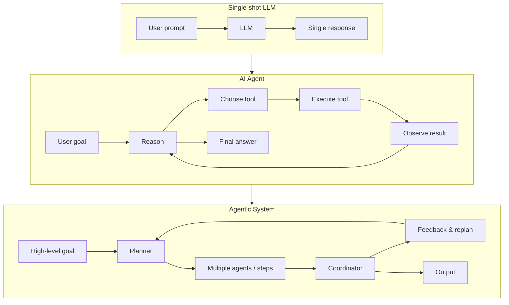
```mermaid
flowchart TB
    subgraph Single["Single-shot LLM"]
        A1[User prompt] --> A2[LLM]
        A2 --> A3[Single response]
    end
    subgraph Agent["AI Agent"]
        B1[User goal] --> B2[Reason]
        B2 --> B3[Choose tool]
        B3 --> B4[Execute tool]
        B4 --> B5[Observe result]
        B5 --> B2
        B2 --> B6[Final answer]
    end
    subgraph Agentic["Agentic System"]
        C1[High-level goal] --> C2[Planner]
        C2 --> C3[Multiple agents / steps]
        C3 --> C4[Coordinator]
        C4 --> C5[Feedback & replan]
        C5 --> C2
        C4 --> C6[Output]
    end
    Single --> Agent --> Agentic
```

---

## 1.2 What is Agentic AI?

### Autonomous Decision-Making Systems

- **Agentic AI** refers to AI systems that can **autonomously** make decisions and take actions to achieve goals, rather than only answering a single query with one response. The system has a **loop**: it perceives the current situation, decides what to do next (including calling tools), acts, observes the result, and repeats until the goal is met or a stopping condition is reached.
- **Key characteristics:**
  - **Autonomy**: The system chooses *what* to do and *when*—e.g., which tool to call, with what arguments, whether to retry after a failure, or when to ask the user for help. These choices are driven by the LLM (or a planner) and the current context, not by a fixed script.
  - **Goal-oriented**: The user or system provides a **goal** (e.g., “Summarize all open bugs and suggest priorities,” “Book a meeting with the team next week”). The agent works toward that goal over multiple steps, possibly using several tools and replanning as needed.
  - **Environment interaction**: The agent interacts with the outside world through **tools**: it can *read* state (e.g., search the web, query a database, read files) and *change* state (e.g., create a ticket, send an email, update a record). This makes the agent useful for real workflows, not just conversation.

---

### Agents vs Assistants vs Workflows

| Concept | Description |
|--------|-------------|
| **Agent** | Entity that perceives, reasons, and acts in an environment; can use tools and iterate until a goal is met. |
| **Assistant** | Often a conversational interface (e.g., chatbot) that may or may not use tools; can be single-turn or multi-turn but not necessarily goal-driven and autonomous. |
| **Workflow** | Predefined sequence of steps (e.g., “if A then B then C”); deterministic or rule-based. An **agent** can *decide* to run workflows or steps as part of its plan. |

- **Agentic** = agent-like behavior: **autonomous**, **goal-driven**, **tool-using**, with **loops** (plan → act → observe → replan).

---

### Reactive vs Proactive Agents

- **Reactive**: Responds to events or user input. Example: “User asked a question → answer it” or “Alert fired → run diagnostic.”
- **Proactive**: Initiates actions without a direct user request. Example: “Noticed anomaly → run checks and notify,” or “Goal: keep dashboard updated → periodically fetch and refresh data.”

Agentic systems can be **reactive** (triggered by user or event) or **proactive** (background goals, monitoring, scheduled tasks), or both.

| Trait        | Reactive agent                    | Proactive agent                          |
|-------------|------------------------------------|------------------------------------------|
| **Trigger** | User message, webhook, event       | Timer, goal, or internal state           |
| **Example** | Answer question; run runbook on alert | Nightly report; anomaly then notify    |
| **Flow**    | Event → agent → response           | Schedule/goal → agent → action           |

---

### Goal-Driven Execution

- The agent is given a **goal** (e.g., “Summarize all open bugs and suggest priorities” or “Book a meeting with the team next week”). Everything the agent does is in service of that goal.
- **Typical execution flow:**
  - **Plan**: Decompose the goal into steps or sub-goals. Planning can be done once up front (planner–executor) or updated after each step (ReAct-style). The plan might be a list of tool calls or natural-language steps that are then executed.
  - **Act**: Execute the next step—usually by calling a tool (search, read a doc, call an API, run code) or delegating to another agent. The action is chosen by the reasoning engine (e.g., LLM) based on the current context and available tools.
  - **Observe**: Collect the result of the action—tool output, error message, or state change. This observation is fed back into the agent’s context so it can decide what to do next.
  - **Replan**: If the observation indicates failure, ambiguity, or new information, the agent may **replan**: retry with different parameters, try a different tool, or ask the user for clarification. The loop continues until the goal is satisfied, a failure is accepted (with or without escalation), or a human is asked to intervene.
- **Stopping conditions**: Execution stops when the agent produces a final answer that meets the goal, hits a max step limit, encounters an unrecoverable error, or explicitly asks for human help. In production, timeouts and cost limits are also common stopping conditions.

**Full flow: Goal-driven execution loop**

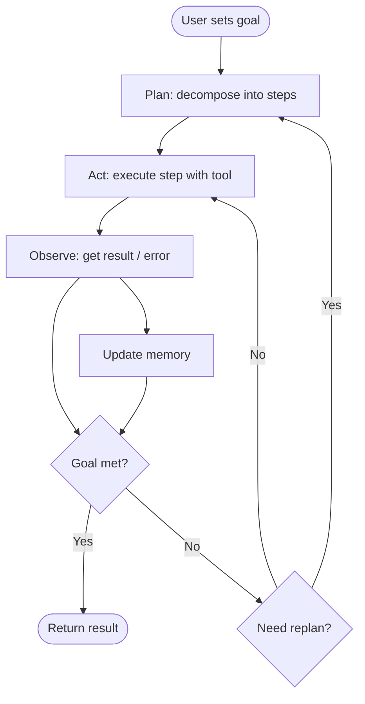
```mermaid
flowchart TB
    Start([User sets goal]) --> Plan[Plan: decompose into steps]
    Plan --> Act[Act: execute step with tool]
    Act --> Observe[Observe: get result / error]
    Observe --> Check{Goal met?}
    Check -->|Yes| End([Return result])
    Check -->|No| Replan{Need replan?}
    Replan -->|Yes| Plan
    Replan -->|No| Act
    Observe --> Update[Update memory]
    Update --> Check
```

---

## 1.3 Core Components of an AI Agent

### Perception Layer

- **Role**: Ingest and interpret all inputs that are relevant to the agent’s current decision: user messages, tool outputs, system events, and optionally sensor or structured data (e.g., from APIs or DB). The perception layer turns these raw inputs into a **structured representation** of “current state” and “what just happened” that the reasoning engine can use.
- **Inputs** typically include: (1) **User messages**—the latest question or instruction; (2) **Tool results**—output or error from the last tool call(s); (3) **System events**—e.g., timeout, rate limit, or “session resumed”; (4) **Retrieved context**—from memory (e.g., RAG chunks, past conversation summary). In some setups, sensor data or external triggers (e.g., “new ticket created”) also feed into perception.
- **Output**: A unified **context** passed to the reasoning engine: e.g., a list of messages (user/assistant/tool) or a structured state object that includes the goal, recent turns, last tool call and result, and any retrieved memory. The format should match what the LLM (or planner) expects.
- **Implementation notes**: Often implemented as a pipeline: parse user intent (if needed), format tool results into a consistent observation format (e.g., “Tool X returned: …” or “Tool X failed: timeout”), and maintain a **sliding window** or **token-bounded buffer** of recent messages so the prompt does not exceed the model’s context limit. Perception may also trigger **memory retrieval** (e.g., vector search for relevant past turns or docs) and attach that to the context.

---

### Reasoning Engine

- **Role**: Decide *what* to do next: call a specific tool with specific arguments, return a final answer to the user, or (in multi-agent setups) delegate to another agent. The reasoning engine is the “brain” that chooses the next action given the current state and goal.
- **Typical implementation**: An **LLM** used in a loop. Each call receives a prompt that includes: (1) **Current goal** and optionally sub-goals or remaining steps; (2) **Current context** from the perception layer (recent messages, last tool result); (3) **Available tools**—for each tool, name, description, and parameter schema (e.g., JSON Schema) so the model can choose and fill in arguments; (4) **Instructions**—e.g., “think step by step,” “output a tool call in JSON,” or “if you have enough information, respond with a final answer.”
- **Patterns**: **Chain-of-thought** (model outputs reasoning steps before the action) can improve reliability. **Plan-and-execute** separates “create a plan” from “execute next step”; the executor may be the same LLM or a separate module. **Structured output** (e.g., JSON with required fields for tool name and args) makes parsing robust and avoids regex on free text.
- **Output**: Either a **tool call** (tool name + arguments) or a **final answer** (text to return to the user). The application parses this, runs the tool if needed, and passes the observation back into perception for the next reasoning step.

---

### Memory Systems

- **Short-term (working) memory**: Holds the **current** conversation and task context: last N user/assistant/tool messages, the current plan (if any), and the latest tool outputs. Implemented as a **sliding window** of messages or a token-bounded buffer. Usually in-memory; sometimes persisted to Redis or DB for multi-instance or restart resilience. Essential for the model to “remember” what it just did and what the user asked.
- **Long-term memory**: Persistent storage for **facts**, **user preferences**, and **past outcomes** across sessions. Implemented as: (1) **Vector store**—embeddings of past interactions or documents for semantic search (“find similar past conversations”); (2) **Structured store**—relational DB or knowledge graph for explicit facts and relationships. Retrieved when relevant (e.g., “user prefers X,” “project Y context”) and injected into the prompt. Enables personalization and continuity without stuffing full history into every request.
- **Episodic memory**: Stores and recalls **past episodes**—events, interactions, and outcomes—so the agent can learn from experience. Examples: “last time we did X, Y happened”; “similar situation in the past, we used tool Z.” Implemented as logs of (state, action, outcome) or summarized “stories,” often indexed in a vector DB for similarity search. Used to avoid repeating mistakes or to reuse successful strategies.

---

### Tool Usage

- **Tools** are the interface between the agent and the world: search, calculator, code runner, API calls, database queries, file read/write, send email, create ticket, etc. Each tool is described to the reasoning engine (name, description, parameters) so the model can decide when and how to call it.
- **Flow**: (1) The agent **knows** available tools—the application provides tool definitions (e.g., OpenAI function definitions, or LangChain tool objects) in the prompt or API. (2) The agent **chooses** which tool to call and with what arguments; this choice is made by the LLM and parsed from its output (e.g., JSON). (3) The application **executes** the tool (see Action Execution). (4) The agent **receives** the tool result (or error) as an **observation**; this observation is appended to the conversation and fed back into perception and reasoning for the next step.
- **Why it matters**: Tool use turns the LLM from “stateless Q&A” into a **capable actor** that can read and change real-world state. Without tools, the model can only answer from its training; with tools, it can use live data, APIs, and code, and take actions on behalf of the user.

---

### Action Execution

- **Role**: Actually **run** the chosen action—execute the tool call, call an external API, run a script, or perform a DB query. The action execution layer sits between the agent’s *decision* (output of the reasoning engine) and the *observation* (result) that goes back to the agent.
- **Responsibilities**: (1) **Validate and sanitize** inputs—check that the tool name and arguments are allowed and safe; prevent injection and abuse. (2) **Invoke** the tool or external system—with timeouts, retries, and rate limits as appropriate. (3) **Capture** result, errors, and timeouts—normalize them into a consistent format. (4) **Return** a standardized observation (e.g., “Success: …” or “Error: …”) to the perception/reasoning layer so the agent can decide the next step.
- **Safety**: In production, action execution enforces **allowlists** (only certain tools and parameters), **resource limits** (time, memory, network), and **audit logging** (who called what, when, with what args). Dangerous operations (e.g., delete all, send email to everyone) may require human approval or be blocked entirely.

---

### Feedback Loop

- **Flow**: **Perceive → Reason → Act → Observe → Perceive → …** The **observe** step is the feedback: the result of the action (tool output, user message, error, or environment change) becomes the input for the next perception and reasoning step.
- **What feedback does**: (1) **Updates memory**—e.g., “this tool call failed,” “user said X”; short-term buffer is updated; optionally long-term or episodic memory is updated. (2) **Informs the reasoning engine**—the next LLM call sees the observation and can decide to retry with different params, try another tool, or return a final answer. (3) **Can trigger replanning**—if the observation indicates the plan is wrong or the goal is unreachable, the agent (or planner) may produce a new plan or ask the user for clarification.
- **Why it’s essential**: Without a feedback loop, the system is **single-shot**: one request, one response. With a feedback loop, the system is **iterative and adaptive**—it can use tools, react to errors, and pursue multi-step goals. That iterative, tool-using, goal-driven behavior is what we mean by **agentic**.

**Full flow: Core agent loop (Perceive → Reason → Act → Observe)**

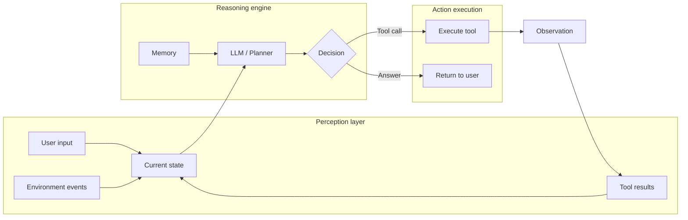
```mermaid
flowchart LR
    subgraph Perception["Perception layer"]
        P1[User input]
        P2[Tool results]
        P3[Environment events]
        P1 --> S[Current state]
        P2 --> S
        P3 --> S
    end
    subgraph Reasoning["Reasoning engine"]
        S --> R[LLM / Planner]
        M[Memory] --> R
        R --> D{Decision}
    end
    subgraph Action["Action execution"]
        D -->|Tool call| T[Execute tool]
        D -->|Answer| Out[Return to user]
    end
    T --> O[Observation]
    O --> P2
```

| Component        | Inputs                          | Outputs / Responsibility                    |
|-----------------|----------------------------------|--------------------------------------------|
| **Perception**  | User msg, tool results, events  | Structured current state for reasoning     |
| **Reasoning**   | State, memory, tool list        | Next action (tool call or final answer)    |
| **Memory**      | Past turns, facts, episodes     | Retrieved context for reasoning            |
| **Tools**       | Agent’s tool choice + args      | Result or error for observation            |
| **Action**      | Parsed tool call                | Execute safely, return observation         |
| **Feedback**    | Observation                     | Update memory, trigger next reason step    |

---

# Module 3: Agent Architectures & Frameworks

---

## 3.1 Single Agent Architectures

### ReAct Architecture

**ReAct** (Reasoning + Acting) is a paradigm that interleaves **reasoning traces** (“thoughts”) and **actions** (e.g., tool calls) in a loop. The model reasons about what to do, takes an action, observes the result, then reasons again—so its next step is grounded in real observations rather than pure guessing.

- **Idea**: At each step the model produces: (1) **Thought**—a short reasoning trace (e.g., “I need the current weather to answer the user”); (2) **Action**—a concrete step, usually a tool call (e.g., `get_weather(city="London")`); (3) **Observation**—provided by the system after executing the action (e.g., “22°C, cloudy”). The loop continues until the model outputs a **Final answer** instead of another action. The thought step is optional in some implementations but helps with interpretability and grounding.
- **Benefits**: (1) **Grounding**—the model’s next move is conditioned on actual tool results, which reduces hallucination. (2) **Multi-step tool use**—the agent can chain several tools (search → read → summarize) in one run. (3) **Debugging**—the thought–action–observation trace is human-readable and useful for logging and tuning.
- **Typical pattern**: Thought → Action → Observation → Thought → … → Answer. Implementations vary: some use a single LLM call per step that outputs both thought and action; some use strict templates (e.g., “Thought: … Action: …”); some rely on the model to output structured tool calls (e.g., JSON) while still including free-text reasoning.

**Flow: ReAct loop (detailed)**

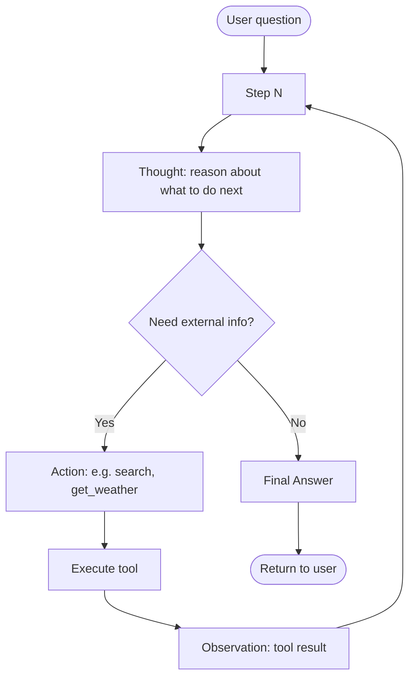
```mermaid
flowchart TB
    Start([User question]) --> Step[Step N]
    Step --> Thought[Thought: reason about what to do next]
    Thought --> Decide{Need external info?}
    Decide -->|Yes| Action[Action: e.g. search, get_weather]
    Action --> Execute[Execute tool]
    Execute --> Observation[Observation: tool result]
    Observation --> Step
    Decide -->|No| Answer[Final Answer]
    Answer --> End([Return to user])
```

| Single-agent pattern      | When to use it                         | Main loop                                      |
|---------------------------|----------------------------------------|------------------------------------------------|
| **ReAct**                 | Need reasoning + tool use step-by-step | Thought → Action → Observation → repeat        |
| **Planner–Executor**      | Clear split: plan once, then execute   | Plan → Execute steps → Feedback → (replan?)   |
| **Reflection-based**      | Quality matters (code, docs)           | Generate → Reflect → Revise → repeat         |
| **Tool-calling**          | Any task needing tools                 | LLM + tools → parse call → execute → observe   |

**Example trace:**
1. *Thought*: I need the current weather to answer.
2. *Action*: `get_weather(city="London")`
3. *Observation*: "22°C, cloudy."
4. *Thought*: I have the answer.
5. *Answer*: "It's 22°C and cloudy in London."

---

### Planner–Executor Models

In **planner–executor** architectures, the agent is split into two parts: a **planner** that decides *what* to do (and in what order), and an **executor** that performs each step (tool call, API, code, or delegated sub-agent). This separation simplifies control flow and makes it easier to enforce structure (e.g., “always plan before acting”) and to replan when things go wrong.

- **Planner**: Inputs are the **goal**, **current state** (and optionally feedback from the last execution). Output is a **plan**—an ordered list of steps or sub-goals (e.g., “1. Search for X; 2. Read top result; 3. Summarize”). The planner can be an LLM (e.g., “Given this goal, output a step-by-step plan”) or a rule-based/template-based planner. In dynamic replanning, the planner is invoked again after each step or when the executor reports failure.
- **Executor**: Takes the **next step** from the plan (or the full plan) and executes it—e.g., calls a tool, runs code, or delegates to a specialist agent. The executor returns the **result** (success + payload or failure + error message) to the planner (or to a central loop that then decides whether to continue or replan).
- **Feedback**: If a step fails or the result is unexpected, the **planner may replan**: adjust the remaining steps, retry with different parameters, or abort and ask the user. This feedback loop is what makes the system adaptive.

**Use when**: Tasks are naturally decomposable (e.g., “research topic X and write a report” → search, read, summarize, draft). Reduces the need for one giant prompt that does everything; allows clear separation of “what to do” (plan) from “how to do it” (execution), and makes it easier to add replanning and error recovery.

**Flow: Planner–Executor (detailed)**

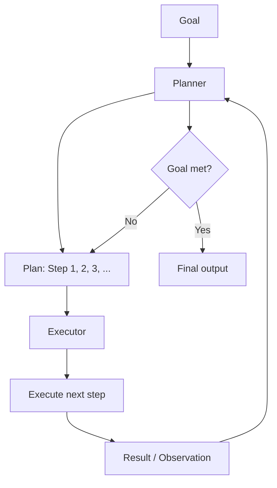
```mermaid
flowchart TB
    G[Goal] --> P[Planner]
    P --> Plan[Plan: Step 1, 2, 3, ...]
    Plan --> E[Executor]
    E --> Step[Execute next step]
    Step --> R[Result / Observation]
    R --> P
    P --> Done{Goal met?}
    Done -->|No| Plan
    Done -->|Yes| Out[Final output]
```

- **Use when**: Tasks are naturally decomposable (e.g., research → summarize → draft report). Reduces “one big prompt” and allows clear separation of planning vs execution.

---

### Reflection-Based Agents

**Reflection-based** agents add a **critique** step after generating an answer or action: the system (or a separate “critic” model) evaluates the output against criteria (correctness, completeness, safety, style) and, if issues are found, triggers a **revision** or retry. This improves quality at the cost of extra LLM calls and latency.

- **Reflection**: After the agent produces a draft (e.g., code, summary, or plan), a **reflection** step asks: “Is this correct? Complete? Safe? Does it meet the user’s request?” Reflection is often implemented as another LLM call with the draft plus a list of criteria or a rubric. The output can be a simple pass/fail or a structured list of issues (e.g., “Missing error handling,” “Fact X is wrong”).
- **Revision**: If the reflection finds issues, the agent **revises** the draft—e.g., fix the code, add the missing step, correct the fact. The revised output can be passed through reflection again. The loop continues until the reflection approves the output or a maximum number of iterations is reached.
- **Loop**: Generate → Reflect → (if not good enough) Revise → Reflect → … → Final output. In some designs, the same LLM does both generation and reflection (self-critique); in others, a smaller or specialized model does reflection to save cost.

**Use when**: Code generation, long-form writing, or any output where **correctness or safety** matters. Especially useful when the agent’s first attempt might be incomplete or wrong and you want to catch and fix errors before returning to the user. The trade-off is more latency and token usage.

**Flow: Reflect–Revise**

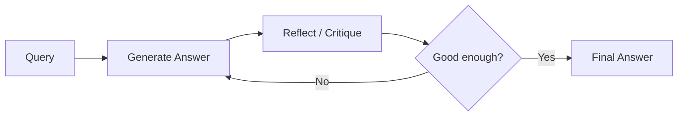
```mermaid
flowchart LR
    Q[Query] --> G[Generate Answer]
    G --> R[Reflect / Critique]
    R --> OK{Good enough?}
    OK -->|No| G
    OK -->|Yes| A[Final Answer]
```

- **Use when**: Code generation, long-form writing, or any output where correctness or safety matters. Improves quality at the cost of extra LLM calls.

---

### Tool-Calling Agents

**Tool-calling** agents implement the core loop: **reason → choose tool → call tool → observe → repeat**. The LLM is prompted with a list of **tools** (name, description, and parameter schema, e.g., JSON Schema). On each turn, the model either returns a **tool call** (which tool and with what arguments) or a **final answer** to the user. The runtime parses the output, executes the tool if present, and appends the **observation** to the conversation; then it calls the LLM again. This is the foundation of most production agents (OpenAI function calling, Anthropic tool use, LangChain agents, etc.).

- **Tool schema**: Each tool is described with a **name** (e.g., `search`), a **description** (e.g., “Search the web for a query”), and **parameters** (e.g., `query: string`). The LLM uses these to decide which tool to call and how to fill in the arguments. Good descriptions improve tool selection; clear parameter types reduce invalid calls.
- **Structured output**: The model’s response is constrained to a **structured format**—e.g., a JSON object with `tool` and `args`, or a dedicated “function call” block in the API response. This allows the runtime to parse and execute without brittle regex. Parsing failures (e.g., malformed JSON) can be handled by retrying or returning an error observation to the model.
- **Observation**: After executing the tool, the **result** (or error message) is formatted as an **observation** and appended to the conversation (e.g., as an “assistant” message with tool call + “tool” message with result). The LLM is then called again with the full conversation so it can decide the next action or produce a final answer.

**Use when**: Any task that requires **search, APIs, databases, code execution, or file access**. Tool-calling is the standard pattern for production agents; combine it with memory and guardrails for safe, scalable deployments.

**Flow: Tool-calling loop**

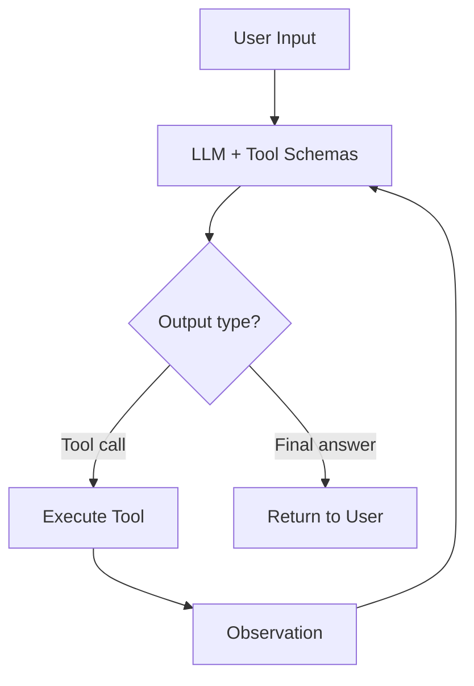
```mermaid
flowchart TB
    U[User Input] --> L[LLM + Tool Schemas]
    L --> T{Output type?}
    T -->|Tool call| X[Execute Tool]
    X --> O[Observation]
    O --> L
    T -->|Final answer| F[Return to User]
```

- **Use when**: Any task requiring search, APIs, DB, code execution, or file access. Foundation of most production agents (OpenAI function calling, LangChain tools, etc.).

---

## 3.2 Multi-Agent Systems

### Collaborative Agents

In **collaborative** multi-agent systems, several agents work toward the **same goal** by **sharing context** and **handing off** sub-tasks. There is no single “manager”; coordination happens via a **message bus**, **shared blackboard**, or **direct agent-to-agent** calls. Each agent has a defined role (e.g., researcher, writer, critic) and contributes its output to the shared context so the next agent can use it.

- **Coordination**: (1) **Message bus**—agents publish results to a topic or queue; others subscribe and consume. (2) **Shared blackboard**—a common workspace where agents read and write intermediate results (e.g., “draft,” “feedback”). (3) **Direct handoff**—Agent A finishes and passes its output to Agent B in a fixed or dynamic sequence. The order can be predefined (pipeline) or determined by content (e.g., “if draft needs more research, send back to researcher”).
- **Use cases**: Research pipelines (one agent gathers sources, another synthesizes); content creation (writer produces draft, editor revises); coding (coder implements, reviewer suggests changes). Well-suited when the workflow is a linear or branching pipeline with clear handoffs.

**Flow: Collaborative (e.g., writer + editor)**

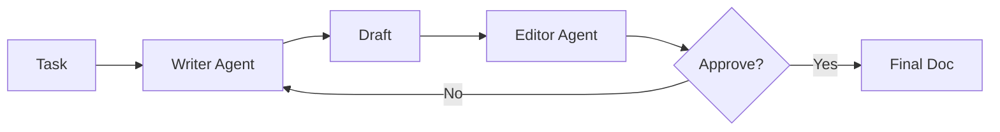
```mermaid
flowchart LR
    T[Task] --> W[Writer Agent]
    W --> D[Draft]
    D --> E[Editor Agent]
    E --> F{Approve?}
    F -->|No| W
    F -->|Yes| Out[Final Doc]
```

---

### Hierarchical Agents

In **hierarchical** multi-agent systems, a **manager** (or planner) agent **decomposes** the high-level goal and **assigns** sub-tasks to **worker** agents. Workers execute their tasks (often using tools or sub-routines) and **report back**; the manager **aggregates** results, checks goal completion, and may **replan** or assign new tasks. Control flow is top-down: the manager is the single point of coordination.

- **Manager**: Responsibilities include: (1) **Understanding the goal** and breaking it into sub-tasks (e.g., “research,” “analyze,” “draft,” “review”). (2) **Assigning** each sub-task to the right worker (e.g., search agent, code agent, DB agent). (3) **Receiving** results and deciding whether to continue, replan, or return a final answer. The manager is often implemented with an LLM that outputs a plan and task assignments; it may also use a workflow engine or rule-based router.
- **Workers**: **Specialist agents** (or tools) that perform one type of task. Each worker gets a clear input (the assigned task + context), runs tools or logic, and returns a structured result to the manager. Workers typically do not coordinate with each other directly; all coordination goes through the manager.
- **Use cases**: Complex workflows where the goal has multiple phases and different skills—e.g., “analyze this codebase and suggest refactors” → manager assigns “read repo” to reader agent, “analyze dependencies” to analyzer agent, “draft recommendations” to writer agent, then synthesizes the final report.

**Flow: Hierarchical**

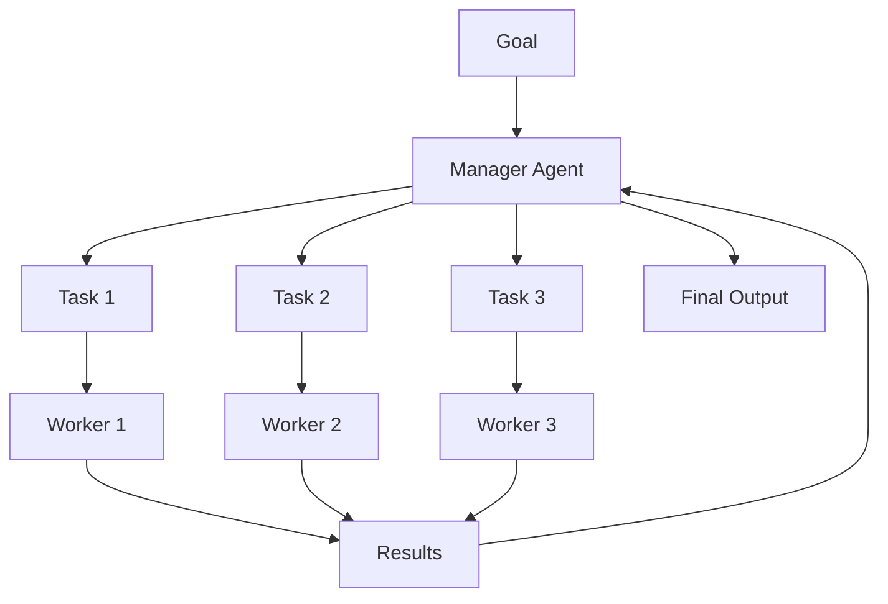
```mermaid
flowchart TB
    G[Goal] --> M[Manager Agent]
    M --> T1[Task 1]
    M --> T2[Task 2]
    M --> T3[Task 3]
    T1 --> W1[Worker 1]
    T2 --> W2[Worker 2]
    T3 --> W3[Worker 3]
    W1 --> R[Results]
    W2 --> R
    W3 --> R
    R --> M
    M --> Out[Final Output]
```

---

### Swarm-Based Coordination

In **swarm-based** coordination, agents act in a **decentralized** way: there is **no central planner** or manager. Each agent follows **simple local rules** and coordinates indirectly through the **environment** (e.g., a shared task queue, blackboard, or “pheromone”-like signals). The overall behavior **emerges** from many agents working in parallel and reacting to shared state—useful for load distribution, exploration, and adaptive work distribution.

- **Concepts**: (1) **Stigmergy**—indirect coordination via the environment (e.g., agents add “completed” markers or update a shared board so others avoid duplicate work). (2) **Task queue**—agents pull tasks from a common queue; when one finishes, it may push new tasks. (3) **Publish–subscribe**—agents emit events (e.g., “topic X done”); others react by starting dependent work. No single agent has a global plan; each agent’s behavior is local and simple.
- **Use cases**: **Distributed crawling** (many agents crawl different URLs; queue of links to process); **parallel research** (many agents each research a sub-question; results merged later); **adaptive routing** (agents pick work from a queue based on load or capability). Best when you want **scalability** and **fault tolerance** without a single bottleneck, and when tasks can be split and merged naturally.

**Flow: Swarm (decentralized, queue-based)**

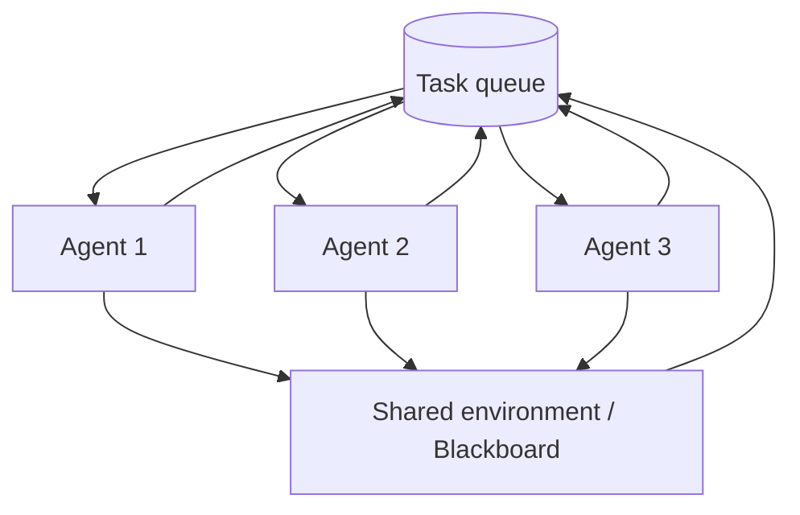
```mermaid
flowchart TB
    Q[(Task queue)] --> A1[Agent 1]
    Q --> A2[Agent 2]
    Q --> A3[Agent 3]
    A1 --> Q
    A2 --> Q
    A3 --> Q
    A1 --> E[Shared environment / Blackboard]
    A2 --> E
    A3 --> E
    E --> Q
```

| Multi-agent pattern     | Coordination style   | Best for                                      |
|-------------------------|----------------------|-----------------------------------------------|
| **Collaborative**       | Shared context, handoffs | Pipelines (e.g. writer → editor)              |
| **Hierarchical**        | Manager assigns tasks    | Complex goals, clear roles                    |
| **Swarm**              | Decentralized, queue/env | Load distribution, exploration, no single boss |
| **Debate**             | Argue then moderate      | Reasoning, reducing overconfidence           |
| **Role-based**         | Route by role            | HR, support, compliance workflows            |

---

### Debate-Based Agents

In **debate-based** setups, **multiple agents** (or multiple “voices” of the same system) **argue** or **debate** over a question or decision. One agent proposes an answer or strategy; another critiques it; a third may rebut or propose an alternative. A **moderator** or **aggregator** then synthesizes the discussion into a **final answer** or recommendation. The goal is to surface alternatives, expose weaknesses, and improve reasoning before committing to an output.

- **Flow**: (1) **Agent A** proposes an answer or plan. (2) **Agent B** (critic) evaluates it—points out flaws, missing cases, or risks. (3) **Agent A** (or **Agent C**) rebuts or revises. (4) Steps 2–3 can repeat for several rounds. (5) **Moderator** summarizes the debate and either picks the best argument, merges insights, or returns a qualified answer (e.g., “A is stronger but B raised valid concerns about X”).
- **Benefits**: Reduces **overconfidence** by forcing the system to consider counterarguments; improves **reasoning quality** in domains where a single model might miss edge cases. Used in **reasoning-heavy** or **high-stakes** domains (e.g., legal analysis, medical reasoning, strategic decisions) where you want the model to “think twice” before answering.

**Flow: Debate**

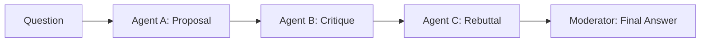
```mermaid
flowchart LR
    Q[Question] --> A[Agent A: Proposal]
    A --> B[Agent B: Critique]
    B --> C[Agent C: Rebuttal]
    C --> M[Moderator: Final Answer]
```

---

### Role-Based Agents

In **role-based** multi-agent systems, each agent has a **fixed role** (e.g., “researcher,” “analyst,” “writer,” “approver”). **Incoming tasks** are **routed** to the agent (or pipeline) that matches the required role; **handoffs** between roles follow a predefined workflow or router logic. This mirrors real organizational roles and makes it easier to assign responsibility, enforce policies, and audit who did what.

- **Routing**: (1) **Rule-based**—e.g., keyword or intent: “summarize” → writer, “analyze data” → analyst. (2) **LLM-based**—a router (or classifier) asks “who should handle this?” and selects an agent based on the task description. (3) **Workflow**—tasks move through a fixed sequence of roles (e.g., triage → technical → escalation); each role is implemented by one or more agents.
- **Use cases**: **HR** (screening → interview scheduling → offer); **support** (triage → technical resolution → escalation to human); **content** (research → draft → legal review). Aligns with **governance** and **compliance** because roles can be mapped to permissions and audit trails (e.g., “only Approver can publish”).

**Flow: Role-based routing and handoffs**

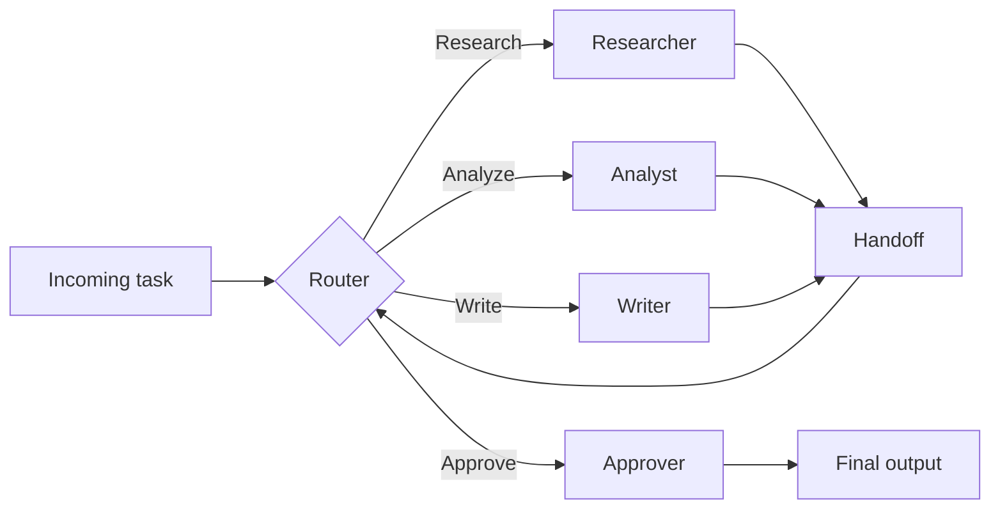
```mermaid
flowchart LR
    T[Incoming task] --> R{Router}
    R -->|Research| A1[Researcher]
    R -->|Analyze| A2[Analyst]
    R -->|Write| A3[Writer]
    R -->|Approve| A4[Approver]
    A1 --> H[Handoff]
    A2 --> H
    A3 --> H
    H --> R
    A4 --> Out[Final output]
```

---

## 3.3 Agent Frameworks

### Using LangChain

- **What it is**: Open-source framework for building chains and agents with LLMs; strong focus on tools, memory, and pluggable components.
- **Concepts**:
  - **Agents**: `AgentExecutor` runs an agent that uses a list of tools; the LLM chooses tools and the executor runs them in a loop.
  - **Tools**: Wrap functions/APIs with a name and description; LangChain passes them to the LLM and invokes them from the agent output.
  - **Chains**: Composable sequences (prompt → LLM → parse → next step). Agents are “chains with a tool loop.”
  - **Memory**: Built-in buffer (e.g., conversation buffer, summary buffer), or custom (vector store, DB).
- **Flow**: User message → Agent (LLM + tools) → tool calls executed → observations added to history → LLM called again until final answer.
- **Use when**: Quick prototyping, research, or production agents with many integrations (vector stores, APIs, document loaders). Language: Python/JS.

---

### Using AutoGPT

- **What it is**: Autonomous agent that tries to accomplish high-level goals by generating its own tasks, using tools (web, file, code), and iterating.
- **Concepts**: Goal → task list generation → loop: pick task → execute (tool or LLM) → update task list / memory → repeat. Often uses local vector store for memory.
- **Use when**: Experimentation and demos; less standardized than LangChain/CrewAI, so production use requires careful hardening (cost, loops, safety).

---

### Using CrewAI

- **What it is**: Framework for **multi-agent** teams with roles, goals, and backstories. Agents are assigned to tasks in a sequence or hierarchy.
- **Concepts**:
  - **Agent**: Role, goal, backstory, optional tools. Defines “who” the agent is.
  - **Task**: Description, assigned agent, optional context from other tasks’ outputs.
  - **Crew**: Set of agents + ordered list of tasks. Crew runs tasks in order; each task’s output can be passed as context to the next.
- **Flow**: Crew kickoff → Task 1 (Agent A) → Task 2 (Agent B, input = Task 1 output) → … → final output.
- **Use when**: Role-play teams (e.g., researcher + writer + reviewer), structured pipelines where handoffs are clear. Python.

---

### Using Microsoft Semantic Kernel

- **What it is**: SDK for integrating LLMs and AI into apps; supports plugins (skills), planning, and memory. Strong .NET and Python support; Azure OpenAI integration.
- **Concepts**:
  - **Plugins (Skills)**: Functions that the agent can call; defined with descriptions and parameters for the planner.
  - **Planner**: Creates a plan (sequence of plugin calls) from a user goal; can be LLM-based (e.g., “generate a plan”) or template-based.
  - **Memory**: Semantic memory (vector store) and optional episodic memory for conversations.
  - **Orchestration**: Execute plan steps, pass outputs between plugins, handle errors and retries.
- **Flow**: User request → Planner generates plan → Executor runs each step (plugin call) → results fed back; replan if needed.
- **Use when**: .NET or Python apps, Azure-heavy stacks, need for planners + plugins + memory in one SDK.

---

### Using OpenAI Agent APIs

- **What it is**: OpenAI’s native **assistants** and **runs** API: you define an assistant (model, instructions, tools), then create threads and runs. The API runs the tool loop server-side.
- **Concepts**:
  - **Assistant**: Model + system instructions + list of tools (function definitions with names, descriptions, parameters).
  - **Thread**: Conversation container (messages + optional file IDs).
  - **Run**: Execute the assistant on a thread; the API calls the LLM, detects tool calls, returns them to the client; client executes tools and submits results; run continues until completion.
- **Flow**: Create assistant → create thread → create run → (client) handle tool calls → submit tool outputs → run continues → final response.
- **Use when**: You want OpenAI to own the “agent loop” and you only implement tool execution; good for chat-style agents with code interpreter, retrieval, and function calling.

| Framework / API           | Language / stack   | Strengths                                      | Best for                          |
|---------------------------|--------------------|------------------------------------------------|-----------------------------------|
| **LangChain**             | Python, JS         | Tools, memory, chains, many integrations        | Prototyping, RAG, multi-tool agents |
| **AutoGPT**               | Python             | Autonomous goal → tasks, self-directed        | Experiments, demos                |
| **CrewAI**                | Python             | Multi-agent teams, roles, tasks, crew         | Role-based pipelines              |
| **Semantic Kernel**       | .NET, Python       | Plugins, planner, memory, Azure                | Enterprise .NET/Azure apps        |
| **OpenAI Assistants API** | API (any client)   | Server-side agent loop, threads, runs         | Chat agents, minimal backend      |

**Flow: Generic agent framework (e.g. LangChain / SK)**

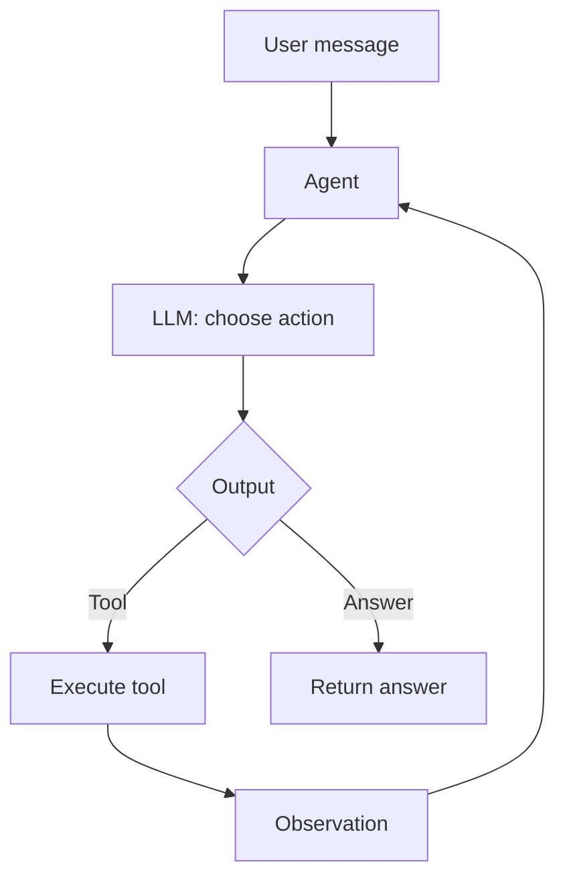
```mermaid
flowchart TB
    U[User message] --> A[Agent]
    A --> L[LLM: choose action]
    L --> T{Output}
    T -->|Tool| X[Execute tool]
    X --> O[Observation]
    O --> A
    T -->|Answer| F[Return answer]
```

---

# Module 4: Memory Systems in Agentic AI

---

## 4.1 Types of Memory

| Memory type        | Scope          | Storage example              | Retrieval                    | Use case                          |
|--------------------|----------------|-----------------------------|------------------------------|-----------------------------------|
| **Short-term**    | Current session| Sliding window, buffer       | Last N messages / tokens     | Coherent conversation, tool loop  |
| **Long-term**     | Cross-session  | DB, knowledge graph          | Query by key or relation     | User prefs, facts, continuity     |
| **Episodic**      | Past events    | Logs, vector index          | Similar situation / time      | Learn from past, avoid mistakes   |
| **Vector**        | Semantic       | Vector DB (embeddings)       | Similarity search (k-NN)     | RAG, semantic search, recall      |

**Full flow: How memory feeds into the agent**

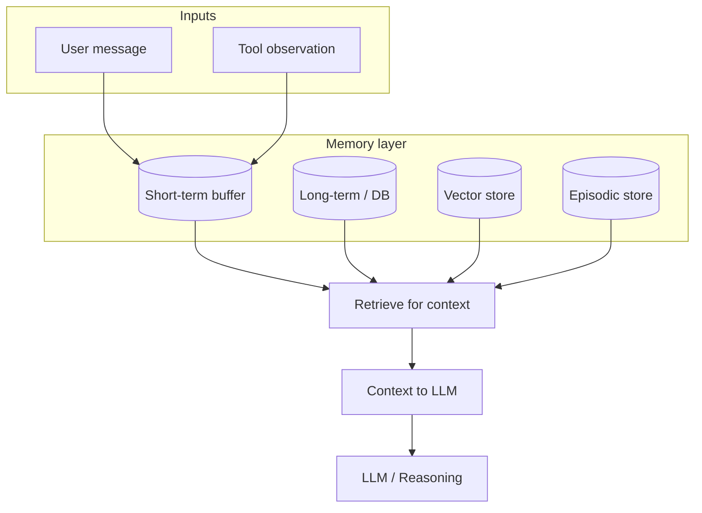
```mermaid
flowchart TB
    subgraph Input["Inputs"]
        U[User message]
        TO[Tool observation]
    end
    subgraph Memory["Memory layer"]
        ST[(Short-term buffer)]
        LT[(Long-term / DB)]
        V[(Vector store)]
        EP[(Episodic store)]
    end
    U --> ST
    TO --> ST
    ST --> R[Retrieve for context]
    LT --> R
    V --> R
    EP --> R
    R --> C[Context to LLM]
    C --> L[LLM / Reasoning]
```

### Short-Term Memory

- **Purpose**: Hold the **current** conversation and recent context so the model has a coherent view of the immediate task.
- **Implementation**: Sliding window of last N messages (user/assistant/tool), or a token-bounded buffer (e.g., last 4K tokens). Often in-memory; not persisted across sessions.
- **Role**: Prevents context overflow; keeps the prompt focused on “this turn” and “recent turns.” Essential for multi-turn tool-use loops.

---

### Long-Term Memory

- **Purpose**: Persist **facts**, **preferences**, and **learned information** across sessions or tasks.
- **Implementation**: Database (SQL/NoSQL), knowledge graph, or vector store. Updated by agent actions or background jobs. Retrieved when relevant (e.g., “user prefers X” or “project Y context”).
- **Role**: Personalization, continuity, and grounding in historical data without stuffing everything into the context window.

---

### Episodic Memory

- **Purpose**: Store and recall **past episodes** (events, interactions, outcomes) to reuse successful strategies or avoid past mistakes.
- **Implementation**: Logs of (state, action, outcome) or summarized “stories”; can be indexed in a vector DB for similarity search (“similar situation in the past?”).
- **Role**: Enables learning from experience and consistent behavior across similar situations.

---

### Vector Memory

- **Purpose**: Store **embeddings** of text (or other modalities) and retrieve by **semantic similarity**.
- **Implementation**: Text → embedding model → vector stored in a vector DB (Pinecone, Weaviate, Chroma, pgvector, etc.). At query time: query → embedding → k-NN or similarity search → return top-k chunks.
- **Role**: Powers RAG, “remember similar past conversations,” and long-term semantic search over documents or history.

---

## 4.2 Vector Databases

### Embeddings

- **What**: Dense vector representations of text (or code, images) from an embedding model (e.g., OpenAI `text-embedding-3`, Cohere, open-source sentence transformers).
- **Why**: Enables similarity search: “find content most similar to this query” instead of exact keyword match. Critical for RAG and semantic memory.

---

### Similarity Search

- **Process**: Query → embed → search vector store for nearest vectors (cosine similarity, dot product, or L2). Return associated metadata (source doc, timestamp, etc.).
- **Index types**: HNSW, IVF, or brute-force for small datasets. Trade-off between recall, speed, and memory.

---

### RAG (Retrieval-Augmented Generation)

- **Flow**: User question → embed question → retrieve relevant chunks from vector store → build prompt: “Context: … Question: …” → LLM generates answer grounded in context.
- **Why**: Reduces hallucination; keeps answers up to date with your data. Combines retrieval (vector + optional keyword) with generation.

**Flow: RAG (full pipeline)**

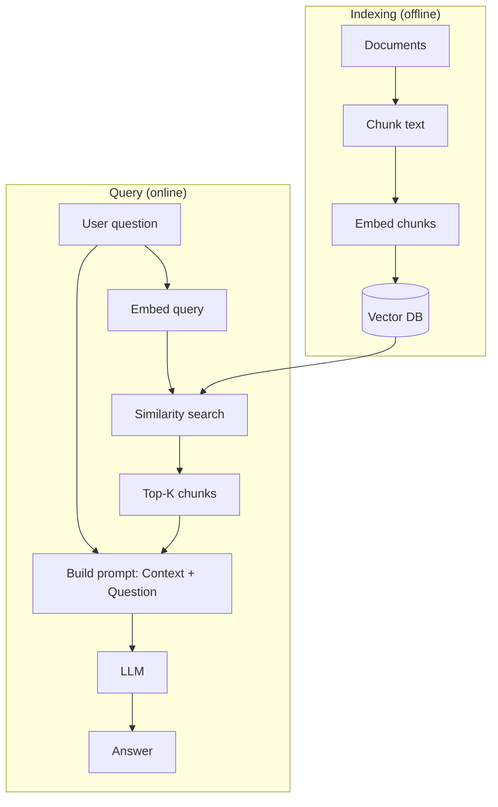
```mermaid
flowchart TB
    subgraph Indexing["Indexing (offline)"]
        Doc[Documents] --> Chunk[Chunk text]
        Chunk --> Emb1[Embed chunks]
        Emb1 --> VDB[(Vector DB)]
    end
    subgraph Query["Query (online)"]
        Q[User question] --> Emb2[Embed query]
        Emb2 --> Search[Similarity search]
        VDB --> Search
        Search --> Top[Top-K chunks]
        Top --> Prompt[Build prompt: Context + Question]
        Q --> Prompt
        Prompt --> LLM[LLM]
        LLM --> A[Answer]
    end
```

---

### Memory Persistence

- **Short-term**: Usually in-memory; optionally persisted to Redis or DB for server restarts or multi-instance consistency.
- **Long-term / vector**: Persisted in vector DB and/or relational DB. Backups, replication, and retention policies apply. Episodic and user memory often in the same DBs with clear schema.

---

## 4.3 Memory Optimization

### Context Compression

- **Goal**: Keep the useful part of history without exceeding context limits. Methods: summarize old turns, drop low-relevance messages, or replace long chunks with short “summaries” plus pointers.
- **Techniques**: LLM-based summarization of past N turns; sliding window + summary; or “importance scoring” to keep only high-signal messages.

---

### Memory Pruning

- **Goal**: Remove or downweight old or low-value memories to control cost and noise. Policies: TTL (time-to-live), max items per user, or eviction by “importance” (e.g., recency + relevance).
- **Use**: Prevents vector stores and buffers from growing unbounded; keeps retrieval quality high.

---

### Knowledge Graph Memory

- **Idea**: Store facts as **entities and relations** (e.g., Person–works_at–Company). Query via graph traversal or graph + vector hybrid.
- **Benefits**: Explicit relations and reasoning paths; good for “who knows what,” “what depends on what,” and compliance/audit. Can be combined with vector search for hybrid retrieval.

---

### Hybrid Memory Systems

- **Combination**: Short-term buffer + long-term vector store + (optional) graph or SQL for structured facts. Router or orchestrator decides: “answer from context only,” “retrieve from vector,” or “query graph/DB.”
- **Use**: Production systems that need conversation context + document RAG + structured data (e.g., user profile, permissions).

**Flow: Hybrid memory (router + merge)**

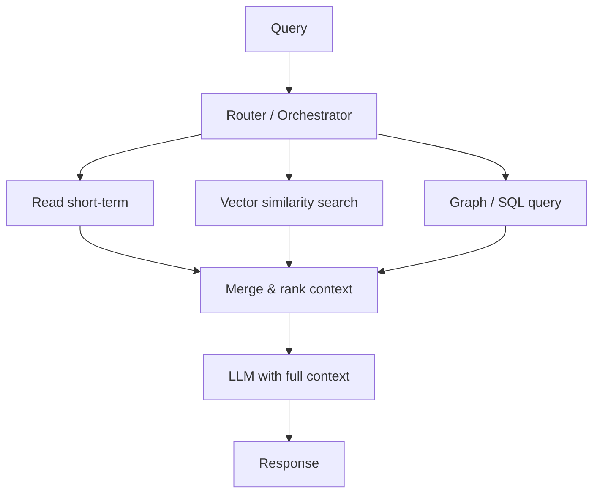
```mermaid
flowchart TB
    Q[Query] --> R[Router / Orchestrator]
    R --> R1[Read short-term]
    R --> R2[Vector similarity search]
    R --> R3[Graph / SQL query]
    R1 --> M[Merge & rank context]
    R2 --> M
    R3 --> M
    M --> L[LLM with full context]
    L --> Out[Response]
```

| Optimization technique    | Purpose                                  | Example                                      |
|---------------------------|------------------------------------------|----------------------------------------------|
| **Context compression**   | Stay within context limit                | Summarize old turns; sliding window + summary |
| **Memory pruning**        | Limit size and noise                     | TTL, max items, evict by importance          |
| **Knowledge graph**       | Explicit relations, reasoning            | Entities + relations; graph + vector hybrid  |
| **Hybrid memory**        | Right source per query                   | Router: buffer vs vector vs graph/DB         |

---

# Module 5: Tool Integration & Action Systems

**Full flow: Tool call from agent to observation**

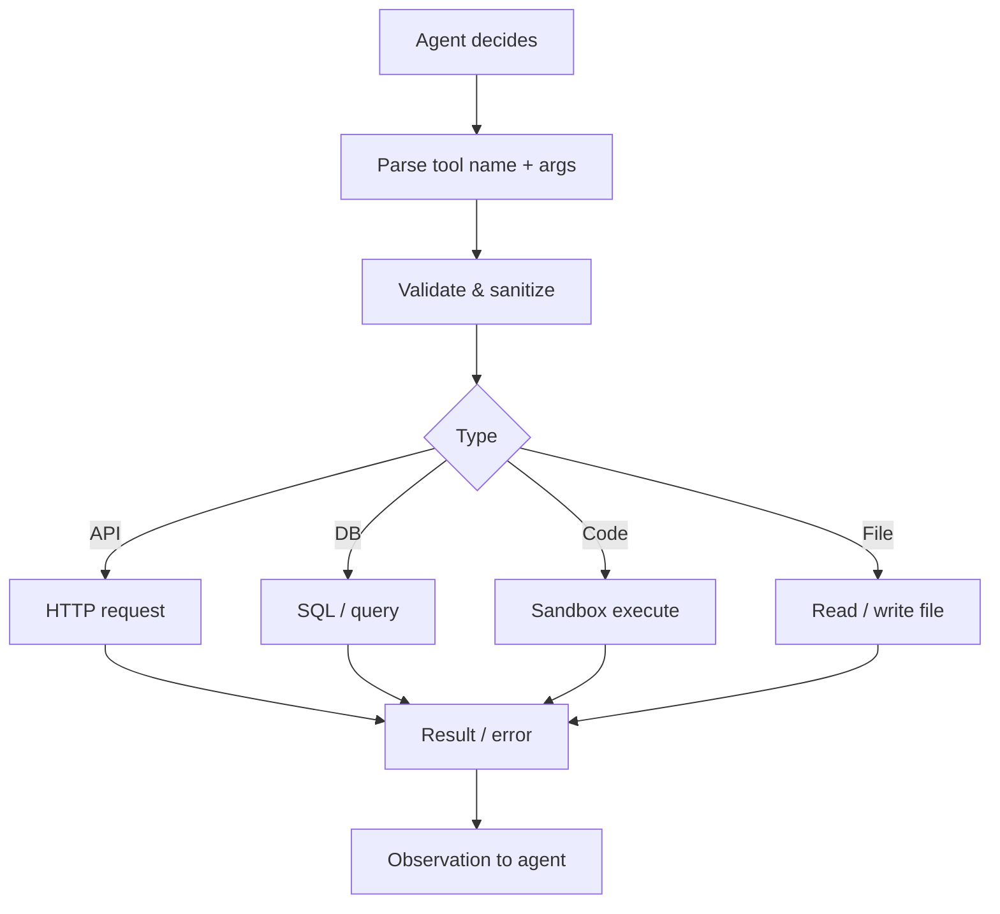
```mermaid
flowchart TB
    A[Agent decides] --> P[Parse tool name + args]
    P --> V[Validate & sanitize]
    V --> I{Type}
    I -->|API| H[HTTP request]
    I -->|DB| S[SQL / query]
    I -->|Code| E[Sandbox execute]
    I -->|File| F[Read / write file]
    H --> R[Result / error]
    S --> R
    E --> R
    F --> R
    R --> O[Observation to agent]
```

| Tool category    | Examples                    | Risks / mitigations                          |
|------------------|-----------------------------|----------------------------------------------|
| **Function call**| Calculator, formatter       | Input validation, output schema              |
| **API**          | REST, GraphQL               | Timeouts, retries, rate limits, no raw keys  |
| **Database**     | Read/write queries          | Parameterized SQL, read-only where possible  |
| **Web**          | Fetch URL, browse           | Allowlist, sandbox, PII filter               |
| **Code**         | Run Python/shell in sandbox | Timeout, memory limit, no network            |
| **File**         | Read/write paths            | Path allowlist, no traversal                 |

---

## 5.1 Tool Calling

### Function Calling

- **What**: LLM returns a structured **function call** (name + arguments) instead of or in addition to free text. The application executes the function and returns the result to the model.
- **Schema**: Tools described with name, description, and parameters (JSON Schema). Model chooses which tool to call and with what arguments.
- **Implementations**: OpenAI function calling, Anthropic tool use, open-source (e.g., with structured output or fine-tuning). Core building block for tool-calling agents.

---

### API Integration

- **What**: Tools that wrap external APIs (REST, GraphQL). Agent “calls” the tool; backend performs HTTP request, parses response, returns simplified result to the agent.
- **Best practices**: Timeouts, retries, rate limits; sanitize inputs; avoid exposing raw API keys to the model; log calls for audit and cost.

---

### Structured Outputs

- **What**: Constrain LLM output to a schema (e.g., JSON with required fields). Ensures tool calls (or other structured decisions) are parseable and valid.
- **Methods**: Prompt engineering (“output JSON”), response format (OpenAI JSON mode), or parsing/validation layer that rejects malformed output and retries.

---

## 5.2 External System Integration

### Databases

- **Read**: Tool that runs parameterized queries (e.g., “get orders for customer X”). Use safe patterns (parameterized SQL, read-only role) to avoid injection and accidental writes.
- **Write**: Optional tools for inserts/updates with strict validation and approval flows in sensitive systems.

---

### Web Browsing

- **What**: Tool that fetches URLs, extracts text (or uses a headless browser), and returns content to the agent. Enables “search and read” behavior.
- **Risks**: Malicious URLs, PII in pages, high latency. Mitigate with allowlists, sandboxing, and content filters.

---

### Code Execution

- **What**: Tool that runs code (e.g., Python in a sandbox) and returns stdout/result. Enables math, data processing, and scripting.
- **Risks**: Infinite loops, resource abuse, security. Use timeouts, memory limits, and sandboxed environments (e.g., containers, restricted interpreters).

---

### File Systems

- **What**: Tools to read/write/list files (e.g., project directory, cloud storage). Useful for code agents and document workflows.
- **Risks**: Path traversal, overwriting critical files. Restrict to allowed paths and operations; prefer read-only or scoped write.

---

## 5.3 Autonomous Task Execution

### Task Decomposition

- **What**: Break a high-level goal into smaller, executable sub-tasks (e.g., “research” → “search,” “read,” “summarize”). Done by planner LLM or rule-based decomposer.
- **Output**: Ordered list of steps; each step can be a tool call or a sub-goal for another agent.

---

### Planning

- **What**: Produce a **plan** (sequence of actions or sub-goals) before or during execution. Can be static (one plan) or dynamic (replan after each step).
- **Formats**: Natural language steps, structured JSON (e.g., step id, action, args), or DAG for parallel branches.

---

### Retry Mechanisms

- **What**: On tool or API failure, retry with backoff (exponential, jitter). Optional: retry with different params or fallback tool.
- **Policies**: Max retries, timeout, circuit breaker for repeatedly failing services. Prevents one failing tool from killing the whole run.

---

### Error Handling

- **What**: Catch tool errors, timeouts, and invalid outputs; present a concise “observation” to the agent (e.g., “Tool X failed: timeout”). Agent can then retry, skip, or ask for help.
- **Production**: Log errors, alert on repeated failures, and optionally escalate to human or fallback workflow.

**Flow: Autonomous task execution (full)**

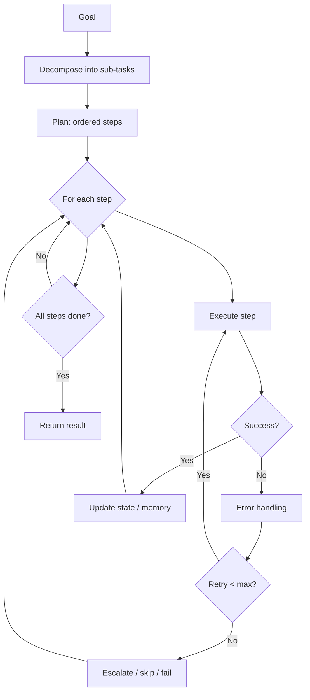
```mermaid
flowchart TB
    G[Goal] --> D[Decompose into sub-tasks]
    D --> P[Plan: ordered steps]
    P --> L{For each step}
    L --> T[Execute step]
    T --> R{Success?}
    R -->|No| E[Error handling]
    E --> Retry{Retry &lt; max?}
    Retry -->|Yes| T
    Retry -->|No| Escalate[Escalate / skip / fail]
    Escalate --> L
    R -->|Yes| Update[Update state / memory]
    Update --> L
    L --> Done{All steps done?}
    Done -->|No| L
    Done -->|Yes| Out[Return result]
```

| Concern             | Approach                                                |
|---------------------|---------------------------------------------------------|
| **Task decomposition** | LLM or rules split goal into steps/sub-goals          |
| **Planning**        | Static plan or dynamic replan after each step          |
| **Retry**           | Backoff, max retries, optional fallback tool           |
| **Error handling**  | Return observation to agent; log; optional human escalation |

---

# Module 6: Building Production-Grade Agentic Systems

**Full flow: Production agent system (high-level)**

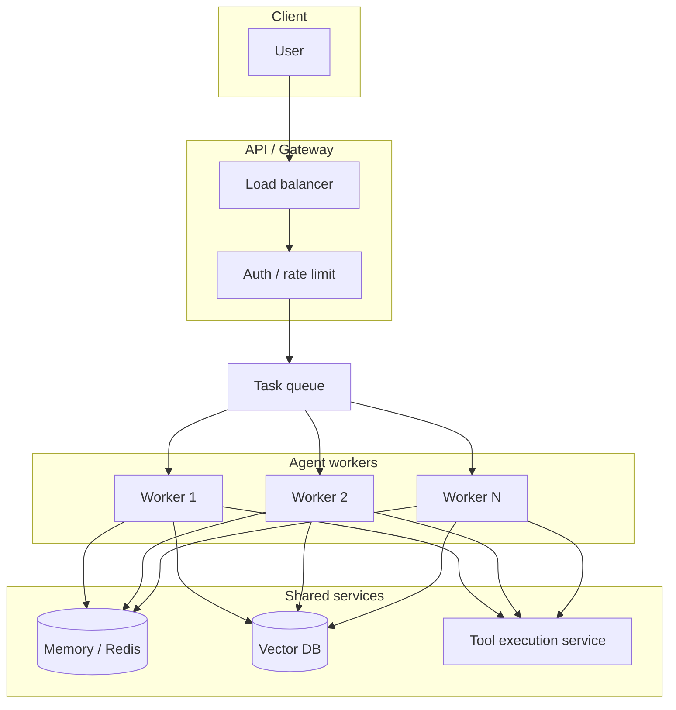
```mermaid
flowchart TB
    subgraph Client["Client"]
        U[User]
    end
    subgraph Gateway["API / Gateway"]
        LB[Load balancer]
        Auth[Auth / rate limit]
    end
    subgraph Workers["Agent workers"]
        W1[Worker 1]
        W2[Worker 2]
        W3[Worker N]
    end
    subgraph Services["Shared services"]
        Mem[(Memory / Redis)]
        VDB[(Vector DB)]
        Tools[Tool execution service]
    end
    U --> LB --> Auth
    Auth --> Q[Task queue]
    Q --> W1 & W2 & W3
    W1 & W2 & W3 --> Mem
    W1 & W2 & W3 --> VDB
    W1 & W2 & W3 --> Tools
```

| Design pattern           | Description                                    | When to use                    |
|--------------------------|------------------------------------------------|--------------------------------|
| **Scalable**             | Stateless workers, external state, async queue| High throughput                |
| **Microservices**        | API, orchestrator, tools, memory separate      | Clear boundaries, scale parts  |
| **Event-driven**         | Agents react to events; emit events            | Loose coupling, replay         |
| **Orchestration**        | Central vs choreography vs saga                | Control vs flexibility         |

---

## 6.1 System Design

### Scalable Architecture

- **Horizontal scaling**: Stateless agent services behind a load balancer; scale out with traffic. Session/context stored in Redis or DB, not in process.
- **Async**: Use queues (e.g., Azure Service Bus, RabbitMQ) for agent tasks so API stays responsive; workers consume and run agent loops.
- **Caching**: Cache embeddings, tool results, and LLM responses where safe to reduce cost and latency.

---

### Microservices-Based Agent Systems

- **Idea**: Separate services for: (1) API/gateway, (2) agent orchestration, (3) tool execution, (4) memory/RAG, (5) monitoring. Each scales and deploys independently.
- **Benefits**: Clear boundaries, language flexibility, and easier security (e.g., tool runner in a locked network).

---

### Event-Driven Agents

- **Idea**: Agents triggered by **events** (e.g., “new ticket,” “file uploaded,” “alert”). Event bus (Kafka, Event Grid) → agent service → actions → possibly emit new events.
- **Use**: Loose coupling, replay, and scaling by partition. Fits async and background workflows.

---

### Orchestration Patterns

- **Central orchestrator**: One service runs the agent loop and calls out to tools and memory. Simple; orchestrator is the bottleneck.
- **Choreography**: Agents and tools emit events; no central brain. Flexible but harder to reason about and debug.
- **Saga / workflow engine**: Long-running workflow with defined steps and compensation. Use for multi-step business processes with rollback.

---

## 6.2 Deployment

### Dockerized Agents

- **What**: Package agent app (and optional dependencies) in a container. Ensures consistent runtime; easy to run locally and in any cloud.
- **Practice**: Multi-stage builds to keep image small; non-root user; secrets via env or mounts, not in image.

---

### Kubernetes Deployment

- **What**: Deploy agent services as pods; use Deployments, HPA (CPU/memory or custom metrics), and Ingress for traffic. State in external stores (DB, Redis, vector DB).
- **Benefits**: Auto-scaling, rolling updates, and resilience. Use ConfigMaps/Secrets for config and keys.

---

### CI/CD for AI Systems

- **What**: Pipelines for code, config, and (where applicable) model/embedding updates. Run tests (unit, integration, contract tests for tools); deploy to dev → staging → prod with approvals.
- **Include**: Prompt/config versioning, evaluation runs on sample inputs, and safe rollout (e.g., canary or feature flags for new agent versions).

**Flow: CI/CD for agent / AI system**

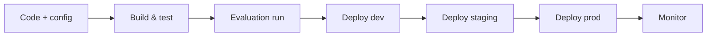
```mermaid
flowchart LR
    Code[Code + config] --> Build[Build & test]
    Build --> Eval[Evaluation run]
    Eval --> Deploy[Deploy dev]
    Deploy --> Stage[Deploy staging]
    Stage --> Prod[Deploy prod]
    Prod --> Monitor[Monitor]
```

---

### Observability & Logging

- **Logging**: Structured logs (request id, agent run id, step, tool, latency, token usage). Centralize in Log Analytics, ELK, or similar.
- **Tracing**: Distributed tracing across API → orchestrator → tools → LLM so you can see full latency and failures.
- **Metrics**: Request rate, error rate, latency (p50/p95/p99), token usage, cost per run. Alert on SLO breaches.

---

## 6.3 Monitoring & Evaluation

### Agent Performance Metrics

| Metric                  | What it measures                         | How to use it                          |
|-------------------------|------------------------------------------|----------------------------------------|
| **Task success rate**   | % of runs that achieve the goal          | Quality target; alert if drops         |
| **Steps to completion** | Distribution of steps per run            | Cost and UX; optimize planning         |
| **Tool use**            | Which tools, how often, errors           | Detect misuse, add/remove tools        |
| **Latency (p50/p95/p99)** | End-to-end and per-step                | SLOs; find bottlenecks                 |
| **Token usage / cost**  | Input/output tokens per run              | Budgets; model choice                  |
| **User satisfaction**   | Ratings, feedback                        | Tune prompts and flows                 |

---

### Latency Optimization

- **Reduce round-trips**: Fewer tool calls via better planning or tool design; batch where possible.
- **Faster models**: Use smaller or distilled models for simple steps; reserve large models for hard reasoning.
- **Caching**: Cache frequent tool results and embeddings; stream LLM output for perceived latency.

---

### Cost Optimization

- **Token usage**: Track input/output tokens per run and per customer; set limits and alerts.
- **Model choice**: Use cheaper models for routing, summarization, or simple steps; expensive models only when needed.
- **Caching and reuse**: Cache prompts and responses; reuse embeddings and retrieved context across similar queries.

---

### Guardrails & Safety Systems

- **Input**: Validate and sanitize user input; block prompt injection patterns; PII detection and redaction.
- **Output**: Content filters (hate, violence, PII); block dangerous tool calls (e.g., delete all, send email to all).
- **Policies**: Allowlists for tools and external calls; human-in-the-loop for sensitive actions; rate limits and abuse detection.
- **Audit**: Log all tool calls and decisions for compliance and incident response.

---

# Module 7: Multi-Agent Enterprise Systems

**Full flow: Enterprise multi-agent with governance**

```mermaid
flowchart TB
    subgraph Users["Users / systems"]
        U1[HR]
        U2[DevOps]
        U3[Support]
    end
    subgraph Gateway["Gateway & governance"]
        APIM[API / APIM]
        RBAC[Access control]
        Audit[Audit log]
    end
    subgraph Agents["Agent pool"]
        A1[HR agent]
        A2[DevOps agent]
        A3[Support agent]
    end
    subgraph Backends["Backends"]
        DB[(DB)]
        Tools[Tools / APIs]
    end
    U1 & U2 & U3 --> APIM --> RBAC
    RBAC --> A1 & A2 & A3
    A1 & A2 & A3 --> Audit
    A1 & A2 & A3 --> DB & Tools
```

| Enterprise workflow   | Agents / roles              | Key integrations              |
|----------------------|-----------------------------|--------------------------------|
| **HR automation**    | Screening, scheduler, FAQ   | ATS, calendar, HRIS            |
| **DevOps automation**| Triage, runbook, approval   | Jira, CI/CD, cloud APIs        |
| **Customer support** | Triage, FAQ, escalation     | KB, CRM, ticketing             |
| **Sales automation** | Lead, schedule, CRM, email  | CRM, calendar, email           |

---

## 7.1 Enterprise Agent Workflows

### HR Automation Agents

- **Use cases**: Resume screening, interview scheduling, answering policy questions, onboarding checklists, leave requests.
- **Design**: Role-based agents (screening, scheduler, FAQ); integration with ATS, calendar, and HRIS via APIs; audit trail for decisions.

---

### DevOps Automation Agents

- **Use cases**: Incident triage, runbook execution, deployment approvals, log analysis, cost recommendations.
- **Design**: Agents with tools for ticketing (Jira, ServiceNow), CI/CD (Azure DevOps, GitHub), and cloud APIs; guardrails to prevent destructive actions without approval.

---

### Customer Support AI Agents

- **Use cases**: Triage, FAQ, ticket summarization, suggested responses, escalation to humans.
- **Design**: RAG over knowledge base; intent detection and routing; handoff to human with full context; sentiment and CSAT tracking.

---

### Sales Automation Agents

- **Use cases**: Lead scoring, meeting scheduling, CRM updates, email drafting, follow-up reminders.
- **Design**: Integration with CRM (Salesforce, Dynamics); tools for calendar and email; compliance with communication and data policies.

---

## 7.2 Agent Governance

### Access Control

- **Principle**: Agents and users get only the permissions they need. Use RBAC; assign identities (e.g., managed identity) to agent services; restrict tool access by role and environment.

---

### Security

- **Secrets**: No keys in code or prompts; use Key Vault or secret manager; rotate regularly.
- **Network**: Agents and tools in private networks where possible; restrict outbound calls; use private endpoints for SaaS.
- **Data**: Encrypt at rest and in transit; minimize PII in logs; data residency and retention per policy.

---

### Compliance

- **Regulations**: Align with GDPR, HIPAA, SOC2, etc.: consent, right to deletion, audit trails, and data handling.
- **Policies**: Define what agents may and may not do; enforce via allowlists, guardrails, and human approval for sensitive actions.

---

### Audit Trails

- **What**: Immutable logs of who (user/agent) did what (tool call, decision), when, and with what outcome. Store in tamper-resistant or append-only storage.
- **Use**: Compliance, debugging, and incident response. Include request id, user id, agent id, tool name, params (sanitized), result summary, and timestamp.

**Flow: Audit and governance**

```mermaid
flowchart LR
    R[Request] --> Auth[Auth / RBAC]
    Auth --> Agent[Agent run]
    Agent --> T[Tool call]
    T --> Log[Log: who, what, when, result]
    Log --> Store[(Append-only store)]
    Store --> Report[Compliance / reports]
```

| Governance area   | Practices                                              |
|-------------------|--------------------------------------------------------|
| **Access control**| RBAC; least privilege; identity per agent/service     |
| **Security**      | Secrets in vault; encrypt; private network where possible |
| **Compliance**   | GDPR/HIPAA/SOC2: consent, deletion, retention, audit   |
| **Audit trails** | Immutable log: user, agent, tool, params, result, time  |

---

## 7.3 Scaling Multi-Agent Systems

### Distributed Coordination

- **Challenge**: Multiple agents and workers; avoid duplicate work and keep state consistent.
- **Patterns**: Leader election or distributed lock for “single worker per task”; message queues with partition keys; or workflow engine that assigns tasks and tracks completion.

---

### Load Balancing

- **What**: Distribute agent requests across instances (round-robin, least connections, or based on queue depth). Use load balancer or queue consumers; stateless agents scale with instance count.
- **Sticky sessions**: Only if you keep context in-process; otherwise prefer stateless + external memory.

---

### Failover Systems

- **What**: Redundant instances and regions; health checks and automatic failover; circuit breakers for dependent services (LLM, tools, DB).
- **State**: Persist conversation and run state so another instance can resume; use DB or distributed cache with replication.

---

### State Synchronization

- **What**: When multiple agents or instances touch shared state (e.g., shared memory, workflow state), use consistent storage (DB, Redis with proper consistency model) and clear ownership of who updates what.
- **Conflict handling**: Optimistic locking, version fields, or last-write-wins with audit; avoid conflicting writes without coordination.

**Flow: Multi-agent scaling (full)**

```mermaid
flowchart TB
    subgraph Traffic["Traffic"]
        LB[Load balancer]
    end
    subgraph Pool["Agent pool"]
        A1[Instance 1]
        A2[Instance 2]
        A3[Instance N]
    end
    subgraph State["Shared state"]
        Q[(Message queue)]
        DB[(DB / Redis)]
    end
    LB --> A1 & A2 & A3
    A1 & A2 & A3 --> Q
    A1 & A2 & A3 --> DB
    Q --> A1 & A2 & A3
```

| Scaling concern          | Approach                                              |
|-------------------------|--------------------------------------------------------|
| **Distributed coordination** | Locks, leader election, or workflow engine for task assignment |
| **Load balancing**      | Stateless instances + LB or queue consumers           |
| **Failover**            | Redundant instances; health checks; persist run state |
| **State sync**          | DB/Redis with clear ownership; optimistic locking if needed |

---

## Quick Reference

| Component | Purpose |
|-----------|--------|
| **Perception** | Get and structure inputs (user, tools, environment). |
| **Reasoning** | Decide next action or answer (often LLM + plan). |
| **Memory** | Short-term context + long-term/episodic storage. |
| **Tools** | Capabilities (search, API, code, DB, etc.). |
| **Action execution** | Run the chosen tool/action safely. |
| **Feedback loop** | Observe results → update state → reason again. |

---

*Agentic AI Notes — Evolution of AI Systems, Definition of Agentic AI, and Core Components of an AI Agent.*
