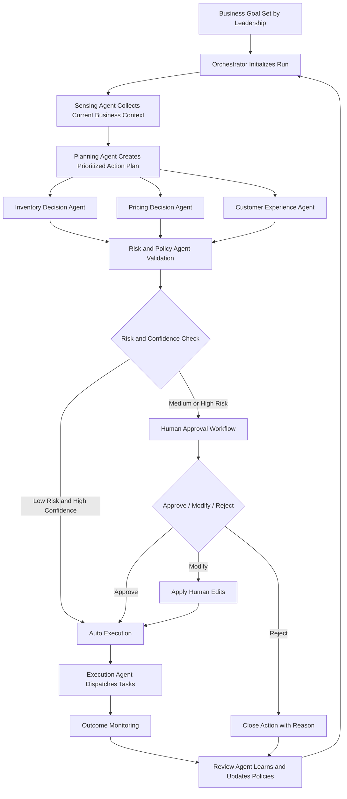
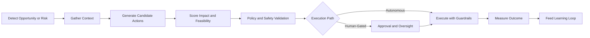
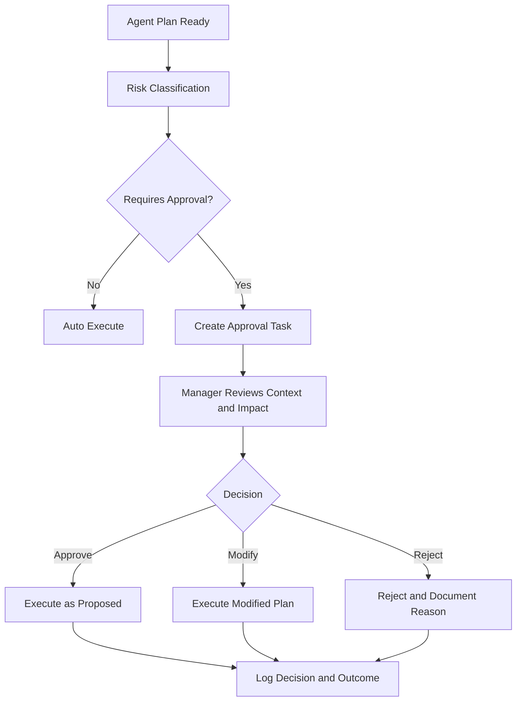
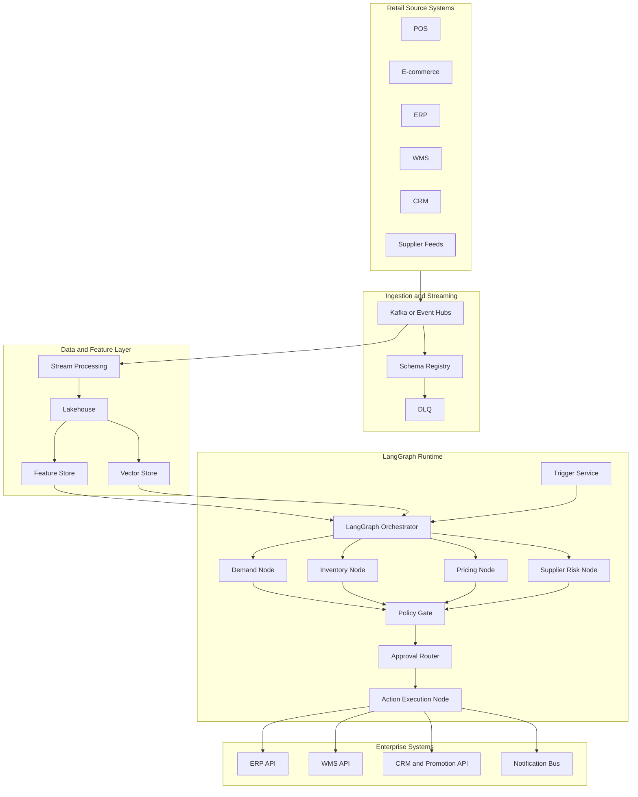
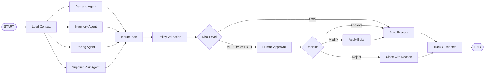
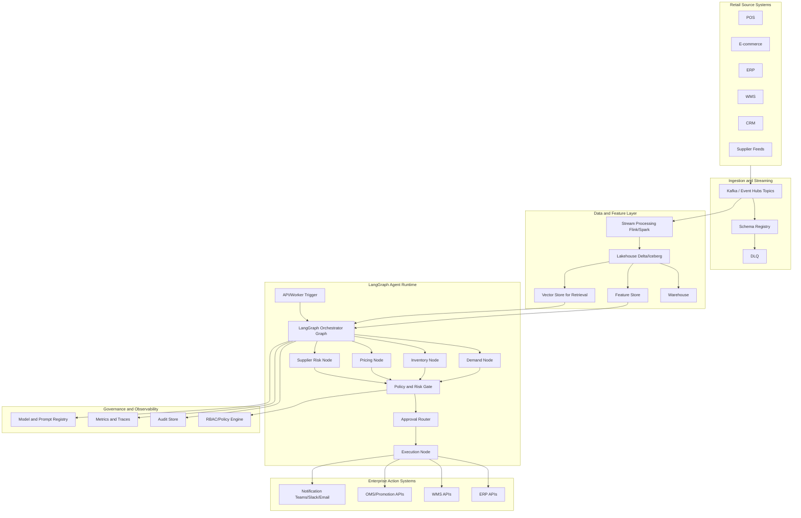
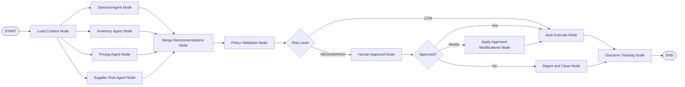
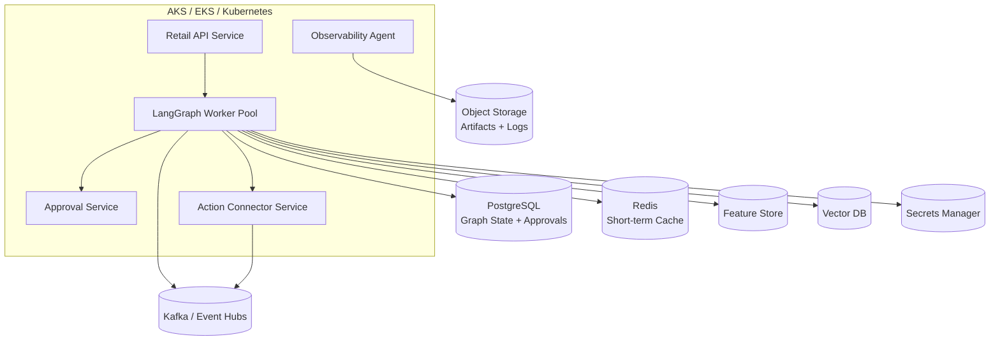
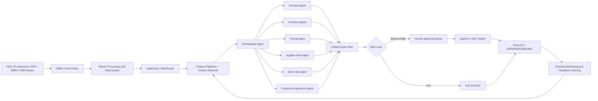
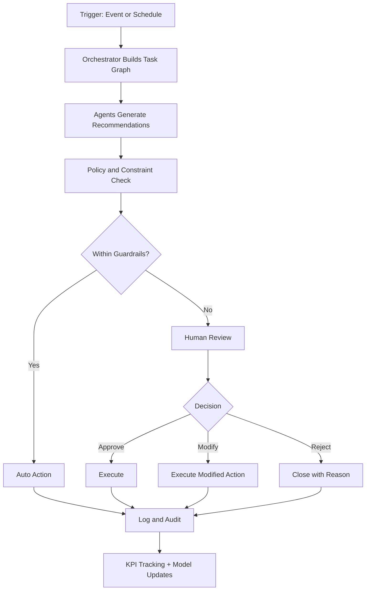

# Intelligent Retail Business Flow Automation Using Agentic AI

## 1) Project Overview

This project builds an **Agentic AI platform** to automate key retail workflows across demand planning, inventory, pricing, promotions, store operations, customer engagement, and post-sales support.

The goal is to move from static dashboards and manual actions to an **AI-driven decision-and-action system** where multiple specialized agents collaborate with human teams.

---

## 2) Business Problem Statement

Retail teams often face:
- stockouts and overstock due to delayed demand signals
- slow pricing and promotion decisions
- manual handling of supplier delays and store exceptions
- inconsistent customer experiences across channels
- high operational cost from repetitive decision tasks

This project solves these using event-driven automation and agent-based intelligence.

---

## 3) Business Objectives

- Improve product availability and reduce stockouts
- Reduce excess inventory and markdown loss
- Increase campaign conversion and basket size
- Improve response time for operational incidents
- Enable real-time decisioning with human approval controls

---

## 4) Scope (What Will Be Automated)

1. Demand sensing and forecasting refresh  
2. Inventory rebalancing and replenishment recommendations  
3. Dynamic pricing and promotion optimization  
4. Supplier risk detection and mitigation actions  
5. Store-level anomaly handling (POS issues, low shelf fill, shrinkage signals)  
6. Customer service auto-resolution for common requests  
7. Daily executive summary and intervention queue

---

## 5) Core Agent Design

### Agent 1: Demand Intelligence Agent
- Monitors sales, seasonality, weather, and local events
- Predicts near-term demand shifts at SKU-store level
- Publishes forecast adjustments with confidence score

### Agent 2: Inventory Optimization Agent
- Reads inventory, in-transit stock, and forecast deltas
- Recommends replenishment quantities and transfer plans
- Triggers purchase request drafts for planner approval

### Agent 3: Pricing and Promotion Agent
- Detects low conversion or slow-moving inventory
- Simulates price/promotional scenarios
- Recommends best action for margin + volume targets

### Agent 4: Supplier and Logistics Risk Agent
- Tracks supplier lead-time deviations and ASN delays
- Predicts fulfillment risk and proposes fallback vendors/routes
- Escalates high-risk SKUs to procurement

### Agent 5: Store Operations Agent
- Detects store anomalies from POS, footfall, and task logs
- Auto-generates store action tasks and priority levels
- Follows up on SLA closure

### Agent 6: Customer Experience Agent
- Handles FAQs, delivery updates, return status, loyalty queries
- Uses policy-aware response generation
- Sends complex cases to human support with summarized context

### Agent 7: Orchestrator / Supervisor Agent
- Coordinates all agents using business goals and constraints
- Resolves agent conflicts (for example margin vs availability)
- Maintains audit trail and approval workflow

---

## 6) End-to-End Project Flow

### Phase A: Data Ingestion and Event Backbone
1. Capture events from POS, e-commerce, ERP, WMS, CRM, supplier feeds
2. Stream events into Kafka / Event Hubs topics
3. Validate schema and route bad records to DLQ
4. Store curated data in lakehouse/warehouse

### Phase B: Intelligence Preparation
1. Build feature pipelines for demand, pricing, and supply risk
2. Refresh embeddings for policy/docs/context retrieval
3. Generate baseline forecasts and optimization inputs
4. Publish inputs for agent consumption

### Phase C: Agentic Decision Cycle
1. Orchestrator receives trigger (time/event/threshold breach)
2. Demand Agent estimates demand deviation
3. Inventory Agent computes replenishment/transfer plans
4. Pricing Agent runs promotion/price action options
5. Supplier Risk Agent checks upstream constraints
6. Orchestrator merges outputs into a single action plan

### Phase D: Human-in-the-Loop Governance
1. Low-risk actions auto-execute within policy boundaries
2. Medium/high-risk actions move to approval queue
3. Planner/manager approves, edits, or rejects actions
4. Decisions are logged for feedback learning

### Phase E: Action Execution
1. Push approved actions to ERP/WMS/OMS/CRM systems
2. Trigger store tasks, replenishment orders, campaign updates
3. Notify stakeholders through Teams/Slack/email

### Phase F: Monitoring and Continuous Learning
1. Track outcomes (availability, sales uplift, margin impact, SLA)
2. Compare forecast vs actual and recommendation vs result
3. Retrain models and update agent policies
4. Improve confidence thresholds and routing rules

---

## 7) Reference Technical Architecture

- **Event Layer:** Kafka / Azure Event Hubs
- **Stream Processing:** Spark Structured Streaming / Flink / Kafka Streams
- **Storage:** Data Lake + Warehouse (Delta/Iceberg + Synapse/Snowflake/BigQuery)
- **Model Layer:** Forecasting models + optimization models + LLM services
- **Agent Framework:** LangGraph / CrewAI / Semantic Kernel / custom orchestrator
- **Tool Layer:** ERP, WMS, OMS, CRM, campaign APIs
- **Governance:** RBAC, policy engine, approval workflow, audit logs
- **Observability:** Prometheus, Grafana, OpenTelemetry, model drift monitors

---

## 8) Detailed Workflow Example (One SKU Category)

1. Weekend sales spike detected for beverage SKUs in Mumbai stores  
2. Demand Agent predicts +22% uplift for next 5 days  
3. Inventory Agent identifies stockout risk in 18 stores  
4. Supplier Risk Agent flags primary supplier delay for 2 days  
5. Pricing Agent recommends stopping discount in low-stock stores  
6. Orchestrator proposes:
   - inter-store transfer for urgent stores
   - emergency PO split to backup supplier
   - discount pause for affected stores
7. Planner approves transfer + PO, modifies discount rule  
8. Actions pushed to WMS/ERP/campaign tool  
9. Outcome tracking shows:
   - stockout reduced by 31%
   - margin improved by 4.8%
   - no major lost-sales incident

---

## 9) Implementation Roadmap

### Stage 1 (0-6 weeks): Foundation
- Define use cases, KPIs, and policy boundaries
- Build data contracts and event schemas
- Set up Kafka/Event Hubs topics and data quality checks

### Stage 2 (7-12 weeks): First Agent Pilot
- Deploy Demand + Inventory agents for one category and region
- Add approval dashboard for planners
- Measure stockout and replenishment performance

### Stage 3 (13-20 weeks): Multi-Agent Expansion
- Add Pricing and Supplier Risk agents
- Introduce orchestrator conflict handling
- Expand to multiple categories/channels

### Stage 4 (21-28 weeks): Enterprise Rollout
- Add Store Ops and Customer Experience agents
- Tighten governance, security, and model ops
- Formalize playbooks and SLA ownership

---

## 10) Governance, Risk, and Controls

- Mandatory human approval for high financial impact actions
- Region/store/category guardrails for automated changes
- Explainable recommendation logs (why action was suggested)
- Bias and fairness checks for pricing/customer treatment
- Disaster rollback: revert pricing/replenishment updates quickly
- Full auditability for compliance teams

---

## 11) KPI Framework

### Business KPIs
- Stockout rate
- Sell-through rate
- Gross margin return on inventory (GMROI)
- Promotion uplift
- Customer satisfaction / NPS

### Operational KPIs
- Decision cycle time
- Planner productivity gain
- SLA adherence for incidents
- Auto-resolution rate in support flows

### AI/Model KPIs
- Forecast MAPE / WAPE
- Recommendation acceptance rate
- Action success rate
- Drift and confidence threshold breaches

---

## 12) Team and Ownership

- **Business Owner:** Head of Retail Operations
- **Program Lead:** Product Manager (AI Automation)
- **Data Team:** Data engineers + analytics engineers
- **AI Team:** ML engineers + LLM/agent engineers
- **Domain SMEs:** Merchandising, supply chain, store ops
- **Governance:** Security, compliance, risk committee

---

## 13) Expected Outcomes (Year 1 Targets)

- 20% to 35% reduction in stockouts
- 10% to 20% reduction in excess inventory
- 3% to 8% margin improvement in pilot categories
- 25% to 40% faster operational decision cycles
- 30%+ automation of repetitive retail workflows

---

## 14) Final Delivery Checklist

- Use-case blueprint and KPI baseline approved
- Data pipelines and event contracts production-ready
- Agent orchestration with approvals live
- Monitoring and governance dashboards active
- Rollout playbook completed for category-wise expansion

This creates a scalable and governed **intelligent retail business flow automation** program powered by Agentic AI.

---

## 15) Agentic AI Project Flow (Only) - Full Notes + Flow Diagrams

This section is intentionally focused on **Agentic AI project flow only**.  
It avoids platform-specific streaming/tool discussions and describes how a retail business can run end-to-end automation using collaborating AI agents, policy controls, and human approvals.

### 15.1 What an Agentic AI Retail Project Means

An Agentic AI retail project is a system where multiple specialized AI agents do more than answer questions. They observe business context, reason over goals and constraints, produce action plans, coordinate with each other, ask for human decisions when needed, and continuously learn from outcomes.

In retail, this helps teams move from reactive manual operations to proactive, AI-assisted operations. The value is not only in prediction accuracy but in **decision speed**, **execution consistency**, and **governed autonomy**.

### 15.2 Core Agent Roles

1. **Sensing Agent** - detects demand changes, store exceptions, and customer intent shifts.  
2. **Planning Agent** - decomposes goals into executable tasks and priorities.  
3. **Inventory Decision Agent** - recommends replenishment, allocation, and transfer actions.  
4. **Pricing Decision Agent** - recommends pricing or promotion adjustments within policy.  
5. **Risk and Policy Agent** - evaluates compliance, financial exposure, and operational risk.  
6. **Execution Agent** - converts approved decisions into actionable enterprise tasks.  
7. **Review Agent** - evaluates outcomes, captures lessons, and updates rules/policies.

These agents are coordinated by an **Orchestrator Agent** that controls sequence, dependencies, and escalation.

### 15.3 Full Agentic AI Business Flow



### 15.4 Decision Lifecycle (Detailed)



### 15.5 Human-in-the-Loop Governance Flow



### 15.6 Full Notes: How the Project Operates in Practice

#### A) Goal Definition Phase

The project starts by translating business goals into measurable AI goals. For example, reducing stockouts, improving margin quality, increasing promotion effectiveness, and reducing decision turnaround time. Every goal is mapped to thresholds and escalation rules so the agents operate with clear boundaries.

#### B) Context Assembly Phase

Before any recommendation is made, agents gather current context: recent business performance, active constraints, open interventions, and policy boundaries. This avoids isolated decisions and ensures each recommendation is contextual, explainable, and aligned with current priorities.

#### C) Multi-Agent Reasoning Phase

The orchestrator assigns sub-problems to specialized agents. Each agent returns:
- recommendation,
- expected impact,
- confidence,
- assumptions,
- constraints checked,
- reason codes.

The orchestrator merges these outputs and resolves conflicts (for example, availability-first vs margin-first). This produces one coherent action plan instead of disconnected recommendations.

#### D) Policy and Risk Control Phase

Before execution, the plan is validated against governance policies:
- financial exposure limits,
- operational capacity limits,
- fairness/compliance rules,
- business criticality rules.

If a recommendation is low-risk and reversible, it may be auto-executed. If risk is medium/high or confidence is low, the plan goes to approval.

#### E) Human Approval and Intervention Phase

Approvers receive concise, decision-ready context:
- what the agent recommends,
- why it recommends it,
- expected uplift and downside risk,
- fallback/rollback option.

Approvers can approve, modify, or reject. Modified actions are preserved for learning so the system improves and aligns with business judgment over time.

#### F) Execution Phase

Once approved, execution agents convert plans into business actions (for example replenishment tasks, price rule updates, store action items, customer response actions). Execution is tracked with status states such as queued, started, completed, failed, and compensated.

#### G) Outcome and Learning Phase

Every action is measured against intended outcomes. The review agent compares expected vs realized impact and records:
- success/failure,
- root causes,
- intervention quality,
- confidence calibration quality.

Insights are used to tune agent prompts, decision rules, confidence thresholds, and escalation policies.

### 15.7 Agentic AI Project Operating Model

| Layer | Purpose | Owner | Output |
|---|---|---|---|
| Strategy Layer | Define goals, policy, guardrails | Leadership + Product | Goal map and control boundaries |
| Intelligence Layer | Analyze context and generate options | AI Agents | Ranked recommendations |
| Governance Layer | Risk checks and approvals | Risk + Business Managers | Approved/modified/rejected decisions |
| Execution Layer | Carry out approved actions | Ops + Execution Agent | Completed business actions |
| Learning Layer | Measure outcomes and improve system | AI + Analytics | Updated rules, prompts, thresholds |

### 15.8 Project Lifecycle Timeline (Agentic AI View)

1. **Design:** Define objectives, boundaries, and intervention model.  
2. **Pilot:** Start with 1-2 high-impact decision journeys.  
3. **Stabilize:** Improve confidence, reduce false alerts, harden approvals.  
4. **Scale:** Expand to more categories, regions, and teams.  
5. **Optimize:** Shift from assisted automation to governed autonomy.

### 15.9 Success Conditions for Agentic AI Projects

The project is successful when:
- teams trust recommendations because they are explainable,
- risky decisions are controlled through approvals,
- low-risk decisions are executed fast automatically,
- measurable KPIs improve consistently,
- the system learns and improves without creating governance risk.

### 15.10 Final Agentic AI-Only Summary

A complete Agentic AI retail project is a closed-loop intelligent operating system: it senses business conditions, plans cross-functional actions, enforces policy, routes human decisions where needed, executes approved interventions, and learns from outcomes continuously.  
This is the full flow that turns AI from a reporting assistant into a governed decision-and-action engine for retail business automation.

---

## 17) Technology Architecture (LangGraph-Centric, Detailed)

This section defines the production technical architecture using **LangGraph** as the orchestration backbone for multi-agent retail automation. The design follows event-driven execution, typed state transitions, deterministic policy gates, and human-in-the-loop controls for high-impact actions.

### 17.1 High-Level Technical Architecture



### 17.2 LangGraph Decision Flow



### 17.3 Typed LangGraph State

```python
from typing import TypedDict, Dict, Any, List

class RetailGraphState(TypedDict, total=False):
    event: Dict[str, Any]
    context: Dict[str, Any]
    demand_output: Dict[str, Any]
    inventory_output: Dict[str, Any]
    pricing_output: Dict[str, Any]
    supplier_output: Dict[str, Any]
    merged_plan: Dict[str, Any]
    policy_result: Dict[str, Any]
    approval_result: Dict[str, Any]
    execution_result: Dict[str, Any]
    errors: List[str]
    trace_id: str
    run_id: str
```

### 17.4 Node Contract Pattern

Every LangGraph node should:
1. Read only required keys from state.
2. Perform one isolated business step.
3. Return partial state updates only.
4. Add confidence, assumptions, and reason codes.
5. Avoid side effects unless it is an explicit execution node.

Example output payload:

```json
{
  "inventory_output": {
    "recommended_qty": 122,
    "confidence": 0.81,
    "reason_codes": ["DEMAND_UPLIFT", "LOW_BUFFER_STOCK"],
    "constraints_checked": ["max_po_limit", "store_capacity"]
  }
}
```

### 17.5 Routing and Policy Gates

Recommended routers:
- `risk_router`: LOW vs MEDIUM/HIGH risk.
- `approval_router`: APPROVED vs MODIFIED vs REJECTED.
- `error_router`: RETRY vs ESCALATE.

Gate logic should combine:
- financial exposure threshold
- supplier risk threshold
- confidence threshold
- category-level governance rules

### 17.6 Checkpointing, Resume, and Failure Handling

Use checkpointing after key nodes (`merge_plan`, `policy_gate`, `approval`, `execute`) so the graph can resume safely.

Failure strategy:
1. retry transient failures with backoff,
2. resume from last checkpoint,
3. escalate to human queue if retries exceed limit.

### 17.7 Human-in-the-Loop Using Pause/Resume

For high-risk decisions:
- Graph pauses at approval node.
- Approval task is created with impact and rollback summary.
- Approver action resumes the graph.
- Decision metadata is written to audit store.

This keeps automation fast while retaining enterprise governance.

### 17.8 Action Connector Design

Action execution node should support:
- idempotency keys
- preflight validation
- retries with circuit breaker
- post-write verification
- compensation steps on partial failure

Keep execution connectors separate from reasoning nodes for clean isolation.

### 17.9 Observability Architecture

Capture:
- graph metrics (node latency, retries, routing path),
- agent metrics (confidence, token use, error patterns),
- business metrics (stockout delta, margin impact, action success rate).

Minimum alerts:
- graph failure rate breach,
- approval queue SLA breach,
- connector error spike,
- confidence collapse in specific category/region.

### 17.10 Full Technical Runtime Sequence

1. Event enters Kafka/Event Hubs with `trace_id`.
2. Trigger service starts LangGraph run.
3. Context node loads features, policies, and retrieval context.
4. Domain agent nodes execute (parallel where possible).
5. Merge node builds unified plan.
6. Policy node computes risk and approval need.
7. Router chooses auto-execution or approval branch.
8. Approval branch pauses and resumes on callback.
9. Execution node sends actions to ERP/WMS/CRM connectors.
10. Outcome node stores results and KPI deltas.
11. Feedback pipeline updates thresholds, prompts, and model versions.

### 17.11 Recommended Production Deployment

- API service for trigger/approval callbacks
- LangGraph worker pool for asynchronous execution
- Postgres for durable state and approvals
- Redis for short-term context/cache
- Object storage for logs/artifacts
- OpenTelemetry + Prometheus + Grafana for runtime visibility

### 17.12 Technical Conclusion

LangGraph enables a strong production pattern for retail agentic automation: parallel agent reasoning, deterministic routing, resumable workflows, controlled approvals, and auditable execution. This provides both agility (faster actions) and safety (policy-governed operations) at enterprise scale.

---

## 17) Technology Architecture (LangGraph-Centric, Detailed)

This section defines the production technical architecture using **LangGraph** as the orchestration backbone for multi-agent retail automation. The design follows event-driven execution, strongly typed state transitions, deterministic policy gates, and human-in-the-loop approval for high-impact actions.

### 17.1 High-Level Technical Architecture



### 17.2 LangGraph Execution Graph (Agent Flow)



### 17.3 Deployment Topology (Production)



### 17.4 LangGraph State Design (Recommended)

Use a typed state object so every node reads/writes known keys. This keeps graph behavior deterministic and easier to test.

```python
from typing import TypedDict, Dict, Any, List, Optional

class RetailGraphState(TypedDict, total=False):
    event: Dict[str, Any]
    context: Dict[str, Any]
    demand_output: Dict[str, Any]
    inventory_output: Dict[str, Any]
    pricing_output: Dict[str, Any]
    supplier_output: Dict[str, Any]
    merged_plan: Dict[str, Any]
    policy_result: Dict[str, Any]
    approval: Dict[str, Any]
    execution_result: Dict[str, Any]
    errors: List[str]
    trace_id: str
    run_id: str
    updated_at: str
```

Technical guidance:
- Keep each node idempotent (safe on retries).
- Limit node write scope; avoid uncontrolled state mutation.
- Add `trace_id` and `run_id` at graph entry for lineage.
- Store agent confidence, assumptions, and citations in node outputs.

### 17.5 LangGraph Node Contract Pattern

Each node should follow the same contract:
1. Read only required state keys.
2. Perform one clear task.
3. Return partial state update.
4. Attach confidence, constraints, and reason codes.
5. Never perform external side effects in analysis nodes.

Example node output contract:

```json
{
  "inventory_output": {
    "recommended_qty": 122,
    "confidence": 0.81,
    "constraints_checked": ["max_po_limit", "store_capacity"],
    "assumptions": ["lead_time_3_days", "no_promo_extension"],
    "reason_codes": ["DEMAND_UPLIFT", "LOW_DC_STOCK"]
  }
}
```

### 17.6 Routing and Conditional Edges in LangGraph

Routing should be explicit and policy-driven. Recommended routers:
- `risk_router`: low vs medium/high risk path
- `approval_router`: approved / modified / rejected
- `error_router`: retry / compensating action / human escalation

Edge strategy:
- Use deterministic thresholds for financial and operational risk.
- Route to approval if confidence is low even when risk is moderate.
- Route to reject when policy violations are non-overridable.

### 17.7 Memory, Checkpointing, and Recovery

Use LangGraph checkpointing to support resumability and human pauses.

Recommended model:
- **Short-term state:** active graph state in Redis/Postgres.
- **Durable checkpoint:** persisted after every critical node.
- **Long-term memory:** decision outcomes and feedback stored in warehouse.
- **Context memory:** indexed SOPs, contracts, and policy docs in vector DB.

Recovery pattern:
1. Node fails.
2. Retry with bounded attempts.
3. Resume from latest checkpoint.
4. If still failing, route to manual incident queue with full state snapshot.

### 17.8 Human-in-the-Loop with LangGraph Interrupts

For high-risk actions, the graph should pause and wait for approval event.

Recommended behavior:
- Create approval task with plan summary, expected impact, and rollback path.
- Persist graph state + checkpoint.
- Resume graph on approval callback event.
- Record approver id, timestamp, and change notes for audit.

This pattern gives strong governance without breaking end-to-end automation.

### 17.9 Tool/Action Integration Pattern

Separate decision nodes from action nodes:
- **Decision nodes:** read data and compute recommendation.
- **Action nodes:** call ERP/WMS/CRM APIs.

Action node requirements:
- idempotency key per command
- preflight validation
- retry with backoff
- circuit breaker on downstream instability
- compensation/rollback handlers

### 17.10 Observability and SRE Design

Capture three telemetry layers:

1. **Graph telemetry:** node latency, retries, path decisions, checkpoint counts.
2. **Agent telemetry:** token usage, tool calls, confidence distribution, failure modes.
3. **Business telemetry:** stockout deltas, margin impact, action success.

Minimum alerts:
- graph failure rate above threshold
- approval backlog SLA breach
- action connector error spikes
- drift or confidence collapse by category

### 17.11 Security and Compliance Controls

- Enforce RBAC for graph trigger, approval, and execution APIs.
- Mask/tokenize customer identifiers before agent context assembly.
- Restrict tool access per node role (least privilege).
- Sign and retain audit events for every recommendation and execution.
- Keep model/prompt version in every decision record.

### 17.12 CI/CD and Release Architecture

Release components independently but validate end-to-end:
- graph definitions (nodes/edges/routers)
- prompts and policy rules
- model versions
- connectors and schema contracts

Pipeline gates:
1. Unit tests per node.
2. Contract tests for state schema.
3. Simulation tests with historical replay.
4. Canary rollout for one category/region.
5. Auto rollback on KPI regression or error spike.

### 17.13 Full Technical Runtime Sequence (Detailed)

1. Kafka/Event Hubs event arrives with `trace_id`.
2. Trigger service starts LangGraph run and loads baseline context.
3. Demand, Inventory, Pricing, Supplier nodes execute (parallel where possible).
4. Merge node builds unified decision payload and impact estimates.
5. Policy node validates constraints, risk, and confidence thresholds.
6. Router sends flow to auto-execution or approval path.
7. If approval path: graph pauses, checkpoint persists, approver reviews.
8. Graph resumes on approval callback; applies modifications if any.
9. Action node invokes ERP/WMS/OMS/CRM connectors with idempotency.
10. Outcome node writes KPI deltas, decision lineage, and telemetry.
11. Feedback pipelines update model features, prompt policies, and thresholds.

### 17.14 Recommended Initial LangGraph Project Structure

```text
retail-agentic-platform/
  app/
    api/
      trigger.py
      approval_callback.py
    graph/
      state.py
      builder.py
      routers.py
      nodes/
        load_context.py
        demand.py
        inventory.py
        pricing.py
        supplier_risk.py
        merge_plan.py
        policy_gate.py
        execute_actions.py
        track_outcomes.py
    connectors/
      erp_client.py
      wms_client.py
      crm_client.py
    policies/
      risk_rules.yaml
      approval_rules.yaml
    observability/
      logging.py
      tracing.py
  tests/
    test_nodes/
    test_routers/
    test_graph_e2e/
```

### 17.15 Final Technical Conclusion

Using LangGraph as the orchestration core gives you a strong balance of flexibility and control: parallel multi-agent reasoning, deterministic routing, resumable workflows, policy-first governance, and production-grade observability. In retail operations, where decisions directly impact revenue, inventory cost, and customer experience, this architecture provides both business agility and enterprise safety.

---

## 16) Full Project Flow with Code (Line-by-Line Explanation)

This section gives a practical reference implementation for the same retail Agentic AI flow.  
The code is written as Python-style orchestration logic so you can convert it to FastAPI, Airflow, or microservices.

### 16.1 End-to-End Code Flow (Reference)

```python
# 01
from datetime import datetime
# 02
from typing import Dict, List, Any
# 03
import json

# 04
def validate_event(event: Dict[str, Any]) -> bool:
# 05
    required = ["event_id", "event_type", "store_id", "sku_id", "timestamp"]
# 06
    return all(key in event and event[key] is not None for key in required)

# 07
def demand_agent(event: Dict[str, Any]) -> Dict[str, Any]:
# 08
    uplift = 0.22 if event["event_type"] == "sales_spike" else 0.05
# 09
    return {"forecast_uplift": uplift, "confidence": 0.84}

# 10
def inventory_agent(event: Dict[str, Any], demand: Dict[str, Any]) -> Dict[str, Any]:
# 11
    base_replenish = 100
# 12
    recommended_qty = int(base_replenish * (1 + demand["forecast_uplift"]))
# 13
    return {"recommended_replenishment_qty": recommended_qty, "confidence": 0.80}

# 14
def pricing_agent(event: Dict[str, Any], demand: Dict[str, Any]) -> Dict[str, Any]:
# 15
    action = "pause_discount" if demand["forecast_uplift"] > 0.20 else "keep_discount"
# 16
    return {"pricing_action": action, "confidence": 0.76}

# 17
def supplier_risk_agent(event: Dict[str, Any]) -> Dict[str, Any]:
# 18
    delayed = event.get("supplier_delay_days", 0) >= 2
# 19
    risk_score = 0.82 if delayed else 0.28
# 20
    return {"supplier_delay_risk": risk_score, "use_backup_supplier": delayed}

# 21
def orchestrator(event: Dict[str, Any]) -> Dict[str, Any]:
# 22
    demand = demand_agent(event)
# 23
    inventory = inventory_agent(event, demand)
# 24
    pricing = pricing_agent(event, demand)
# 25
    supplier = supplier_risk_agent(event)
# 26
    plan = {
# 27
        "event_id": event["event_id"],
# 28
        "store_id": event["store_id"],
# 29
        "sku_id": event["sku_id"],
# 30
        "demand": demand,
# 31
        "inventory": inventory,
# 32
        "pricing": pricing,
# 33
        "supplier": supplier,
# 34
        "created_at": datetime.utcnow().isoformat()
# 35
    }
# 36
    return apply_policy_and_risk(plan)

# 37
def apply_policy_and_risk(plan: Dict[str, Any]) -> Dict[str, Any]:
# 38
    high_financial_impact = plan["inventory"]["recommended_replenishment_qty"] > 115
# 39
    high_supplier_risk = plan["supplier"]["supplier_delay_risk"] > 0.75
# 40
    plan["risk_level"] = "HIGH" if (high_financial_impact or high_supplier_risk) else "LOW"
# 41
    plan["approval_required"] = plan["risk_level"] == "HIGH"
# 42
    return plan

# 43
def execute_plan(plan: Dict[str, Any], approved_by: str = "") -> Dict[str, Any]:
# 44
    if plan["approval_required"] and not approved_by:
# 45
        return {"status": "PENDING_APPROVAL", "plan": plan}
# 46
    actions = []
# 47
    actions.append(f"ERP_PO_CREATE qty={plan['inventory']['recommended_replenishment_qty']}")
# 48
    actions.append(f"PROMO_UPDATE action={plan['pricing']['pricing_action']}")
# 49
    if plan["supplier"]["use_backup_supplier"]:
# 50
        actions.append("PROCUREMENT_SWITCH_TO_BACKUP_SUPPLIER")
# 51
    return {"status": "EXECUTED", "approved_by": approved_by or "AUTO", "actions": actions, "plan": plan}

# 52
def log_outcome(result: Dict[str, Any]) -> None:
# 53
    print(json.dumps(result, indent=2))

# 54
def process_event(event: Dict[str, Any], approver: str = "") -> Dict[str, Any]:
# 55
    if not validate_event(event):
# 56
        return {"status": "INVALID_EVENT", "reason": "Schema validation failed"}
# 57
    plan = orchestrator(event)
# 58
    result = execute_plan(plan, approved_by=approver)
# 59
    log_outcome(result)
# 60
    return result

# 61
sample_event = {
# 62
    "event_id": "evt-1001",
# 63
    "event_type": "sales_spike",
# 64
    "store_id": "MUM-018",
# 65
    "sku_id": "BEV-330ML-12PK",
# 66
    "timestamp": "2026-04-30T09:30:00Z",
# 67
    "supplier_delay_days": 2
# 68
}

# 69
output = process_event(sample_event, approver="planner_lead_01")
# 70
print("FINAL_STATUS:", output["status"])
```

### 16.2 Line-by-Line Explanation

- **Line 01** imports `datetime` to stamp every generated plan.
- **Line 02** imports typing helpers for readable, strongly-typed function signatures.
- **Line 03** imports `json` to print structured execution logs.
- **Line 04** defines event validation function.
- **Line 05** declares mandatory event fields expected from Kafka/Event Hubs consumers.
- **Line 06** checks all mandatory fields are present and non-null.
- **Line 07** defines the demand intelligence agent function.
- **Line 08** applies simple business logic to forecast uplift from event type.
- **Line 09** returns demand output with confidence score.
- **Line 10** defines inventory optimization agent function.
- **Line 11** sets a baseline replenishment quantity.
- **Line 12** adjusts replenishment based on forecast uplift.
- **Line 13** returns inventory recommendation and confidence.
- **Line 14** defines pricing agent function.
- **Line 15** selects pricing action based on expected demand pressure.
- **Line 16** returns pricing recommendation and confidence.
- **Line 17** defines supplier risk agent function.
- **Line 18** interprets delay data into a boolean delayed flag.
- **Line 19** converts delay condition into a risk score.
- **Line 20** returns supplier risk output and backup supplier flag.
- **Line 21** defines orchestrator that coordinates all agents.
- **Line 22** calls demand agent first.
- **Line 23** calls inventory agent using demand output.
- **Line 24** calls pricing agent using demand output.
- **Line 25** calls supplier risk agent.
- **Line 26** starts assembling unified plan payload.
- **Line 27** copies event identifier for traceability.
- **Line 28** attaches store context.
- **Line 29** attaches SKU context.
- **Line 30** embeds demand agent result.
- **Line 31** embeds inventory agent result.
- **Line 32** embeds pricing agent result.
- **Line 33** embeds supplier risk result.
- **Line 34** stamps plan creation timestamp.
- **Line 35** closes plan dictionary.
- **Line 36** pushes plan to policy/risk stage before execution.
- **Line 37** defines policy and guardrail evaluation function.
- **Line 38** evaluates financial impact risk from replenishment size.
- **Line 39** evaluates supply-side risk from supplier delay.
- **Line 40** computes overall risk level.
- **Line 41** sets approval requirement based on risk.
- **Line 42** returns policy-scored plan.
- **Line 43** defines enterprise action executor.
- **Line 44** checks mandatory approval for high-risk actions.
- **Line 45** returns pending state when approval is missing.
- **Line 46** initializes action command list.
- **Line 47** creates ERP purchase order action command.
- **Line 48** creates promotion update action command.
- **Line 49** checks if backup supplier route is required.
- **Line 50** appends procurement switch action if needed.
- **Line 51** returns final execution response payload.
- **Line 52** defines logging function.
- **Line 53** writes structured JSON log for observability.
- **Line 54** defines complete event processing pipeline function.
- **Line 55** runs schema validation first.
- **Line 56** short-circuits invalid events with reason.
- **Line 57** generates orchestrated action plan.
- **Line 58** executes or routes for approval.
- **Line 59** logs final result for audit.
- **Line 60** returns final pipeline output.
- **Line 61** creates sample retail event payload.
- **Line 62** sets unique event id.
- **Line 63** sets event type as sales spike trigger.
- **Line 64** sets store identifier.
- **Line 65** sets SKU identifier.
- **Line 66** sets event timestamp.
- **Line 67** sets supplier delay input for risk detection.
- **Line 68** closes sample payload.
- **Line 69** runs full pipeline with planner approval.
- **Line 70** prints final execution status.

### 16.3 Full Runtime Flow (How This Code Maps to Project)

1. Event arrives from stream (`sales_spike`, SKU, store, supplier delay).  
2. `validate_event()` enforces data contract quality at entry point.  
3. `orchestrator()` invokes specialized agents (demand, inventory, pricing, supplier risk).  
4. Agent outputs are unified into one decision object (`plan`).  
5. `apply_policy_and_risk()` adds governance controls (`risk_level`, `approval_required`).  
6. `execute_plan()` either:
   - auto-executes low-risk actions, or
   - returns pending approval for high-risk actions.  
7. Enterprise action commands are generated for ERP, promotion, procurement systems.  
8. `log_outcome()` writes traceable execution records for monitoring and audit.  
9. Final status (`EXECUTED` or `PENDING_APPROVAL`) is returned to control tower/API layer.  
10. The same output is used for KPI measurement, learning, and model/policy tuning.

### 16.4 Production Extension Checklist (Next Step)

- Replace sample logic with real model endpoints and feature store reads.
- Replace `print` logging with structured logging + OpenTelemetry traces.
- Convert action strings into API clients for ERP/WMS/CRM systems.
- Add retry, idempotency key, and rollback handlers for each action type.
- Persist plans, approvals, and outcomes in a governed database for audit.

---

## 15) Expanded End-to-End Full Project Flow (Detailed Narrative)

### 15.1 Business Vision and Transformation Scope

The core transformation objective is not only to automate tasks, but to redesign retail decision-making from a batch, report-driven model into a continuous intelligence loop. In a typical retail setup, teams review yesterday's reports, manually coordinate through spreadsheets and calls, and then execute decisions with delay. Agentic AI changes this model by continuously reading business signals, generating prioritized actions, routing them through policy controls, and learning from outcomes.

In this project, automation is designed around measurable business value: reducing stockouts, improving margin quality, accelerating response to disruptions, and improving consistency in customer interactions. The architecture intentionally combines deterministic systems (rules, constraints, approvals) with adaptive systems (forecasting, optimization, LLM reasoning), so that the business remains controlled while becoming more responsive.

### 15.2 Detailed Business Process Coverage

The automation program covers the full retail operational chain:

- **Demand sensing:** Interprets fast-changing demand signals by product, store, and channel.
- **Inventory planning and execution:** Converts predicted demand and current stock posture into replenishment and transfer actions.
- **Price and promotion steering:** Dynamically adjusts commercial levers based on sell-through, margin pressure, and stock position.
- **Supplier and logistics risk control:** Detects lead-time instability and delivery slippage before shelves are impacted.
- **Store exception management:** Converts real-time anomalies into prioritized and trackable actions.
- **Customer interaction automation:** Resolves high-volume support intents and escalates only complex cases.
- **Executive command visibility:** Produces an explainable daily control tower view with decisions, outcomes, and interventions.

This coverage ensures the system does not operate as isolated AI experiments. Instead, each automation domain feeds into a common orchestration and governance layer, which is critical for enterprise scale.

### 15.3 Full Technical Flow: From Raw Events to Measurable Outcomes

The complete flow runs as a closed loop with seven operational stages.

#### Stage 1: Source System Event Capture

The platform continuously ingests events from POS transactions, e-commerce order streams, returns systems, ERP, warehouse operations, supplier feeds, loyalty platform activity, and customer support channels. Each source emits business events with timestamp, entity identifiers, and operational context. Events are standardized into canonical schemas to avoid downstream semantic conflicts.

Data contracts are enforced at ingress so producers cannot silently break consumer logic. Versioned schemas are maintained in registry and backward compatibility rules are applied. Invalid records are sent to DLQ with reason codes to support quick producer-side remediation.

#### Stage 2: Event Backbone and Stream Processing

Kafka or Azure Event Hubs serves as the transport and decoupling layer. Topic design follows business domains (sales, inventory, fulfillment, pricing, support), with partition strategy based on high-cardinality keys such as `store_id`, `sku_id`, or `order_id` for parallelism and ordering where required.

Stream processing jobs execute enrichment, normalization, deduplication, out-of-order correction, and quality scoring. Gold-level business facts are then materialized into a lakehouse and warehouse for analytical and AI consumption. Near-real-time SLAs are defined by domain, for example sub-minute for availability alerts and 5-15 minutes for pricing recommendation windows.

#### Stage 3: Feature and Context Preparation

Feature pipelines transform curated facts into model-ready inputs: demand velocity, seasonality indicators, price elasticity proxies, lead-time volatility, stockout risk scores, and service risk signatures. At the same time, unstructured artifacts such as policy documents, supplier contracts, SOPs, and campaign rules are indexed into a retrieval layer for grounded agent reasoning.

This stage is where deterministic analytics and LLM context retrieval are synchronized. Forecast and optimization models provide quantitative candidates, while retrieval-grounded LLM agents provide decision narratives and policy-aware execution suggestions.

#### Stage 4: Multi-Agent Decision Orchestration

The Orchestrator Agent acts as the decision governor. It receives a trigger from time schedules, threshold breaches, anomaly detectors, or business events. It decomposes the problem into sub-tasks and dispatches them to specialized agents. Each agent returns structured payloads with recommendation, expected impact, confidence, constraint checks, and required approvals.

The orchestrator merges these outputs into a single action plan, then runs conflict resolution. Example conflicts include:

- demand increase suggests aggressive replenishment, but supplier risk indicates delayed fulfillment
- pricing agent suggests markdown for conversion, but inventory agent indicates low stock
- store ops recommends labor reallocation, but local compliance window restricts shift changes

Conflict policies are encoded into precedence logic, guardrails, and escalation rules. The resulting plan contains ranked actions, risk score, estimated business impact, and execution pathway.

#### Stage 5: Governance and Human-in-the-Loop

Every action is policy-scored before execution. Low-risk and reversible actions can execute automatically within guardrails. Medium and high-risk actions move to an approval queue with explainability context: why suggested, which data used, expected uplift/risk, and rollback path.

Human roles are mapped by action type: planners approve replenishment, merchandising approves pricing, procurement approves supplier switches, and operations managers approve store-level interventions. All decisions (approve, modify, reject) are logged to the learning store to improve future recommendation quality and confidence calibration.

#### Stage 6: Enterprise Action Execution

Approved actions are translated into system-specific commands and pushed to ERP, WMS, OMS, CRM, and campaign tools through secure APIs. The execution framework supports idempotency keys, retries with backoff, and compensation logic for partial failures.

The action layer includes operational safeguards:

- pre-check validation before write operations
- post-write verification for state confirmation
- circuit breaker behavior during downstream instability
- rollback templates for high-impact commercial actions

Stakeholders receive contextual notifications with action summary, owner, SLA clock, and escalation path.

#### Stage 7: Monitoring, Learning, and Continuous Improvement

Outcome tracking is built into the flow, not treated as a reporting afterthought. Each recommendation is linked to realized outcomes such as stockout avoidance, conversion uplift, margin impact, and cycle-time savings. This enables causal performance review by action type, agent, and business context.

Model and agent monitoring includes data drift, concept drift, confidence miscalibration, anomaly rates, and recommendation acceptance trends. Retraining triggers and prompt/policy updates are automatically proposed and reviewed through MLOps governance.

### 15.4 Expanded Full Flow by Time Horizon

#### Real-Time (seconds to minutes)

- Event ingestion, schema checks, streaming quality validation
- Store anomaly detection and immediate triage
- Customer service intent automation and escalation
- Dynamic suppression of risky promotions under low stock

#### Near Real-Time (5 to 30 minutes)

- Demand signal refresh and short-term risk recomputation
- Inventory transfer and replenishment recommendation generation
- Supplier delay risk update and fallback route simulation
- Approval queue generation for non-automated actions

#### Daily / Shift-Level

- Cross-agent decision summary for business leadership
- KPI delta analysis vs baseline and target
- Backlog of rejected/modified actions for policy tuning
- Drift report and retraining candidate recommendations

#### Weekly / Monthly

- Strategy recalibration by category and region
- Guardrail threshold adjustments
- Cost-to-serve and ROI review
- Enterprise rollout prioritization update

### 15.5 Detailed Control Tower Operating Model

The control tower dashboard is the operational center for planners, merchandising leads, supply teams, and executives. It is organized into four panes:

1. **Risk pane:** current stockout, supplier, and service risk map by region/category.
2. **Decision pane:** pending and executed actions with business impact estimates.
3. **Approval pane:** action queue with SLA timers and role-based routing.
4. **Outcome pane:** realized KPI movement and action effectiveness trends.

This structure ensures transparency and trust. Teams can see not only what was done, but why it was done, whether it worked, and what to adjust next.

### 15.6 Detailed Data Governance and Security Flow

Security and compliance are built into every stage:

- RBAC and attribute-based access for data and action permissions
- PII masking/tokenization in non-essential agent contexts
- policy engine checks before every external action
- immutable audit logs for recommendation-to-action lineage
- environment isolation (dev, staging, production) with controlled promotion

For regulated contexts, explainability packets are retained for internal and external audit. These packets include model version, feature snapshot, prompt/context reference, guardrail checks, and final approver identity.

### 15.7 Detailed MLOps and AgentOps Lifecycle

The system combines MLOps and AgentOps practices:

- model registry with versioned artifacts and approval gates
- prompt and tool policy versioning for each agent
- automated offline evaluation before production release
- canary rollout for high-impact logic changes
- shadow-mode comparisons before full cutover

Operational resilience is strengthened using runbooks for message lag spikes, schema breaks, failed actions, and confidence degradation. Each runbook maps detection signal, immediate mitigation, owner, and escalation timeline.

### 15.8 Expanded Rollout Execution Plan (Practical)

#### Wave 1: Pilot Category + Limited Geography

Start with one high-volume category and a controlled store cluster. Target measurable issues such as recurrent stockouts and delayed replenishment response. Keep agent set minimal (Demand + Inventory + Orchestrator) to reduce integration complexity and accelerate proof of value.

#### Wave 2: Commercial Intelligence Add-On

Add Pricing and Promotion agent once inventory stability improves. Introduce financial guardrails and approval hierarchy to prevent uncontrolled margin erosion. Run A/B comparative evaluation against manual process in selected cohorts.

#### Wave 3: Supply Risk Integration

Bring in Supplier Risk agent to proactively handle lead-time volatility and fill-rate variability. Integrate fallback sourcing playbooks and procurement escalation workflows. Measure avoided lost-sales incidents as a primary success metric.

#### Wave 4: Enterprise Operations + Customer Layer

Scale Store Ops and Customer Experience agents across channels. Standardize SOPs, SLA ownership, and escalation matrices. Introduce enterprise command center reviews and quarterly policy tuning cadence.

### 15.9 Full Success Measurement Framework

A strong success framework combines business, operational, and trust metrics.

- **Business value:** stockout reduction, margin improvement, conversion uplift, waste reduction.
- **Execution quality:** action latency, SLA adherence, intervention load, failure recovery time.
- **AI quality:** forecast accuracy, recommendation acceptance, drift, calibration error.
- **Trust and governance:** approval override rate, explainability completeness, audit pass rate.

The program is considered mature when it consistently improves business KPIs while keeping governance exceptions within agreed risk thresholds.

### 15.10 Final Full-Flow Summary

This project flow establishes a production-grade Agentic AI operating model for retail. It starts from reliable event ingestion, builds high-quality intelligence layers, coordinates specialized agents under a policy-governed orchestrator, routes decisions through controlled approval pathways, executes actions in core enterprise systems, and continuously learns from outcomes.

The result is a retail organization that moves from delayed reaction to proactive control, from fragmented decision making to synchronized execution, and from static reporting to continuously optimized business operations.

---

## 15) Flow Diagrams and Tables

### A) End-to-End Retail Agentic Flow



### B) Decision and Governance Flow



### C) System Component Mapping Table

| Layer | Component | Purpose | Example Tools |
|---|---|---|---|
| Ingestion | Event intake | Capture omnichannel business events | Kafka, Event Hubs |
| Processing | Stream transforms | Clean, enrich, and validate events | Flink, Spark Streaming, Kafka Streams |
| Storage | Analytical data store | Persist curated data for analytics and ML | Delta Lake, Iceberg, Synapse, Snowflake |
| Intelligence | Models + retrieval | Forecast, optimize, and contextual reasoning | XGBoost/Prophet, LLM APIs, Vector DB |
| Agent Orchestration | Multi-agent workflow | Coordinate planning and actions | LangGraph, CrewAI, Semantic Kernel |
| Action Layer | Enterprise integrations | Execute approved business actions | ERP, WMS, OMS, CRM APIs |
| Governance | Policy + approvals | Control risk and maintain accountability | RBAC, policy engine, approval UI |
| Observability | Monitoring and drift | Track system, model, and business health | Prometheus, Grafana, OpenTelemetry |

### D) Agent Responsibility Matrix

| Agent | Primary Input | Core Decision | Output Action | Human Approval Needed |
|---|---|---|---|---|
| Demand Agent | Sales trends, seasonality, events | Demand shift forecast | Forecast deltas by SKU-store | Optional (high variance only) |
| Inventory Agent | Stock, in-transit, demand deltas | Replenish or transfer quantities | PO drafts, transfer proposals | Yes for high-value POs |
| Pricing Agent | Conversion, margin, stock age | Price and promo changes | Discount rules and campaign edits | Yes for strategic categories |
| Supplier Risk Agent | Lead times, ASN delays, fill rates | Risk mitigation plan | Alternate supplier/route suggestions | Yes for supplier change |
| Store Ops Agent | POS errors, shelf data, task logs | Store-level exception routing | Priority task creation | Usually no |
| CX Agent | Tickets, order status, policies | Resolution path selection | Auto-response or escalation | Only for exceptions |
| Orchestrator Agent | All agent outputs + guardrails | Final action consolidation | Unified action plan | Enforced by policy |

### E) KPI Baseline and Target Table

| KPI | Baseline (Example) | 12-Month Target | Owner |
|---|---|---|---|
| Stockout rate | 11% | 7% | Inventory Operations |
| Excess inventory days | 48 days | 35 days | Merchandising |
| Gross margin % | 24% | 27% | Commercial Finance |
| Promotion conversion | 3.8% | 5.2% | Marketing |
| Incident resolution SLA | 76% | 92% | Store Operations |
| Support auto-resolution | 22% | 55% | Customer Support |
| Forecast WAPE | 29% | 18% | Data Science |
| Decision cycle time | 1.5 days | 4 hours | Retail PMO |

### F) Rollout Plan Table

| Stage | Duration | Scope | Exit Criteria |
|---|---|---|---|
| Stage 1 | 0-6 weeks | Event backbone + data contracts | Stable ingestion, <2% bad records |
| Stage 2 | 7-12 weeks | Demand + Inventory pilot | Stockout reduction visible in pilot |
| Stage 3 | 13-20 weeks | Add Pricing + Supplier Risk | Margin and service metrics improve |
| Stage 4 | 21-28 weeks | Add Store Ops + CX at scale | Governance and SLA targets achieved |
# Intelligent Retail Business Flow Automation Using Agentic AI

## 1) Project Overview

This project builds an **Agentic AI platform** to automate key retail workflows across demand planning, inventory, pricing, promotions, store operations, customer engagement, and post-sales support.

The goal is to move from static dashboards and manual actions to an **AI-driven decision-and-action system** where multiple specialized agents collaborate with human teams.

---

## 2) Business Problem Statement

Retail teams often face:
- stockouts and overstock due to delayed demand signals
- slow pricing and promotion decisions
- manual handling of supplier delays and store exceptions
- inconsistent customer experiences across channels
- high operational cost from repetitive decision tasks

This project solves these using event-driven automation and agent-based intelligence.

---

## 3) Business Objectives

- Improve product availability and reduce stockouts
- Reduce excess inventory and markdown loss
- Increase campaign conversion and basket size
- Improve response time for operational incidents
- Enable real-time decisioning with human approval controls

---

## 4) Scope (What Will Be Automated)

1. Demand sensing and forecasting refresh  
2. Inventory rebalancing and replenishment recommendations  
3. Dynamic pricing and promotion optimization  
4. Supplier risk detection and mitigation actions  
5. Store-level anomaly handling (POS issues, low shelf fill, shrinkage signals)  
6. Customer service auto-resolution for common requests  
7. Daily executive summary and intervention queue

---

## 5) Core Agent Design

## Agent 1: Demand Intelligence Agent
- Monitors sales, seasonality, weather, and local events
- Predicts near-term demand shifts at SKU-store level
- Publishes forecast adjustments with confidence score

## Agent 2: Inventory Optimization Agent
- Reads inventory, in-transit stock, and forecast deltas
- Recommends replenishment quantities and transfer plans
- Triggers purchase request drafts for planner approval

## Agent 3: Pricing and Promotion Agent
- Detects low conversion or slow-moving inventory
- Simulates price/promotional scenarios
- Recommends best action for margin + volume targets

## Agent 4: Supplier and Logistics Risk Agent
- Tracks supplier lead-time deviations and ASN delays
- Predicts fulfillment risk and proposes fallback vendors/routes
- Escalates high-risk SKUs to procurement

## Agent 5: Store Operations Agent
- Detects store anomalies from POS, footfall, and task logs
- Auto-generates store action tasks and priority levels
- Follows up on SLA closure

## Agent 6: Customer Experience Agent
- Handles FAQs, delivery updates, return status, loyalty queries
- Uses policy-aware response generation
- Sends complex cases to human support with summarized context

## Agent 7: Orchestrator / Supervisor Agent
- Coordinates all agents using business goals and constraints
- Resolves agent conflicts (for example margin vs availability)
- Maintains audit trail and approval workflow

---

## 6) End-to-End Project Flow

## Phase A: Data Ingestion and Event Backbone
1. Capture events from POS, e-commerce, ERP, WMS, CRM, supplier feeds
2. Stream events into Kafka / Event Hubs topics
3. Validate schema and route bad records to DLQ
4. Store curated data in lakehouse/warehouse

## Phase B: Intelligence Preparation
1. Build feature pipelines for demand, pricing, and supply risk
2. Refresh embeddings for policy/docs/context retrieval
3. Generate baseline forecasts and optimization inputs
4. Publish inputs for agent consumption

## Phase C: Agentic Decision Cycle
1. Orchestrator receives trigger (time/event/threshold breach)
2. Demand Agent estimates demand deviation
3. Inventory Agent computes replenishment/transfer plans
4. Pricing Agent runs promotion/price action options
5. Supplier Risk Agent checks upstream constraints
6. Orchestrator merges outputs into a single action plan

## Phase D: Human-in-the-Loop Governance
1. Low-risk actions auto-execute within policy boundaries
2. Medium/high-risk actions move to approval queue
3. Planner/manager approves, edits, or rejects actions
4. Decisions are logged for feedback learning

## Phase E: Action Execution
1. Push approved actions to ERP/WMS/OMS/CRM systems
2. Trigger store tasks, replenishment orders, campaign updates
3. Notify stakeholders through Teams/Slack/email

## Phase F: Monitoring and Continuous Learning
1. Track outcomes (availability, sales uplift, margin impact, SLA)
2. Compare forecast vs actual and recommendation vs result
3. Retrain models and update agent policies
4. Improve confidence thresholds and routing rules

---

## 7) Reference Technical Architecture

- **Event Layer:** Kafka / Azure Event Hubs
- **Stream Processing:** Spark Structured Streaming / Flink / Kafka Streams
- **Storage:** Data Lake + Warehouse (Delta/Iceberg + Synapse/Snowflake/BigQuery)
- **Model Layer:** Forecasting models + optimization models + LLM services
- **Agent Framework:** LangGraph / CrewAI / Semantic Kernel / custom orchestrator
- **Tool Layer:** ERP, WMS, OMS, CRM, campaign APIs
- **Governance:** RBAC, policy engine, approval workflow, audit logs
- **Observability:** Prometheus, Grafana, OpenTelemetry, model drift monitors

---

## 8) Detailed Workflow Example (One SKU Category)

1. Weekend sales spike detected for beverage SKUs in Mumbai stores  
2. Demand Agent predicts +22% uplift for next 5 days  
3. Inventory Agent identifies stockout risk in 18 stores  
4. Supplier Risk Agent flags primary supplier delay for 2 days  
5. Pricing Agent recommends stopping discount in low-stock stores  
6. Orchestrator proposes:
   - inter-store transfer for urgent stores
   - emergency PO split to backup supplier
   - discount pause for affected stores
7. Planner approves transfer + PO, modifies discount rule  
8. Actions pushed to WMS/ERP/campaign tool  
9. Outcome tracking shows:
   - stockout reduced by 31%
   - margin improved by 4.8%
   - no major lost-sales incident

---

## 9) Implementation Roadmap

## Stage 1 (0-6 weeks): Foundation
- Define use cases, KPIs, and policy boundaries
- Build data contracts and event schemas
- Set up Kafka/Event Hubs topics and data quality checks

## Stage 2 (7-12 weeks): First Agent Pilot
- Deploy Demand + Inventory agents for one category and region
- Add approval dashboard for planners
- Measure stockout and replenishment performance

## Stage 3 (13-20 weeks): Multi-Agent Expansion
- Add Pricing and Supplier Risk agents
- Introduce orchestrator conflict handling
- Expand to multiple categories/channels

## Stage 4 (21-28 weeks): Enterprise Rollout
- Add Store Ops and Customer Experience agents
- Tighten governance, security, and model ops
- Formalize playbooks and SLA ownership

---

## 10) Governance, Risk, and Controls

- Mandatory human approval for high financial impact actions
- Region/store/category guardrails for automated changes
- Explainable recommendation logs (why action was suggested)
- Bias and fairness checks for pricing/customer treatment
- Disaster rollback: revert pricing/replenishment updates quickly
- Full auditability for compliance teams

---

## 11) KPI Framework

## Business KPIs
- Stockout rate
- Sell-through rate
- Gross margin return on inventory (GMROI)
- Promotion uplift
- Customer satisfaction / NPS

## Operational KPIs
- Decision cycle time
- Planner productivity gain
- SLA adherence for incidents
- Auto-resolution rate in support flows

## AI/Model KPIs
- Forecast MAPE / WAPE
- Recommendation acceptance rate
- Action success rate
- Drift and confidence threshold breaches

---

## 12) Team and Ownership

- **Business Owner:** Head of Retail Operations
- **Program Lead:** Product Manager (AI Automation)
- **Data Team:** Data engineers + analytics engineers
- **AI Team:** ML engineers + LLM/agent engineers
- **Domain SMEs:** Merchandising, supply chain, store ops
- **Governance:** Security, compliance, risk committee

---

## 13) Expected Outcomes (Year 1 Targets)

- 20% to 35% reduction in stockouts
- 10% to 20% reduction in excess inventory
- 3% to 8% margin improvement in pilot categories
- 25% to 40% faster operational decision cycles
- 30%+ automation of repetitive retail workflows

---

## 14) Final Delivery Checklist

- Use-case blueprint and KPI baseline approved
- Data pipelines and event contracts production-ready
- Agent orchestration with approvals live
- Monitoring and governance dashboards active
- Rollout playbook completed for category-wise expansion

This creates a scalable and governed **intelligent retail business flow automation** program powered by Agentic AI.
