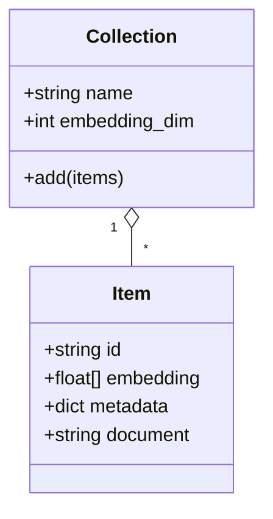
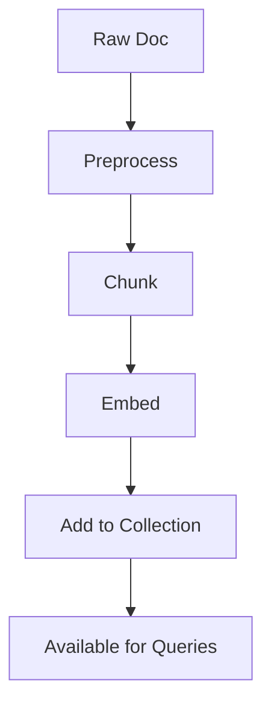

# 03 — Core Concepts

## Overview

This chapter unpacks the core abstractions used when working with ChromaDB and vector stores in general, including collections, items, embeddings, index types, similarity metrics, filters, and lifecycle operations. We'll include conceptual diagrams, data-flow descriptions, and practical implications for design decisions.

---

## Collections

- A `collection` is a named container (similar to a table or index) that stores items: an `id`, an `embedding` vector, `metadata`, and optionally the original `document` text.
- Collections enforce consistency: items in a collection should share the same embedding dimensionality and (ideally) come from the same embedding model/version.

Use cases for multiple collections:

- Different datasets (articles vs. product descriptions) with distinct embedding dims or metadata schemas.
- Per-tenant collections in multi-tenant deployments to isolate data and access control.

Diagram (collection relationship):



---

## Items and metadata

- `id`: unique string (deterministic ids enable idempotent upserts).
- `embedding`: numeric array (float32 typically) matching collection dimensionality.
- `metadata`: small JSON/dict used for filtering and retrieving context (avoid large blobs in metadata).
- `document`: optionally store the raw text or a summary for display and reranking.

Metadata examples and recommended types:

| Key | Type | Purpose |
|---|---|---|
| `source` | string | origin of the document (web, pdf, s3) |
| `doc_id` | string | original document identifier |
| `chunk_index` | int | chunk order within document |
| `created_at` | ISO datetime | auditing and recency filters |

---

## Similarity metrics

- Cosine similarity: measures angle between vectors — common for normalized semantic embeddings.
- Dot product: preserves magnitude — useful when magnitude encodes importance.
- Euclidean (L2): measures distance in vector space — sometimes used for dense vector spaces.

When to choose:

- Use cosine for most text embedding similarity tasks.
- Use dot product when embedding magnitudes are meaningful (rare for text embeddings unless intentionally scaled).

---

## Index types and ANN

- Exact search: computes exact distances to all vectors — accurate but slow at scale.
- ANN (approximate nearest neighbor): algorithms that trade a small amount of accuracy for large speedups. Common ANN types:
	- HNSW (graph-based)
	- IVF (inverted file) + PQ (product quantization)

Table: ANN algorithms (high-level)

| Algorithm | Speed | Memory | Accuracy | Notes |
|---|---:|---:|---:|---|
| HNSW | Very fast | Medium–High | High | Good default for many use cases |
| IVF+PQ | Fast | Low | Medium | Good for very large datasets |
| Brute force | Slow | Low | Exact | Useful for small datasets/testing |

---

## Filters and faceted search

- Filters use metadata fields to narrow down the candidate set before or after vector scoring. Filters support equality, ranges, and boolean combinations depending on client support.
- Best practice: index commonly-filtered metadata fields as typed fields and prefer selective filters early in the pipeline.

Example filter pseudo:

```py
results = col.query(query_embeddings=[q], n_results=10, where={"source":"web","created_at":{"$gte":"2024-01-01"}})
```

---

## Lifecycle operations

- `add` / `upsert`: insert or update items; use deterministic `id` for idempotency.
- `delete`: remove by id or by filter.
- `list` / `get`: fetch items for inspection or re-ingestion.

Operational notes:

- Batch writes: use batch APIs to improve throughput when ingesting large datasets.
- Monitoring write latencies and index rebuild times after bulk updates.

---

## Example flows

1. Indexing flow: raw docs → preprocess → chunk → embed → add to collection.
2. Query flow: query text → embed → filter → nearest-neighbor search → rerank & present.

Mermaid: item lifecycle



