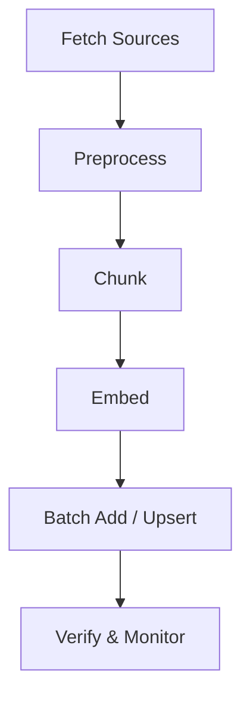

# 06 — Ingestion

## Overview

Ingestion is the process of taking raw source documents, transforming them into chunks, generating embeddings, and writing them to a collection with metadata. This chapter provides end-to-end ingestion pipelines, chunking strategies, batching best practices, idempotency patterns, error handling, and sample scripts.

---

## Typical ingestion pipeline

1. Fetch raw sources (web, S3, DB).
2. Preprocess and clean text (remove boilerplate, fix encoding).
3. Chunk the text into retrieval-friendly pieces.
4. Generate embeddings (batching for throughput).
5. Write to Chroma collection (batch add/upsert).
6. Verify and monitor ingestion results.

Mermaid pipeline:



---

## Chunking strategies

- Fixed-size windows: split by token or word counts with overlap (recommended overlap 10–30% to preserve context).
- Semantic chunking: split by paragraph, heading, or semantic boundaries for better coherence.
- Hybrid: use semantic boundaries but enforce a maximum token/window size.

Chunk sizing guidance:

| Chunking style | Typical size | Pros | Cons |
|---|---:|---|---|
| Fixed tokens | 200–500 tokens | Predictable vector count | May split semantic units |
| Semantic | paragraph/heading | Better coherence | Variable vector count |
| Hybrid | paragraph + max tokens | Balanced | Slightly more complex |

---

## Batching and throughput

- Batch embedding calls to the embedder for better latency and cost efficiency.
- Batch collection writes to reduce RPC/API overhead.

Example: batch size tuning

- Embedding batch: 32–512 depending on model latency and memory.
- Collection write batch: 512–5000 depending on client and memory.

---

## Idempotency and deterministic ids

- Use deterministic ids constructed from stable properties (e.g., `sha256(doc_id + chunk_index)`) so re-running ingestion doesn't create duplicates.

Example deterministic id:

```py
import hashlib

def make_id(doc_id, chunk_index):
    return hashlib.sha256(f"{doc_id}:{chunk_index}".encode()).hexdigest()
```

---

## Error handling and retries

- Retry transient errors with exponential backoff for network/API calls.
- Validate embedding dimensionality before writing to avoid schema errors.
- Log failed items to a dead-letter store for manual inspection and reprocessing.

---

## Sample ingestion script (conceptual)

```py
from chromadb import Client
from embedder import embed_texts

client = Client()
col = client.get_or_create_collection('docs_qa')

def ingest_batch(items):
    texts = [i['text'] for i in items]
    embs = embed_texts(texts)
    ids = [make_id(i['doc_id'], i['chunk_index']) for i in items]
    metadatas = [i['metadata'] for i in items]
    docs = [i['text'][:512] for i in items]
    col.add(ids=ids, embeddings=embs, metadatas=metadatas, documents=docs)

# Iterate over source, chunk, batch, and call ingest_batch
```

---

## Monitoring and verification

- Verify sample items exist using `get` or `query` by id.
- Track ingestion throughput (items/sec), failure rate, and queue backpressure.

---

## Scaling ingestion

- Parallelize embedding generation across worker nodes while preserving deterministic id generation.
- Use backpressure-aware queues (e.g., Kafka, RabbitMQ) to buffer source items.

