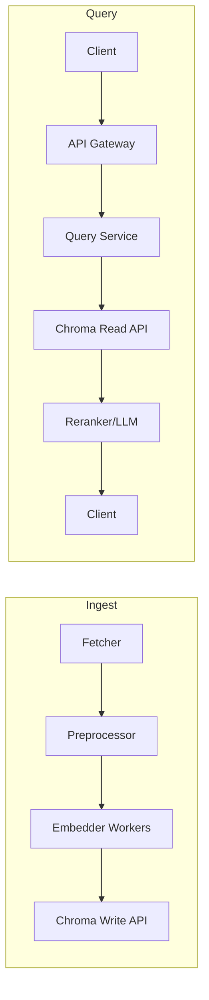

# 09 — Scaling & Deployment

## Overview

This chapter details strategies for scaling ChromaDB-based systems, deployment patterns (local, containerized, Kubernetes), persistence and durability, performance tuning, monitoring, and operational checklists for production readiness.

---

## Scaling approaches

- Vertical scaling: increase memory and CPU on a single node — simplest approach but limited by single-machine resources.
- Horizontal scaling: partition data across multiple collections or nodes and route queries; requires orchestration and routing logic.
- Hybrid: combine vertical scaling for a single hot-node with logical partitioning for cold data.

When to choose:

- Start with vertical scaling for prototypes or small production workloads.
- Move to horizontal partitioning or sharding when index size and throughput exceed a single node's capacity.

---

## Persistence and durability

- In-memory: fastest but data lost on restart — suitable only for ephemeral or test workloads.
- On-disk persistence: store vectors and metadata to disk for durability; use persistent volumes in container platforms.
- Backups: export collections regularly (e.g., periodic snapshots to S3) and store metadata and original documents to enable reconstruction.

Backup checklist:

1. Schedule regular exports of collections and metadata.
2. Store embeddings and metadata in durable object storage.
3. Verify restore procedure periodically.

---

## Deployment patterns

- Single-node container: package application and Chroma client; use a persistent volume for on-disk storage.
- Sidecar: run an ingest/embedding worker alongside application containers to isolate workloads.
- Dedicated vector service: deploy a microservice responsible for vector storage and queries behind an API gateway.

Kubernetes recommendations:

- Use a PersistentVolumeClaim for the data directory when on-disk persistence is required.
- Expose readiness and liveness probes for autoscalers and health checks.
- Use ResourceRequests/Limits to prevent noisy-neighbor problems.

Example `Deployment` considerations:

- Pod anti-affinity for high availability (if multiple replicas are used for read-only workloads).
- Rolling updates with migration strategy for index rebuilds.

---

## Performance tuning

- Precompute embeddings and store them to avoid runtime inference cost.
- Use quantized indices (PQ, INT8) when memory is the limiting factor; measure recall impact.
- Tune search-time parameters (`efSearch`, probes) to balance latency and recall.

Benchmark checklist:

1. Measure indexing throughput (items/sec) and query latency (P50, P95, P99).
2. Test different index types (HNSW vs IVF+PQ) and parameters.
3. Plot recall vs latency trade-offs and choose operating point.

---

## Monitoring and alerting

Key metrics to collect:

- Query latency (P50/P95/P99)
- Query throughput (QPS)
- Memory usage and heap size
- Index size on disk
- Errors and failed requests

Set alerts for sustained increases in latency, memory pressure, or error rates.

---

## Autoscaling and capacity planning

- For read-heavy workloads, scale replicas horizontally behind a read-only layer or cache.
- For write-heavy ingestion pipelines, scale worker pools independently and use queues to smooth bursts.

Capacity planning steps:

1. Estimate data growth (items/day) and average vector size.
2. Compute expected index size and memory needs for chosen index type.
3. Provision headroom for spikes and_growth; revisit monthly.

---

## Failure modes and recovery

- Node failure: rely on persistent backups and rehydrate new nodes from snapshots.
- Index corruption: maintain regular exports and checksums; always test restores.
- Slow queries: identify offending queries via tracing and consider caching or query throttling.

Recovery drills:

- Regularly practice restoring a collection from backup into a staging cluster and run validation queries.

---

## Security and multi-tenant considerations

- Encrypt data at rest (disk encryption) and in transit (TLS).
- Implement per-tenant isolation using separate collections, namespaces, and RBAC.
- Validate and sanitize metadata and filter inputs to avoid injection attacks.

---

## Example deployment architecture

---
