# Psoriasis Analysis and Clinical Report Generation System Architecture

> **Note**: This document uses Mermaid diagrams for all flow visualizations. All diagrams are rendered using standard Mermaid syntax and are compatible with GitHub, GitLab, VS Code (with Mermaid extension), and other markdown viewers that support Mermaid.

## Overview

This document describes the system architecture for a Psoriasis analysis and clinical report generation system. The system processes clinical skin images and patient metadata to generate comprehensive clinical reports using deep learning models and generative AI.

---

## Table of Contents

1. [Complete System Flow Diagram](#complete-system-flow-diagram)

2. [Detailed Component Flow Diagrams](#detailed-component-flow-diagrams)

   - [Data Ingestion & Preprocessing Flow](#1-data-ingestion--preprocessing-flow)

   - [Deep Learning Analysis Flow](#2-deep-learning-analysis-flow)

   - [Feature Extraction & Quantification Details](#3-feature-extraction--quantification-details)

   - [RAG Knowledge Retrieval Flow](#4-rag-knowledge-retrieval-flow)

   - [GenAI Report Generation Flow](#5-genai-report-generation-flow)

   - [Validation & Governance Flow](#6-validation--governance-flow)

   - [Complete End-to-End Sequence Flow](#7-complete-end-to-end-flow)

3. [Component Details](#component-details)

4. [System Flow Summary](#system-flow-summary)

5. [Technology Stack](#technology-stack)

6. [Key Features](#key-features)

7. [Use Cases](#use-cases)

---

## Complete System Flow Diagram

This diagram shows the complete end-to-end flow of the Psoriasis analysis system, from data sources to API deployment.

**Legend:**

- 🔵 **Blue**: Data Sources

- 🟠 **Orange**: Processing Layers

- 🟣 **Purple**: Deep Learning Models

- 🟢 **Green**: Feature Extraction

- 🟡 **Yellow**: RAG Knowledge Retrieval

- 🔴 **Pink**: GenAI Components

- 🔷 **Teal**: Validation & Governance

- 🔵 **Light Blue**: API & Deployment

---

## Detailed Component Flow Diagrams

### 1. Data Ingestion & Preprocessing Flow

This diagram illustrates how raw clinical images and patient metadata are processed before analysis.

```mermaid

flowchart LR

    A1["🖼️ Clinical Skin Images"] --> B["⚙️ Image Preprocessing"]

    A2["📋 Patient Metadata"] --> B

    B --> B1["📐 Image Normalization"]

    B --> B2["🧹 Hair and Noise Removal"]

    B --> B3["📝 Annotation Handling"]

    B1 --> C["✅ Preprocessed Images"]

    B2 --> C

    B3 --> C

    

    style A1 fill:#e1f5ff,stroke:#01579b,stroke-width:3px,color:#000

    style A2 fill:#e1f5ff,stroke:#01579b,stroke-width:3px,color:#000

    style B fill:#fff3e0,stroke:#e65100,stroke-width:3px,color:#000

    style B1 fill:#fff3e0,stroke:#e65100,stroke-width:3px,color:#000

    style B2 fill:#fff3e0,stroke:#e65100,stroke-width:3px,color:#000

    style B3 fill:#fff3e0,stroke:#e65100,stroke-width:3px,color:#000

    style C fill:#c8e6c9,stroke:#1b5e20,stroke-width:3px,color:#000

```

**Key Steps:**

1. Clinical skin images and patient metadata are ingested

2. Images undergo normalization, noise removal, and annotation handling

3. Clean, preprocessed images are ready for deep learning models

---

### 2. Deep Learning Analysis Flow

This diagram shows how preprocessed images are analyzed using segmentation and classification models.

```mermaid

flowchart TD

    A["✅ Preprocessed Images"] --> B1["🔍 Segmentation Model<br/>U-Net / Attention"]

    A --> B2["📊 Classification Model<br/>ResNet / EfficientNet"]

    

    B1 --> C1["📍 Lesion Boundaries"]

    B1 --> C2["📏 Area Estimation"]

    

    B2 --> C3["⚖️ Severity Classification<br/>Mild / Moderate / Severe"]

    B2 --> C4["🏷️ Psoriasis Subtype"]

    

    C1 --> D["📈 Feature Extraction<br/>& Quantification"]

    C2 --> D

    C3 --> D

    C4 --> D

    

    style A fill:#c8e6c9,stroke:#1b5e20,stroke-width:3px,color:#000

    style B1 fill:#f3e5f5,stroke:#4a148c,stroke-width:3px,color:#000

    style B2 fill:#f3e5f5,stroke:#4a148c,stroke-width:3px,color:#000

    style C1 fill:#e1bee7,stroke:#4a148c,stroke-width:2px,color:#000

    style C2 fill:#e1bee7,stroke:#4a148c,stroke-width:2px,color:#000

    style C3 fill:#e1bee7,stroke:#4a148c,stroke-width:2px,color:#000

    style C4 fill:#e1bee7,stroke:#4a148c,stroke-width:2px,color:#000

    style D fill:#e8f5e9,stroke:#1b5e20,stroke-width:3px,color:#000

```

**Key Steps:**

1. Preprocessed images are fed to both segmentation and classification models

2. Segmentation model identifies lesion boundaries and estimates area

3. Classification model determines severity and subtype

4. All outputs feed into feature extraction

---

### 3. Feature Extraction & Quantification Details

This diagram details the metrics extracted from deep learning model outputs.

```mermaid

flowchart TD

    A["🤖 Deep Learning Model Outputs"] --> B["⚙️ Feature Extraction Engine"]

    

    B --> C1["📊 Lesion Area %"]

    B --> C2["🔴 Erythema Score"]

    B --> C3["📏 Thickness Estimation"]

    B --> C4["❄️ Scale Severity"]

    B --> C5["📈 Multi-lesion Statistics"]

    

    C1 --> D["✅ Quantified Metrics"]

    C2 --> D

    C3 --> D

    C4 --> D

    C5 --> D

    

    D --> E["🔍 Validation and Governance"]

    D --> F["📝 GenAI Report Generator"]

    

    style A fill:#f3e5f5,stroke:#4a148c,stroke-width:3px,color:#000

    style B fill:#e8f5e9,stroke:#1b5e20,stroke-width:3px,color:#000

    style C1 fill:#c8e6c9,stroke:#1b5e20,stroke-width:2px,color:#000

    style C2 fill:#c8e6c9,stroke:#1b5e20,stroke-width:2px,color:#000

    style C3 fill:#c8e6c9,stroke:#1b5e20,stroke-width:2px,color:#000

    style C4 fill:#c8e6c9,stroke:#1b5e20,stroke-width:2px,color:#000

    style C5 fill:#c8e6c9,stroke:#1b5e20,stroke-width:2px,color:#000

    style D fill:#a5d6a7,stroke:#1b5e20,stroke-width:3px,color:#000

    style E fill:#e0f2f1,stroke:#004d40,stroke-width:3px,color:#000

    style F fill:#fce4ec,stroke:#880e4f,stroke-width:3px,color:#000

```

**Extracted Metrics:**

- **Lesion Area %**: Percentage of affected skin area

- **Erythema Score**: Redness intensity measurement

- **Thickness Estimation**: Lesion thickness assessment

- **Scale Severity**: Scaling intensity measurement

- **Multi-lesion Statistics**: Aggregated statistics across multiple lesions

---

### 4. RAG Knowledge Retrieval Flow

This diagram shows how clinical knowledge is retrieved and used for report generation.

```mermaid

flowchart TD

    A["📚 Dermatology Guidelines PASI"] --> B["📖 Knowledge Base"]

    B --> B1["📋 PASI Guidelines"]

    B --> B2["📄 Dermatology Literature"]

    B --> B3["📑 Clinical Protocols"]

    

    B1 --> C["💾 Vector Database"]

    B2 --> C

    B3 --> C

    

    C --> C1["🔍 FAISS"]

    C --> C2["🗄️ ChromaDB"]

    

    C1 --> D["🔗 Embedding and Indexing"]

    C2 --> D

    

    D --> E["🔎 Retrieval Engine"]

    E --> F["📌 Relevant Knowledge Context"]

    F --> G["📝 GenAI Report Generator"]

    

    style A fill:#e1f5ff,stroke:#01579b,stroke-width:3px,color:#000

    style B fill:#fff9c4,stroke:#f57f17,stroke-width:3px,color:#000

    style B1 fill:#fffde7,stroke:#f57f17,stroke-width:2px,color:#000

    style B2 fill:#fffde7,stroke:#f57f17,stroke-width:2px,color:#000

    style B3 fill:#fffde7,stroke:#f57f17,stroke-width:2px,color:#000

    style C fill:#fff9c4,stroke:#f57f17,stroke-width:3px,color:#000

    style C1 fill:#fffde7,stroke:#f57f17,stroke-width:2px,color:#000

    style C2 fill:#fffde7,stroke:#f57f17,stroke-width:2px,color:#000

    style D fill:#fff9c4,stroke:#f57f17,stroke-width:3px,color:#000

    style E fill:#fff9c4,stroke:#f57f17,stroke-width:3px,color:#000

    style F fill:#fff9c4,stroke:#f57f17,stroke-width:3px,color:#000

    style G fill:#fce4ec,stroke:#880e4f,stroke-width:3px,color:#000

```

**Key Steps:**

1. PASI guidelines and clinical literature are stored in knowledge base

2. Content is embedded and indexed in vector databases (FAISS/ChromaDB)

3. Retrieval engine finds relevant knowledge based on query context

4. Retrieved knowledge is used to ground the GenAI report generation

---

### 5. GenAI Report Generation Flow

This diagram illustrates how clinical reports are generated using AI.

```mermaid

flowchart TD

    A["📊 Quantified Metrics<br/>from Feature Extraction"] --> D["📝 GenAI Report Generator"]

    B["🔎 Knowledge Context<br/>from RAG Layer"] --> D

    C["📋 Patient Metadata"] --> D

    

    D --> D1["🤖 LLM Engine<br/>OpenAI / Azure OpenAI"]

    D --> D2["✍️ Prompt Engineering"]

    D --> D3["🔗 Context Grounding RAG"]

    D --> D4["🛡️ Hallucination Control"]

    

    D1 --> E["📄 Generated Clinical Report"]

    D2 --> E

    D3 --> E

    D4 --> E

    

    E --> F["🚀 API and Deployment 2<br/>🔒 Encrypted Access"]

    

    style A fill:#e8f5e9,stroke:#1b5e20,stroke-width:3px,color:#000

    style B fill:#fff9c4,stroke:#f57f17,stroke-width:3px,color:#000

    style C fill:#e1f5ff,stroke:#01579b,stroke-width:3px,color:#000

    style D fill:#fce4ec,stroke:#880e4f,stroke-width:3px,color:#000

    style D1 fill:#f8bbd0,stroke:#880e4f,stroke-width:2px,color:#000

    style D2 fill:#f8bbd0,stroke:#880e4f,stroke-width:2px,color:#000

    style D3 fill:#f8bbd0,stroke:#880e4f,stroke-width:2px,color:#000

    style D4 fill:#f8bbd0,stroke:#880e4f,stroke-width:2px,color:#000

    style E fill:#c8e6c9,stroke:#1b5e20,stroke-width:3px,color:#000

    style F fill:#e3f2fd,stroke:#0d47a1,stroke-width:3px,color:#000

```

**Key Components:**

- **LLM Engine**: OpenAI or Azure OpenAI for text generation

- **Prompt Engineering**: Structured prompts for consistent report format

- **Context Grounding**: RAG ensures reports follow clinical guidelines

- **Hallucination Control**: Mechanisms to prevent inaccurate information

---

### 6. Validation & Governance Flow

This diagram shows the validation and quality assurance process.

```mermaid

flowchart TD

    A["📊 Quantified Metrics"] --> B["✅ Validation and Governance Layer"]

    

    B --> B1["📋 Clinical Rule Checks"]

    B --> B2["📈 Confidence Thresholds"]

    B --> B3["👤 Human-in-the-Loop Review"]

    B --> B4["📝 Audit Logging"]

    

    B1 --> C{"✅ Validation Pass?"}

    B2 --> C

    B3 --> C

    

    C -->|"✅ Yes"| D["✅ Validated Output"]

    C -->|"❌ No"| E["❌ Reject / Flag for Review"]

    

    D --> F["🚀 API and Deployment 1<br/>📊 Validated Quantitative Data"]

    E --> B3

    

    style A fill:#e8f5e9,stroke:#1b5e20,stroke-width:3px,color:#000

    style B fill:#e0f2f1,stroke:#004d40,stroke-width:3px,color:#000

    style B1 fill:#b2dfdb,stroke:#004d40,stroke-width:2px,color:#000

    style B2 fill:#b2dfdb,stroke:#004d40,stroke-width:2px,color:#000

    style B3 fill:#b2dfdb,stroke:#004d40,stroke-width:2px,color:#000

    style B4 fill:#b2dfdb,stroke:#004d40,stroke-width:2px,color:#000

    style C fill:#80cbc4,stroke:#004d40,stroke-width:3px,color:#000

    style D fill:#c8e6c9,stroke:#1b5e20,stroke-width:3px,color:#000

    style E fill:#ffcdd2,stroke:#c62828,stroke-width:3px,color:#000

    style F fill:#e3f2fd,stroke:#0d47a1,stroke-width:3px,color:#000

```

**Validation Steps:**

1. Clinical rule checks ensure metrics are within acceptable ranges

2. Confidence thresholds validate model predictions

3. Human-in-the-loop review for critical cases

4. All actions are logged for audit and compliance

---

### 7. Complete End-to-End Flow

This sequence diagram shows the complete interaction flow between all system components.

```mermaid

sequenceDiagram

    participant DS as 📥 Data Sources

    participant IP as ⚙️ Image Preprocessing

    participant DL as 🤖 Deep Learning Models

    participant FE as 📈 Feature Extraction

    participant RAG as 🔎 RAG Knowledge Retrieval

    participant VAL as ✅ Validation Layer

    participant GEN as 📝 GenAI Report Generator

    participant API1 as 🚀 API Deployment 1

    participant API2 as 🚀 API Deployment 2

    

    DS->>IP: 🖼️ Clinical Skin Images

    DS->>GEN: 📋 Patient Metadata

    DS->>RAG: 📚 PASI Guidelines

    

    IP->>DL: ✅ Preprocessed Images

    DL->>FE: 🔍 Segmentation and Classification Results

    

    FE->>VAL: 📊 Quantified Metrics

    FE->>GEN: 📊 Quantified Metrics

    

    RAG->>GEN: 🔎 Retrieved Knowledge Context

    

    VAL->>API1: ✅ Validated Quantitative Data

    

    GEN->>API2: 📄 Generated Clinical Reports

```

**Flow Sequence:**

1. Data sources provide images, metadata, and guidelines

2. Images are preprocessed and analyzed by deep learning models

3. Features are extracted and quantified

4. Knowledge is retrieved from RAG system

5. Reports are generated and validated

6. Both validated metrics and reports are deployed via APIs

---

## Component Details

### 1. Data Sources

#### 1.1 Clinical Skin Images

- **Input**: Raw clinical skin lesion images

- **Format**: Digital images captured from clinical settings

- **Purpose**: Primary visual data for analysis

- **Requirements**: High-resolution images with proper lighting and focus

#### 1.2 Patient Metadata

- **Input**: Patient information and clinical data

- **Components**: 

  - Patient demographics (age, gender, medical history)

  - Medical history (previous treatments, comorbidities)

  - Clinical observations (symptoms, duration, affected areas)

- **Purpose**: Contextual information for analysis and report generation

#### 1.3 Dermatology Guidelines (PASI)

- **Input**: Psoriasis Area and Severity Index guidelines

- **Content**: 

  - Clinical protocols for assessment

  - Assessment criteria and scoring methods

  - Treatment guidelines and recommendations

- **Purpose**: Reference standards for analysis and reporting

---

### 2. Image Preprocessing & Data Management

**Input**: Clinical Skin Images

**Processes**:

- **Image Normalization**: Standardize brightness, contrast, and color balance

- **Hair & Noise Removal**: Remove artifacts that could interfere with analysis

- **Annotation Handling**: Process and preserve clinical annotations

**Output**: Preprocessed, clean images ready for model input

**Technologies**: OpenCV, PIL, scikit-image, data management systems

---

### 3. Deep Learning Vision Models

**Input**: Preprocessed images from Image Preprocessing & Data Management

#### 3.1 Segmentation Model

- **Architecture**: U-Net / Attention-based models

- **Purpose**: Identify and delineate lesion boundaries

- **Outputs**:

  - Lesion boundaries (pixel-level segmentation masks)

  - Area estimation (percentage of affected area)

#### 3.2 Classification Model

- **Architecture**: ResNet / EfficientNet-based models

- **Purpose**: Classify lesion characteristics

- **Outputs**:

  - Severity classification (Mild / Moderate / Severe)

  - Psoriasis subtype identification (plaque, guttate, pustular, etc.)

---

### 4. Feature Extraction & Quantification

**Input**: Outputs from Deep Learning Vision Models

**Extracted Metrics**:

- **Lesion area (%)**: Percentage of body surface area affected

- **Erythema score**: Redness intensity (0-4 scale)

- **Thickness estimation**: Lesion elevation/thickness measurement

- **Scale severity**: Scaling intensity (0-4 scale)

- **Multi-lesion statistics**: Aggregated metrics across multiple lesions

**Output**: Quantified clinical metrics and measurements in standardized format

**Use Cases**: 

- PASI score calculation

- Treatment response monitoring

- Clinical decision support

---

### 5. RAG Knowledge Retrieval Layer

**Input**: Dermatology Guidelines (PASI)

**Knowledge Sources**:

- PASI guidelines and scoring protocols

- Dermatology literature and research papers

- Clinical protocols and best practices

**Vector Database**:

- **FAISS**: Facebook AI Similarity Search for fast retrieval

- **ChromaDB**: Open-source embedding database

**Process**:

1. Knowledge documents are chunked and embedded

2. Embeddings are stored in vector database

3. Query-based retrieval finds relevant context

4. Retrieved context grounds the GenAI report generation

**Purpose**: Retrieve relevant clinical knowledge and guidelines for accurate report generation

---

### 6. GenAI Clinical Report Generator

**Inputs**:

- Feature Extraction & Quantification outputs (quantified metrics)

- RAG Knowledge Retrieval Layer outputs (clinical knowledge context)

- Patient Metadata (demographics and history)

**Key Components**:

- **LLM**: OpenAI GPT models / Azure OpenAI

- **Prompt Engineering**: Structured prompts for consistent clinical report format

- **Context Grounding**: RAG-based context integration ensures accuracy

- **Hallucination Control**: Fact-checking and validation mechanisms

**Output**: Generated clinical reports with comprehensive analysis including:

- Patient information summary

- Lesion analysis and measurements

- Severity assessment

- Clinical recommendations

- Treatment suggestions (if applicable)

---

### 7. Validation & Governance Layer

**Input**: Feature Extraction & Quantification outputs

**Processes**:

- **Clinical Rule Checks**: Validate metrics against clinical ranges and rules

- **Confidence Thresholds**: Ensure model predictions meet minimum confidence levels

- **Human-in-the-Loop Review**: Flag cases requiring expert review

- **Audit Logging**: Comprehensive logging for compliance and traceability

**Purpose**: Ensure accuracy, compliance, and quality of outputs before deployment

**Output**: Validated quantitative data ready for API deployment

---

### 8. API & Deployment

#### 8.1 Validation API & Deployment

**Input**: Validated outputs from Validation & Governance Layer

**Technologies**:

- **FastAPI**: Modern Python web framework for APIs

- **Docker**: Containerization for consistent deployment

- **AWS**: Cloud infrastructure (EC2, ECS, Lambda, etc.)

**Features**:

- RESTful API endpoints for validated quantitative data

- Secure access with authentication and authorization

- Scalable and reliable deployment

#### 8.2 Clinical Report API & Deployment

**Input**: Generated reports from GenAI Clinical Report Generator

**Technologies**:

- **FastAPI**: API framework

- **Docker**: Containerization

- **AWS**: Cloud deployment

**Features**:

- RESTful API endpoints for clinical reports

- Encrypted access (HTTPS/TLS)

- Secure report delivery with access controls

---

## System Flow Summary

The complete system flow follows these steps:

1. **Data Ingestion**: Clinical images, patient metadata, and PASI guidelines are collected from various sources

2. **Image Processing**: Images are preprocessed (normalized, cleaned, annotated) for analysis

3. **Deep Learning Analysis**: Segmentation and classification models analyze the images to identify lesions and classify severity

4. **Feature Extraction**: Quantitative metrics are extracted from model outputs (area, erythema, thickness, scaling)

5. **Knowledge Retrieval**: Relevant clinical guidelines are retrieved using RAG from vector databases

6. **Report Generation**: GenAI generates comprehensive clinical reports using extracted features and retrieved knowledge

7. **Validation**: Outputs are validated through clinical rules, confidence checks, and human review

8. **Deployment**: Validated data and reports are exposed via secure APIs for clinical use

---

## Technology Stack

### Deep Learning

- **Segmentation**: U-Net / Attention-based models (PyTorch/TensorFlow)

- **Classification**: ResNet / EfficientNet-based models (PyTorch/TensorFlow)

### Vector Databases

- **FAISS**: Facebook AI Similarity Search

- **ChromaDB**: Open-source embedding database

### Generative AI

- **OpenAI**: GPT-4, GPT-3.5 models

- **Azure OpenAI**: Enterprise-grade OpenAI services

### Backend & Deployment

- **FastAPI**: Modern Python web framework

- **Docker**: Containerization platform

- **AWS**: Cloud infrastructure (EC2, ECS, S3, Lambda, etc.)

### Image Processing

- **OpenCV**: Computer vision library

- **PIL/Pillow**: Image processing

- **scikit-image**: Image analysis tools

---

## Key Features

- **Automated Analysis**: Deep learning models automatically analyze skin lesions with high accuracy

- **Quantitative Metrics**: Precise measurements of lesion characteristics (area, erythema, thickness, scaling)

- **Knowledge-Enhanced Reports**: RAG integration ensures reports follow clinical guidelines and best practices

- **Quality Assurance**: Multi-layer validation ensures accuracy and compliance with clinical standards

- **Secure Deployment**: Encrypted APIs with authentication for secure data access

- **Audit Trail**: Comprehensive logging for compliance, traceability, and quality monitoring

- **Scalable Architecture**: Cloud-based deployment allows for horizontal scaling

- **Human-in-the-Loop**: Critical cases can be flagged for expert review

---

## Use Cases

1. **Clinical Assessment**: Automated severity and subtype classification for initial patient evaluation

2. **Treatment Planning**: Quantitative metrics support evidence-based treatment decisions

3. **Progress Monitoring**: Track changes in lesion characteristics over time to assess treatment efficacy

4. **Clinical Documentation**: Generate comprehensive clinical reports for patient records

5. **Research & Analytics**: Aggregate data for research studies and population health analytics

6. **Telemedicine**: Support remote dermatology consultations with AI-assisted analysis

7. **Quality Control**: Standardize assessment methods across different clinicians and facilities

---

## Notes

- All Mermaid diagrams in this document are compatible with GitHub, GitLab, VS Code (with Mermaid extension), and other markdown viewers that support Mermaid syntax

- The system is designed to be HIPAA-compliant with proper data encryption and access controls

- Regular model updates and retraining ensure continued accuracy and performance

- The RAG system can be updated with new clinical guidelines and research findings

 make this in makrodnw code and display all diagrams
