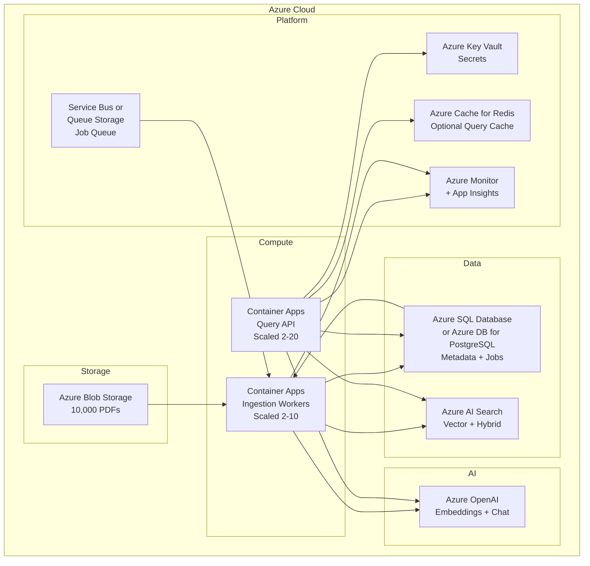

# Production-Grade Gen AI RAG System: 10,000 PDFs → Question Answering

**Project:** RAG (Retrieval Augmented Generation) over a large PDF corpus  
**Scale:** 10,000 PDFs (~600K chunks), production traffic  
**Deployment:** Azure  
**Document:** End-to-end flow, all components, scaling, and production practices

---

## Table of Contents

1. [High-Level Architecture](#1-high-level-architecture)  
2. [Complete Component Inventory](#2-complete-component-inventory)  
3. [Azure Deployment Map](#3-azure-deployment-map)  
4. [Database Schema (Expanded)](#4-database-schema-expanded)  
5. [Full Flow – Step by Step (Expanded)](#5-full-flow--step-by-step-expanded)  
6. [Scaling Strategy](#6-scaling-strategy)  
7. [Production Requirements](#7-production-requirements)  
8. [Configuration (Production)](#8-configuration-production)  
9. [Security & Compliance](#9-security--compliance)  
10. [Monitoring, Logging & Alerting](#10-monitoring-logging--alerting)  
11. [Disaster Recovery & High Availability](#11-disaster-recovery--high-availability)  
12. [API Design (Production)](#12-api-design-production)  
13. [Checklists & Summary](#13-checklists--summary)  
14. [Performance Tuning](#14-performance-tuning)  
15. [Getting Quicker Response (Latency Optimization)](#15-getting-quicker-response-latency-optimization)  
16. [Master Component Checklist (Nothing Missing)](#16-master-component-checklist-nothing-missing)

---

## 1. High-Level Architecture

### 1.1 System Context

```
┌─────────────────────────────────────────────────────────────────────────────────────────────┐
│                        PRODUCTION RAG SYSTEM (AZURE)                                          │
├─────────────────────────────────────────────────────────────────────────────────────────────┤
│                                                                                              │
│  [Azure Blob]          [Metadata DB]        [Ingestion Workers]        [Vector Store]         │
│  10,000 PDFs    →      (Azure SQL)    →     (Container Apps)    →     (AI Search /         │
│                        + Job queue          Chunk + Embed             pgvector)              │
│                                                                                              │
│  [User / API]  →  [API Gateway]  →  [Query API]  →  [Embed]  →  [Retrieve]  →  [Azure OpenAI]│
│                        ↓                    ↓              ↓                    ↓           │
│                   [Auth]             [Rate Limit]    [Cache]              [Answer + Sources]  │
│                                                                                              │
└─────────────────────────────────────────────────────────────────────────────────────────────┘
```

### 1.2 Flow Summary

| Phase | What happens |
|-------|----------------|
| **Ingestion** | PDFs in Blob → metadata in Azure SQL → workers pull from queue → read PDF → chunk → embed (Azure OpenAI) → upsert to vector store → update document status in DB. |
| **Query** | Request → auth → rate limit → (optional cache) → embed question → vector search → build context → Azure OpenAI completion → return answer + sources. |

### 1.3 Detailed Architecture Diagram (Mermaid)



---

## 2. Complete Component Inventory

### 2.1 Azure Services (Deployment)

| Component | Azure Service | Purpose |
|-----------|---------------|---------|
| **PDF storage** | Azure Blob Storage (e.g. container `pdfs`) | Store 10,000 PDFs; versioning optional; private endpoint for VNet. |
| **Metadata database** | Azure SQL Database or Azure Database for PostgreSQL (Flexible Server) | Documents table, ingestion_jobs, audit logs; connection pooling (e.g. 20–50). |
| **Vector store** | Azure AI Search (vector + keyword) or Azure Database for PostgreSQL + pgvector | Store embeddings; hybrid search (vector + keyword); indexers for sync from Blob if needed. |
| **Embeddings & LLM** | Azure OpenAI Service (same region when possible) | text-embedding-ada-002 or text-embedding-3-small; gpt-4o or gpt-4o-mini for chat. |
| **Ingestion compute** | Azure Container Apps (or AKS) | Run ingestion workers; scale 2–10 replicas; pull jobs from queue. |
| **Query API compute** | Azure Container Apps (or AKS, App Service) | Stateless API; scale 2–20+ replicas; health checks, readiness. |
| **Job queue** | Azure Service Bus (queues) or Azure Queue Storage | Decouple “process this document” from workers; at-least-once delivery; dead-letter for failed docs. |
| **Secrets** | Azure Key Vault | DB connection strings, Azure OpenAI keys, API keys; RBAC; no secrets in env/code. |
| **Caching (optional)** | Azure Cache for Redis | Cache frequent question embeddings + top-k results or full answers; TTL 5–60 min. |
| **API gateway / load balancer** | Azure Front Door or Application Gateway | TLS termination, WAF, rate limiting, routing to Query API. |
| **Monitoring** | Azure Monitor, Application Insights, Log Analytics | Traces, metrics, logs; alerts on latency, errors, queue depth. |
| **Identity** | Azure AD / Entra ID | Managed identities for containers; OAuth for user-facing API. |

### 2.2 Application / Runtime Components

| Component | Technology | Purpose |
|-----------|------------|---------|
| **PDF parsing** | PyMuPDF (fitz) or pdfplumber | Extract text; handle password-protected or malformed PDFs with try/except. |
| **Chunking** | LangChain RecursiveCharacterTextSplitter or custom | chunk_size 800–1000, overlap 150–200; preserve doc_id, page, file_name in metadata. |
| **Embedding client** | openai (Azure endpoint) or langchain | Batch embed (e.g. 100–200 per request); retries with backoff. |
| **Vector client** | azure-search-documents, langchain-azure-*, or psycopg2 (pgvector) | Index and query vectors; filter by metadata. |
| **LLM client** | Azure OpenAI chat completions | System + user message; stream or non-stream; token limits. |
| **Orchestration** | LangChain or LlamaIndex or custom | Wire: load → chunk → embed → store; and: embed query → retrieve → prompt → generate. |
| **API framework** | FastAPI | Async; dependency injection for DB, vector, LLM; structured logging; OpenAPI. |
| **Background workers** | Same app in “worker” mode or separate Container App | Consume from Service Bus; process one or batch of documents; update DB. |

### 2.3 Supporting / Cross-Cutting

| Component | Purpose |
|-----------|---------|
| **Structured logging** | JSON logs: request_id, doc_id, duration, status; to stdout/App Insights. |
| **Distributed tracing** | OpenTelemetry → Application Insights; trace ingestion and query paths. |
| **Health checks** | /health: DB, vector store, Azure OpenAI, optional Redis; /ready after warm-up. |
| **Metrics** | Ingestion: docs/sec, chunks/sec, failures; Query: latency p50/p95/p99, cache hit rate, token usage. |

---

## 3. Azure Deployment Map

### 3.1 Resource Group Layout (Example)

```
rg-rag-prod-001
├── stpdfragprod          # Storage account (Blob + Queue if used)
├── sql-rag-metadata      # Azure SQL or postgres-rag-metadata (Flexible Server)
├── search-rag-vector     # Azure AI Search (or use PostgreSQL + pgvector)
├── ao-rag-prod           # Azure OpenAI (embedding + chat)
├── ca-rag-ingest         # Container App (ingestion workers)
├── ca-rag-api            # Container App (query API)
├── kv-rag-prod           # Key Vault
├── sb-rag-prod           # Service Bus namespace + queue
├── redis-rag-cache       # Azure Cache for Redis (optional)
├── fd-rag-prod           # Front Door (optional)
├── log-rag-prod          # Log Analytics workspace
└── appi-rag-api          # Application Insights
```

### 3.2 Networking (Production)

| Concern | Approach |
|---------|----------|
| **VNet** | Deploy Container Apps (or AKS) in a VNet; Blob, SQL, OpenAI, Key Vault with private endpoints where required. |
| **Egress** | Restrict outbound to Azure services and approved endpoints; no arbitrary internet if policy requires. |
| **Ingress** | Only Front Door / App Gateway exposed to internet; API and workers not directly public. |
| **TLS** | TLS 1.2+ only; certificates in Key Vault or Front Door managed cert. |

### 3.3 Identity (Managed Identity)

| Resource | Identity | Use |
|----------|----------|-----|
| Container App (ingestion) | System-assigned managed identity | Key Vault (get secrets), Blob (read), Service Bus (receive), SQL (connect), Azure OpenAI (use). |
| Container App (API) | System-assigned managed identity | Key Vault, SQL, AI Search, Azure OpenAI, Redis. |
| No raw keys in env | — | All secrets from Key Vault at startup or per request. |

---

## 4. Database Schema (Expanded)

### 4.1 Metadata Database (Azure SQL / PostgreSQL)

**Table: `documents`**

| Column | Type | Constraints | Description |
|--------|------|-------------|-------------|
| `id` | UUID or BIGSERIAL | PK | Unique document id. |
| `blob_path` | VARCHAR(2048) | NOT NULL | Full path in Blob (e.g. `pdfs/tenant123/doc.pdf`). |
| `file_name` | VARCHAR(512) | NOT NULL | Original filename. |
| `file_size_bytes` | BIGINT | | Size from Blob. |
| `content_hash` | VARCHAR(64) | | SHA-256 of file (for dedup / re-index skip). |
| `status` | VARCHAR(32) | NOT NULL, INDEX | `pending`, `queued`, `processing`, `indexed`, `failed`, `deleted`. |
| `chunk_count` | INT | DEFAULT 0 | Number of chunks written to vector store. |
| `error_message` | TEXT | | Last error if status = `failed`. |
| `retry_count` | INT | DEFAULT 0 | Number of processing attempts. |
| `processing_started_at` | TIMESTAMPTZ | | When a worker claimed the doc. |
| `indexed_at` | TIMESTAMPTZ | | When status became `indexed`. |
| `created_at` | TIMESTAMPTZ | NOT NULL | Record creation. |
| `updated_at` | TIMESTAMPTZ | NOT NULL | Last update. |
| `tenant_id` | VARCHAR(64) | INDEX | Optional multi-tenant. |

**Table: `ingestion_jobs`**

| Column | Type | Description |
|--------|------|-------------|
| `id` | BIGSERIAL | PK. |
| `job_type` | VARCHAR(32) | `full`, `incremental`, `reindex`. |
| `status` | VARCHAR(32) | `running`, `completed`, `failed`, `cancelled`. |
| `total_documents` | INT | Total to process. |
| `processed` | INT | Successfully indexed. |
| `failed` | INT | Failed count. |
| `skipped` | INT | Skipped (e.g. unchanged). |
| `started_at` | TIMESTAMPTZ | |
| `finished_at` | TIMESTAMPTZ | |
| `created_by` | VARCHAR(256) | |
| `metadata` | JSONB | Extra params. |

**Table: `query_audit_log` (optional)**

| Column | Type | Description |
|--------|------|-------------|
| `id` | BIGSERIAL | PK. |
| `request_id` | UUID | Correlation id. |
| `user_id` | VARCHAR(256) | If authenticated. |
| `question_hash` | VARCHAR(64) | For analytics (not PII). |
| `chunk_count` | INT | Retrieved. |
| `latency_ms` | INT | Total latency. |
| `created_at` | TIMESTAMPTZ | |

### 4.2 Connection Management

- **Connection string:** From Key Vault; use Azure AD authentication where supported (e.g. PostgreSQL with Azure AD).
- **Pool size:** 20–50 per API instance; 10–20 per worker; max connections in DB tier sized accordingly.
- **Timeouts:** Connect 5s, command 30s for ingestion, 10s for query path.
- **Retries:** Transient errors (connection lost, deadlock) retry with exponential backoff (e.g. 3 attempts).

---

## 5. Full Flow – Step by Step (Expanded)

### 5.1 Phase A: One-Time Setup (Production)

| Step | Action | Details |
|------|--------|---------|
| A1 | **Provision Azure resources** | Resource group, Blob, SQL/PostgreSQL, AI Search or pgvector, Azure OpenAI, Container Apps, Key Vault, Service Bus, (optional) Redis, Front Door, Monitor/App Insights. |
| A2 | **Create Blob container** | e.g. `pdfs`; upload 10,000 PDFs or configure sync from external source; set lifecycle/retention if needed. |
| A3 | **Create metadata DB** | Create database; run migrations for `documents`, `ingestion_jobs`, `query_audit_log`; create indexes on `status`, `tenant_id`, `created_at`. |
| A4 | **Create vector index** | Azure AI Search: index with vector field (dimension 1536 or 3072), keyword field, metadata fields (doc_id, page, file_name). Or pgvector: create table with embedding column and HNSW index. |
| A5 | **Create Service Bus queue** | e.g. `documents-to-process`; dead-letter queue `documents-to-process-dlq`; set message TTL and max delivery count. |
| A6 | **Register documents in DB** | Script: list Blob prefix → insert into `documents` with `blob_path`, `file_name`, `status = 'pending'`; optionally enqueue message per doc or batch. |
| A7 | **Secrets in Key Vault** | Store: SQL connection string, Azure OpenAI endpoint + key, AI Search endpoint + key, Redis connection (if used), any API keys. Grant Container Apps managed identity access. |
| A8 | **Deploy Container Apps** | Deploy ingestion worker image and query API image; set env (Key Vault references, not raw secrets); set scaling rules; configure health probes. |

### 5.2 Phase B: PDF Ingestion Pipeline (Production, Detailed)

| Step | Action | Details |
|------|--------|---------|
| B1 | **Worker starts** | Pulls secrets from Key Vault; connects to SQL (pool), Blob, Azure OpenAI, vector store, Service Bus. |
| B2 | **Receive message** | Receive from `documents-to-process` (peek-lock); message body = document id (or batch of ids). |
| B3 | **Claim document** | Update `documents` SET status = 'processing', processing_started_at = now() WHERE id = ? AND status IN ('pending','queued'); if row count = 0, abandon message (already processed). |
| B4 | **Download PDF** | Blob client get blob by `blob_path`; stream to memory or temp file; check content_hash to skip if already indexed (optional). |
| B5 | **Extract text** | PyMuPDF/open document; iterate pages; extract text; handle encryption/errors → set status = 'failed', error_message, retry_count++; release message or send to DLQ after max retries. |
| B6 | **Chunk** | RecursiveCharacterTextSplitter; attach metadata: doc_id, page, file_name, tenant_id; produce list of (text, metadata). |
| B7 | **Embed in batches** | Call Azure OpenAI embeddings API in batches of 100–200; respect rate limits (retry 429 with backoff); same model as at query time. |
| B8 | **Upsert to vector store** | Azure AI Search: upload documents (id, content, embedding, metadata). Or pgvector: INSERT with embedding. Use doc_id + chunk_index for stable ids (idempotent re-index). |
| B9 | **Update DB** | SET status = 'indexed', chunk_count = N, indexed_at = now(), updated_at = now(), error_message = NULL WHERE id = ?. |
| B10 | **Complete message** | Service Bus complete(); on any failure before B9: abandon message (retry) or send to DLQ and set status = 'failed'. |
| B11 | **Scale workers** | Queue length metric → scale Container App replicas (e.g. 2–10); one document per message or batch of 5–10 for throughput. |

**Throughput:** ~600K chunks; with 5 workers, ~3 chunks/sec per worker, ~15 chunks/sec system; embedding and vector write dominate; plan 6–24 hours for full run depending on Azure OpenAI quotas and index size.

### 5.3 Phase C: Question-Answering (RAG) Flow (Production, Detailed)

| Step | Action | Details |
|------|--------|---------|
| C1 | **Request received** | Front Door → Query API; extract request_id (or generate); validate body (question max length, sanitize). |
| C2 | **Auth & rate limit** | Validate JWT or API key; check rate limit per user/tenant (Redis or in-memory); 429 if exceeded. |
| C3 | **Optional cache** | Hash(question + tenant_id + top_k) → Redis key; if hit, return cached answer + sources; TTL 5–60 min. |
| C4 | **Embed question** | Azure OpenAI embeddings, same model as ingestion; single request; timeout 5s. |
| C5 | **Retrieve** | Vector store similarity search: top_k = 10–20, filter by tenant_id if multi-tenant; include metadata (file_name, page). |
| C6 | **Build context** | Concatenate chunk text + “[Source: file X, page Y]”; truncate to stay under model context (e.g. 8K tokens for context). |
| C7 | **Call LLM** | Azure OpenAI chat: system = “Answer only from context…”; user = “Context: … Question: …”; max_tokens, temperature 0.1–0.3; timeout 30s. |
| C8 | **Response** | Return JSON: answer, sources [{ file_name, page }]; set request_id in header; log latency, token usage to App Insights. |
| C9 | **Optional audit** | Insert into query_audit_log (request_id, user_id, question_hash, chunk_count, latency_ms). |

---

## 6. Scaling Strategy

### 6.1 Ingestion Scaling

| Lever | How | Notes |
|-------|-----|-------|
| **Horizontal (workers)** | Scale Container App replicas by Service Bus queue length (e.g. 1 replica per 100 messages, min 2, max 10). | More workers → more concurrent PDFs; watch DB connections and Azure OpenAI rate limits. |
| **Batch size** | Process 1 doc per message or 5–10; larger batches reduce queue overhead but increase message size and lock duration. | Tune for throughput vs latency. |
| **Embedding batch size** | 100–200 texts per Azure OpenAI call; multiple parallel calls per worker if allowed by quota. | Reduces round-trips; stay under token/call limits. |
| **Vector store write** | Azure AI Search: batch upload (e.g. 1000 docs per batch). pgvector: batch INSERT. | Reduces round-trips. |
| **Database** | Scale Azure SQL/PostgreSQL tier (DTU/vCores); read replicas for read-heavy audit/reporting. | Connection pool per app instance; total connections &lt; DB max. |
| **Azure OpenAI quotas** | Request higher TPM/RPM for embedding and chat in Azure OpenAI; or multi-region deployment. | Main bottleneck at high throughput. |

### 6.2 Query API Scaling

| Lever | How | Notes |
|-------|-----|-------|
| **Horizontal (replicas)** | Scale Container App by HTTP request count or CPU; min 2 for HA, max 20+ under load. | Stateless; any replica can serve any request. |
| **Caching** | Redis cache for (question_hash, params) → answer + sources; reduces LLM and embedding calls. | TTL 5–60 min; invalidate on re-index if needed. |
| **Connection pooling** | DB pool 20–50 per replica; vector store client reuse; Azure OpenAI client reuse. | Avoid connection exhaustion. |
| **Async** | Async HTTP and DB drivers; non-blocking I/O. | Better throughput per replica. |
| **Rate limiting** | Per user/tenant limits at API or Front Door; protect Azure OpenAI and downstream. | Prevents abuse and controls cost. |

### 6.3 Vector Store Scaling

| Service | Scaling |
|---------|--------|
| **Azure AI Search** | Standard tier for production; multiple replicas for query HA; partition by tenant_id if very large. |
| **PostgreSQL + pgvector** | Larger instance; connection pooling (PgBouncer); read replica for query if needed. |

### 6.4 Scaling Summary Table

| Component | Scale dimension | Suggested production |
|-----------|-----------------|------------------------|
| Ingestion workers | Replicas | 2–10 |
| Query API | Replicas | 2–20 |
| Metadata DB | Tier + pool size | 20–50 connections per app type |
| Vector store | Tier + replicas | Per Azure AI Search / DB sizing |
| Azure OpenAI | Quota (TPM/RPM) | Request increase for prod |
| Redis (cache) | Node size + cluster | 1–2 nodes for moderate traffic |
| Service Bus | Throughput units | Standard 1+ |

---

## 7. Production Requirements

### 7.1 Availability

- **Target:** 99.5–99.9% uptime for query API.
- **Ingestion** can be batch; short downtime acceptable if queue retains messages.
- **Measures:** Multi-replica API and workers; health checks; automated restart; DB and vector store in same region with replicas where offered.

### 7.2 Latency

- **Query:** p95 &lt; 5–10 s (embed + retrieve + LLM); p50 &lt; 3 s with caching for repeated questions.
- **Ingestion:** Throughput-focused; single doc end-to-end 30 s – 2 min depending on size.

### 7.3 Throughput

- **Query:** 10–100+ QPS depending on replica count and LLM limits.
- **Ingestion:** 5–20 docs/min per worker; scale workers for 10K docs in target window.

### 7.4 Idempotency & Consistency

- **Document id:** Stable (UUID or blob path hash); chunk ids = f(doc_id, chunk_index) so re-index overwrites.
- **Message processing:** Claim document with status transition (pending→processing); exactly-once semantics per doc with DB state; DLQ for poison messages.

### 7.5 Error Handling

- **Transient:** Retry with exponential backoff (DB, Azure OpenAI 429, network).
- **Permanent:** Mark document failed; log; DLQ after N attempts.
- **API:** 5xx only on unexpected errors; 4xx for bad request/unauthorized; structured error body with request_id.

---

## 8. Configuration (Production)

### 8.1 Environment (Key Vault References in Container Apps)

```yaml
# Non-secret (env)
ENVIRONMENT: production
LOG_LEVEL: INFO
AZURE_KEY_VAULT_ENDPOINT: https://kv-rag-prod.vault.azure.net/

# From Key Vault (reference, not value)
DATABASE_URL: @Microsoft.KeyVault(SecretUri=...)
AZURE_OPENAI_ENDPOINT: @Microsoft.KeyVault(SecretUri=...)
AZURE_OPENAI_API_KEY: @Microsoft.KeyVault(SecretUri=...)
AZURE_SEARCH_ENDPOINT: @Microsoft.KeyVault(SecretUri=...)
AZURE_SEARCH_API_KEY: @Microsoft.KeyVault(SecretUri=...)
REDIS_CONNECTION: @Microsoft.KeyVault(SecretUri=...)
SERVICE_BUS_CONNECTION: @Microsoft.KeyVault(SecretUri=...)
```

### 8.2 App Config (YAML / JSON)

```yaml
# Metadata database
database:
  url: "${DATABASE_URL}"
  pool_size: 30
  pool_recycle_seconds: 1800
  connect_timeout_seconds: 5
  command_timeout_seconds: 30

# Blob
blob:
  storage_account_url: "https://stpdfragprod.blob.core.windows.net"
  container_name: "pdfs"
  download_timeout_seconds: 60

# Chunking
chunking:
  chunk_size: 800
  chunk_overlap: 150
  separators: ["\n\n", "\n", " ", ""]

# Embeddings (Azure OpenAI)
embeddings:
  endpoint: "${AZURE_OPENAI_ENDPOINT}"
  api_key: "${AZURE_OPENAI_API_KEY}"
  deployment: "text-embedding-3-small"
  dimension: 1536
  batch_size: 200
  max_retries: 3

# Vector store (Azure AI Search)
vector_db:
  endpoint: "${AZURE_SEARCH_ENDPOINT}"
  api_key: "${AZURE_SEARCH_API_KEY}"
  index_name: "pdf-rag"
  top_k: 15
  filter_tenant: true

# LLM (Azure OpenAI)
llm:
  endpoint: "${AZURE_OPENAI_ENDPOINT}"
  api_key: "${AZURE_OPENAI_API_KEY}"
  deployment: "gpt-4o-mini"
  max_tokens: 1024
  temperature: 0.2
  timeout_seconds: 30

# Service Bus
service_bus:
  connection: "${SERVICE_BUS_CONNECTION}"
  queue_name: "documents-to-process"
  max_concurrent_calls: 5
  prefetch_count: 10

# Redis (optional)
redis:
  url: "${REDIS_CONNECTION}"
  cache_ttl_seconds: 600
  key_prefix: "rag:"

# Observability
observability:
  app_insights_connection: "${APPLICATIONINSIGHTS_CONNECTION_STRING}"
  trace_sampling_rate: 1.0
```

---

## 9. Security & Compliance

### 9.1 Secrets

- All secrets in Azure Key Vault; no secrets in code or env values; managed identity for Container Apps to read Key Vault.
- Rotate keys periodically; use Key Vault rotation where available.

### 9.2 Network

- VNet integration for Container Apps; private endpoints for Blob, SQL, Azure OpenAI, Key Vault.
- Restrict NSGs; no public IP for workers; only Front Door / App Gateway public.

### 9.3 Data

- **At rest:** Azure storage and DB encryption (default); Key Vault HSM if required.
- **In transit:** TLS 1.2+ everywhere.
- **PII:** Avoid logging full questions; log question_hash only; audit log minimal fields.

### 9.4 Identity

- Managed identity for app-to-Azure; Azure AD for user/API auth; RBAC on Key Vault, Blob, SQL, AI Search.

### 9.5 Compliance

- Align with org policy (e.g. SOC2, HIPAA): access logs, encryption, retention; Azure compliance docs for each service.

---

## 10. Monitoring, Logging & Alerting

### 10.1 Metrics to Expose

| Metric | Source | Use |
|--------|--------|-----|
| ingestion_documents_total | Worker | Count by status (indexed, failed). |
| ingestion_duration_seconds | Worker | Per-doc latency. |
| ingestion_queue_depth | Service Bus | Trigger scaling. |
| query_latency_seconds | API | p50, p95, p99. |
| query_requests_total | API | By status code. |
| query_cache_hits_total | API | Cache effectiveness. |
| embedding_requests_total | Both | Cost/usage. |
| llm_tokens_total | API | Cost/usage. |
| db_connection_pool_active | App | Connection pressure. |

### 10.2 Logging

- Structured JSON: timestamp, level, request_id, message, doc_id, duration_ms, error_code.
- Send to Log Analytics / App Insights; retention per policy (e.g. 90 days).
- No full question or answer in logs; only hashes or lengths if needed.

### 10.3 Alerts (Azure Monitor)

| Alert | Condition | Action |
|-------|-----------|--------|
| API error rate | 5xx rate &gt; 5% over 5 min | Notify on-call; runbook. |
| API latency | p95 &gt; 15 s over 5 min | Notify. |
| Ingestion failure rate | failed / processed &gt; 10% | Notify; check DLQ. |
| Queue depth | Messages &gt; 5000 | Scale workers or notify. |
| DB connections | Active &gt; 80% of max | Notify. |
| Azure OpenAI throttling | 429 rate &gt; 10% | Notify; consider quota increase. |

### 10.4 Dashboards

- **Operational:** Request rate, latency, errors, queue depth, worker count.
- **Business:** Questions per day, cache hit rate, top sources.
- **Cost:** Azure OpenAI tokens, Redis, DB DTU usage.

---

## 11. Disaster Recovery & High Availability

### 11.1 Metadata DB

- Azure SQL/PostgreSQL: use geo-replication or same-region replica for failover; backups automated (PITR).
- Run migrations in forward-compatible way; maintain rollback scripts.

### 11.2 Vector Store

- Azure AI Search: replicas in same region for HA; backup index definition and data export for DR.
- PostgreSQL: same as metadata DB.

### 11.3 Blob

- Storage account: LRS/GRS per policy; soft delete for accidental delete recovery.

### 11.4 Application

- Multi-replica API and workers; no local state; restart safe; queue preserves work.
- Deployment: blue/green or rolling; health checks before traffic.

### 11.5 Runbooks

- Document: how to failover DB, how to scale workers, how to drain queue, how to re-index from Blob after vector store loss.

---

## 12. API Design (Production)

### 12.1 Endpoints

| Method | Endpoint | Auth | Description |
|--------|----------|------|-------------|
| GET | /health | None | Liveness: process up. |
| GET | /ready | None | Readiness: DB, vector store, Azure OpenAI reachable. |
| POST | /ask | API key or JWT | Body: {"question": "...", "tenant_id": "?"}. Return answer + sources. |
| GET | /ingest/status | Internal or admin | Counts: pending, indexed, failed (and optional job id). |
| POST | /ingest/trigger | Internal or admin | Enqueue next batch of pending docs (or full re-queue). |
| GET | /ingest/jobs/{id} | Internal or admin | Job status and counts. |

### 12.2 Request / Response Examples

**POST /ask**

```json
// Request
{
  "question": "What is the refund policy?",
  "tenant_id": "optional",
  "top_k": 15,
  "stream": false
}

// Response 200
{
  "answer": "The refund policy states that...",
  "sources": [
    { "file_name": "policy.pdf", "page": 3 },
    { "file_name": "faq.pdf", "page": 1 }
  ],
  "request_id": "uuid"
}
```

### 12.3 Rate Limiting

- Per API key or user: e.g. 60 req/min; return 429 with Retry-After.
- Implement at Front Door or in API with Redis counter.

---

## 13. Checklists & Summary

### 13.1 Pre-Production Checklist

- [ ] All Azure resources provisioned (Blob, SQL, vector store, Azure OpenAI, Container Apps, Key Vault, Service Bus, Monitor).
- [ ] Secrets in Key Vault; no secrets in code; managed identity configured.
- [ ] DB schema and migrations applied; indexes created.
- [ ] Vector index created with correct dimension and metadata.
- [ ] 10,000 PDFs in Blob; documents registered in DB; messages enqueued (or trigger to enqueue).
- [ ] Ingestion workers: scale rule by queue depth; health checks; DLQ and max delivery count set.
- [ ] Query API: scale rule; health and ready endpoints; rate limiting and auth.
- [ ] Logging and tracing to App Insights; alerts configured.
- [ ] Runbooks for scaling, failover, re-index.

### 13.2 Component Summary Table

| Layer | Component | Azure service / tech |
|-------|-----------|----------------------|
| Storage | PDFs | Azure Blob Storage |
| Metadata | Documents, jobs | Azure SQL or Azure DB for PostgreSQL |
| Queue | Job queue | Azure Service Bus (or Queue Storage) |
| Vector | Embeddings store | Azure AI Search or PostgreSQL + pgvector |
| Embeddings | Text → vector | Azure OpenAI (embedding) |
| LLM | Answer generation | Azure OpenAI (chat) |
| Compute | Workers | Azure Container Apps (or AKS) |
| Compute | API | Azure Container Apps (or AKS / App Service) |
| Secrets | Keys, connection strings | Azure Key Vault |
| Cache | Optional query cache | Azure Cache for Redis |
| Gateway | TLS, WAF, routing | Azure Front Door or App Gateway |
| Observability | Logs, metrics, traces, alerts | Azure Monitor, Application Insights, Log Analytics |

### 13.3 End-to-End Flow (One Paragraph)

PDFs are stored in **Azure Blob Storage**. Document metadata and job state live in **Azure SQL** (or **Azure Database for PostgreSQL**). A **Service Bus** queue drives **ingestion workers** (Azure Container Apps): each worker claims a document, downloads the PDF from Blob, extracts text, chunks it, calls **Azure OpenAI** for embeddings, and upserts vectors + metadata into **Azure AI Search** (or **pgvector**), then updates the document status in the DB. For **query**, the **Query API** (Container Apps) receives a question, optionally checks **Azure Cache for Redis**, embeds the question via **Azure OpenAI**, runs similarity search on the vector store, builds a context, calls **Azure OpenAI** chat for an answer, and returns the answer plus source PDFs/pages. **Azure Key Vault** holds all secrets; **Azure Monitor** and **Application Insights** provide logging, metrics, and alerts. Scaling is horizontal for workers (by queue depth) and for the API (by request load), with caching and connection pooling to meet production latency and throughput targets.

---

## 14. Performance Tuning

### 14.1 Ingestion Performance

| Tuning lever | What to do | Impact |
|--------------|------------|--------|
| **PDF read** | Stream from Blob (chunked download); avoid loading full file into memory for huge PDFs. Use PyMuPDF for speed over pdfplumber where possible. | Lower memory, faster start of processing. |
| **Chunking** | Pre-compile regex/splitters; single pass over text; avoid per-chunk Python overhead (batch list operations). | 10–30% faster chunking. |
| **Embedding batch size** | Max out Azure OpenAI batch limit (e.g. 2048 tokens per request, ~100–200 chunks of 800 chars). Run multiple batch requests in parallel per worker (respect TPM). | Fewer round-trips; higher throughput. |
| **Vector store write** | Azure AI Search: Upload documents in batches of 1000. pgvector: Use COPY or batch INSERT (e.g. 500 rows). | Large reduction in write latency. |
| **DB updates** | Batch status updates (e.g. every 10 docs) or use single UPDATE with RETURNING; index on (status, updated_at) for worker queries. | Fewer DB round-trips. |
| **Worker concurrency** | Each worker processes 1 doc at a time for simplicity, or 2–3 in parallel with asyncio; scale out with more replicas rather than overloading one. | Predictable throughput; no connection exhaustion. |
| **Service Bus prefetch** | Prefetch 5–10 messages so worker always has work; reduce lock renewal frequency for long-running docs. | Less idle time. |

### 14.2 Query Path Performance

| Tuning lever | What to do | Impact |
|--------------|------------|--------|
| **Embedding** | Single async call; reuse HTTP client; keep connection to Azure OpenAI warm. | Shave 50–200 ms. |
| **Vector search** | Use Azure AI Search filters (tenant_id, date) to reduce search space; HNSW parameters tuned for recall vs speed; keep top_k modest (10–15). | Faster and more relevant retrieval. |
| **Context building** | Pre-allocate string buffer; truncate to token limit in one pass (e.g. tiktoken); avoid repeated concatenation. | Minor CPU gain. |
| **LLM call** | Use gpt-4o-mini for speed/cost; set max_tokens to cap response length; same-region Azure OpenAI to reduce latency. | 30–50% faster than larger models. |
| **Connection reuse** | One HTTP client per process (async); connection pooling for DB and Redis. | Avoids connect overhead every request. |

### 14.3 Database Performance

| Tuning lever | What to do | Impact |
|--------------|------------|--------|
| **Pool size** | Set pool_size = 2 × expected concurrent requests per replica; max overflow 10. | Avoid wait for connection. |
| **Queries** | SELECT only needed columns; use indexed columns in WHERE (status, tenant_id, created_at). | Faster worker and API queries. |
| **Audit log** | Async write (fire-and-forget or background task); optional batching; consider separate table or DB for high volume. | No blocking on request path. |
| **Migrations** | Add indexes for status, tenant_id, (status, updated_at); avoid full table scans. | Faster ingestion and status APIs. |

### 14.4 Vector Store Performance

| Tuning lever | What to do | Impact |
|--------------|------------|--------|
| **Azure AI Search** | Standard tier; 2+ replicas for query; HNSW ef_search = 50–100 (higher = better recall, slower); use semantic ranker only if needed (adds latency). | Balance recall and latency. |
| **pgvector** | HNSW index with m=16, ef_construction=64; ef_search=40 at query; ANALYZE after bulk load. | Sub-100 ms search for 600K vectors. |
| **Metadata filters** | Push filter to vector store (tenant_id, doc_id) so search is over smaller set. | Faster and cheaper. |

### 14.5 Caching Performance

| Tuning lever | What to do | Impact |
|--------------|------------|--------|
| **Cache key** | Hash(question_normalized + tenant_id + top_k); normalize whitespace and case for higher hit rate. | More cache hits. |
| **TTL** | 10–60 min for answer cache; 24 h for embedding cache if you cache (question → embedding) for repeated similar questions. | Fewer LLM/embed calls. |
| **Redis** | Use connection pooling; pipeline for batch get/set if needed; keep values small (answer + source list). | Low cache latency. |

### 14.6 Azure OpenAI Performance

| Tuning lever | What to do | Impact |
|--------------|------------|--------|
| **Region** | Deploy Azure OpenAI in same region as Container Apps and AI Search. | 20–80 ms lower RTT per call. |
| **Quota** | Request sufficient TPM/RPM so you rarely hit 429; use multiple deployments if needed. | No retries from throttling. |
| **Model choice** | text-embedding-3-small (or ada-002) for embeddings; gpt-4o-mini for chat when latency matters. | Faster and cheaper than larger models. |

---

## 15. Getting Quicker Response (Latency Optimization)

### 15.1 Target: First Token / Time to First Byte

| Strategy | How | Typical gain |
|----------|-----|----------------|
| **Streaming** | Use Azure OpenAI stream=true; return SSE to client; first token in 0.5–1.5 s instead of waiting for full response. | Perceived latency −50% to −70%. |
| **Smaller context** | Reduce top_k to 5–10; truncate context to 4K tokens; shorter system prompt. | LLM sees less text → faster first token. |
| **Faster model** | Prefer gpt-4o-mini over gpt-4o; same region deployment. | 200–500 ms faster per request. |
| **Parallel calls** | Run embed and (if needed) a cheap DB lookup in parallel; then retrieval; then LLM. | Hide embed latency behind other work. |

### 15.2 Caching for Instant Response

| Layer | What to cache | When it helps |
|-------|----------------|---------------|
| **Full answer** | (question_hash, tenant_id) → { answer, sources }; TTL 10–60 min. | Repeated or near-identical questions: &lt; 50 ms from Redis. |
| **Embedding** | question_hash → embedding vector (optional). | Same question asked with different top_k: skip embed call. |
| **Retrieval** | (question_hash, top_k) → chunk_ids or chunk text (optional). | Reuse retrieval when only LLM params change. |

### 15.3 Reduce Work on Critical Path

| Step | Optimization |
|------|--------------|
| **Auth** | Validate JWT/API key once; cache principal in request scope; avoid extra DB call per request. |
| **Rate limit** | Use Redis INCR with sliding window; single round-trip. |
| **Retrieve** | Request only needed fields from vector store (content + file_name, page); no large metadata. |
| **Build prompt** | Pre-allocate; one concatenation; truncate by token count (tiktoken) not character guess. |
| **LLM** | Omit streaming if client does not support it to avoid SSE overhead; otherwise always stream for UX. |

### 15.4 Infrastructure for Low Latency

| Component | Setting |
|-----------|---------|
| **API** | Same region as Azure OpenAI and AI Search; sufficient replicas so no queueing. |
| **Front Door** | Enable caching for GET /health, /ready; route to nearest API replica. |
| **Connection reuse** | Persistent HTTP/2 to Azure OpenAI; keep-alive to Redis and DB. |
| **Cold start** | Minimum replicas = 2; optional pre-warm (scheduled GET /ready) so scale-to-zero does not add cold start on first request. |

### 15.5 Quick Reference: Latency Budget (Typical)

| Stage | Target | Notes |
|-------|--------|-------|
| Auth + rate limit | &lt; 20 ms | Redis/local. |
| Cache hit | &lt; 50 ms | Return cached answer. |
| Embed question | 100–300 ms | Single batch, same region. |
| Vector search | 50–150 ms | top_k=10–15, filtered. |
| Build context | &lt; 10 ms | In-memory. |
| LLM first token | 300–800 ms | gpt-4o-mini, stream. |
| LLM full response | +1–3 s | Depends on length. |
| **Total (no cache)** | **~1.5–4 s** | To first token with streaming. |
| **Total (cached)** | **&lt; 100 ms** | When question was asked before. |

---

## 16. Master Component Checklist (Nothing Missing)

Use this list to confirm every part of the system is accounted for.

### 16.1 Azure Services (All)

| # | Component | Azure service | Purpose |
|---|------------|---------------|---------|
| 1 | PDF storage | Azure Blob Storage | Store 10,000 PDFs; versioning; lifecycle |
| 2 | Metadata DB | Azure SQL Database or Azure Database for PostgreSQL | documents, ingestion_jobs, query_audit_log |
| 3 | Vector store | Azure AI Search or PostgreSQL + pgvector | Embeddings; vector + hybrid search |
| 4 | Embeddings | Azure OpenAI Service (embedding deployment) | Text → vector |
| 5 | Chat / LLM | Azure OpenAI Service (chat deployment) | Generate answer from context |
| 6 | Ingestion compute | Azure Container Apps or AKS | Run ingestion workers |
| 7 | Query API compute | Azure Container Apps or AKS or App Service | Serve /ask and admin APIs |
| 8 | Job queue | Azure Service Bus or Azure Queue Storage | Decouple ingestion; at-least-once |
| 9 | Secrets | Azure Key Vault | All connection strings and keys |
| 10 | Cache | Azure Cache for Redis | Query and optional embedding cache |
| 11 | API gateway / LB | Azure Front Door or Application Gateway | TLS, WAF, routing, optional rate limit |
| 12 | Monitoring | Azure Monitor | Alerts, action groups |
| 13 | APM / traces | Application Insights | Traces, logs, metrics |
| 14 | Log store | Log Analytics workspace | Centralized logs; retention |
| 15 | Identity | Azure AD / Entra ID | Managed identities; user auth |
| 16 | DNS | Azure DNS or custom domain | Hostname for API |
| 17 | Container images | Azure Container Registry | Store worker and API images |
| 18 | Backup (optional) | Azure Backup or DB PITR | DB and optional Blob backup |
| 19 | VNet | Virtual Network | Isolate app and private endpoints |
| 20 | Private endpoints | Private Endpoint (Blob, SQL, Key Vault, etc.) | No public internet for data plane |
| 21 | DDoS (optional) | Azure DDoS Protection | Protect public endpoint |

### 16.2 Application & Runtime (All)

| # | Component | Technology | Purpose |
|---|------------|------------|---------|
| 22 | PDF parsing | PyMuPDF or pdfplumber | Extract text from PDF |
| 23 | Chunking | LangChain RecursiveCharacterTextSplitter or custom | Split text; metadata |
| 24 | Embedding client | openai (Azure) or langchain | Batch embed; retries |
| 25 | Vector client | azure-search-documents or psycopg2 (pgvector) | Index and query vectors |
| 26 | LLM client | Azure OpenAI chat completions | Stream or non-stream |
| 27 | Orchestration | LangChain or LlamaIndex or custom | Wire load → embed → store; query → embed → retrieve → generate |
| 28 | API framework | FastAPI | Async; DI; OpenAPI |
| 29 | Worker process | Same codebase, worker mode or separate app | Consume queue; process docs |
| 30 | HTTP client | httpx or aiohttp | Async; reuse for OpenAI and Search |
| 31 | DB driver | asyncpg or SQLAlchemy async or psycopg2 | Connection pool; async preferred for API |
| 32 | Redis client | redis or aioredis | Cache get/set; rate limit |
| 33 | Service Bus client | azure-servicebus | Receive; complete; abandon; DLQ |
| 34 | Blob client | azure-storage-blob | Download PDF by path |
| 35 | Tracing | OpenTelemetry + Application Insights | Spans for ingest and query |
| 36 | Logging | structlog or loguru | JSON; request_id; to stdout/App Insights |
| 37 | Config loader | pydantic-settings or python-dotenv | Env and Key Vault refs |
| 38 | Health checks | Custom /health, /ready | Liveness and dependency checks |

### 16.3 DevOps & Lifecycle (All)

| # | Component | Purpose |
|---|------------|---------|
| 39 | CI/CD | Azure DevOps or GitHub Actions | Build and deploy images; run tests |
| 40 | Container Registry | ACR | Push worker and API images |
| 41 | IaC (optional) | Bicep or Terraform | Provision Azure resources |
| 42 | Migrations | Alembic or Flyway or raw SQL | DB schema versions |
| 43 | Runbooks | Docs or wiki | Failover; scale; re-index; DLQ handling |
| 44 | Secrets rotation | Key Vault + policy | Rotate keys; no code change |

### 16.4 Cross-Cutting (All)

| # | Concern | How |
|---|----------|-----|
| 45 | Request ID | Generate or propagate; log and return in header |
| 46 | Timeouts | Embed 5s; Search 10s; LLM 30s; DB 10s (query) |
| 47 | Retries | Exponential backoff for DB, 429, transient errors |
| 48 | Circuit breaker (optional) | Skip Azure OpenAI or Redis if repeatedly failing |
| 49 | Graceful shutdown | Drain in-flight requests; complete or abandon queue messages |
| 50 | Dependency order | Key Vault → DB, Blob, Redis, Service Bus, Azure OpenAI, AI Search |

### 16.5 Master Checklist (Single List)

- [ ] 1–21: All Azure services (Blob, SQL, Search, OpenAI, Container Apps, Service Bus, Key Vault, Redis, Front Door, Monitor, App Insights, Log Analytics, AD, DNS, ACR, Backup, VNet, Private Endpoints, DDoS).
- [ ] 22–38: All app components (PDF lib, chunking, embed/vector/LLM clients, FastAPI, worker, HTTP/DB/Redis/Service Bus/Blob clients, tracing, logging, config, health).
- [ ] 39–44: DevOps (CI/CD, ACR, IaC, migrations, runbooks, rotation).
- [ ] 45–50: Cross-cutting (request_id, timeouts, retries, circuit breaker, shutdown, dependency order).

Nothing missing: every layer (storage, data, compute, queue, secrets, cache, gateway, observability, identity, network, registry, backup, DevOps, app runtime, cross-cutting) is covered above.

---

*This document describes a production-level, Azure-deployed Gen AI RAG system: database, 10,000 PDFs, ingestion, vector store, and question-answering, with full component list, scaling, security, operations, performance tuning, and latency optimization.*
